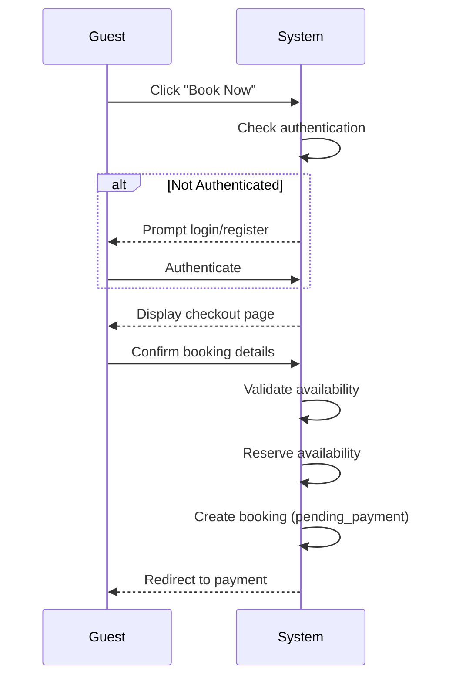

# UC-G03: Create Booking

| Field | Description |
|-------|-------------|
| **Use Case Name** | Create Booking |
| **Created By** | Product Team |
| **Created Date** | 2026-01-25 |
| **Last Updated By** | Product Team |
| **Last Updated Date** | 2026-01-25 |
| **Summary** | Guest initiates a booking request by selecting dates, room type, and number of guests. System validates availability, reserves the dates, and creates a pending booking record. |
| **Dependency** | UC-G02 (View Listing Details) |
| **Actors** | Primary: Guest |
| **Preconditions** | Guest is authenticated (or will authenticate in flow). Selected listing is available for desired dates. |
| **Trigger** | Guest clicks "Book Now" from listing page |
| **Main Sequence** | 1. Guest clicks "Book Now" from listing page 2. System redirects to checkout page (or prompts login if not authenticated) 3. Guest selects or confirms dates, room type, number of guests 4. System validates availability for selected dates 5. System displays price breakdown (base rate, fees, taxes) 6. Guest confirms booking details 7. System reserves availability for selected dates 8. System creates booking record with status 'pending_payment' 9. System redirects guest to payment flow |
| **Alternative Sequences** | Step 2: If guest not authenticated, System prompts login/register, preserves booking data temporarily Step 3: If dates no longer available, System displays error "Selected dates no longer available" with available alternatives Step 4: If availability reservation fails, System displays "Someone is booking this room. Please try again in a moment" Step 7: If booking creation fails, System releases reservation and displays error with retry option |
| **Postconditions** | Booking record created (status: pending_payment). Availability reserved. Payment initiated. Notification queued. |
| **Nonfunctional Requirements** | Availability reservation timeout: 15 minutes. Zero double-bookings guarantee. Atomic booking creation. Payment gateway failover support. |
| **Business Requirements** | BR-003: Guest must provide valid contact information BR-004: Availability reservation expires after 15 minutes if payment not completed |
| **Frequency of Use** | High |
| **Priority** | High |
| **Outstanding Questions** | Reservation timeout: 10 or 15 minutes? How to handle abandoned bookings (cleanup schedule)? |

---

## Sequence Diagram

---

## Black Box Compliance

✅ **COMPLIANT** - All steps describe external interactions only:
- Guest actions (click, confirm, authenticate)
- System responses (validate, reserve, create, redirect)

No internal components mentioned (databases, locks, services).