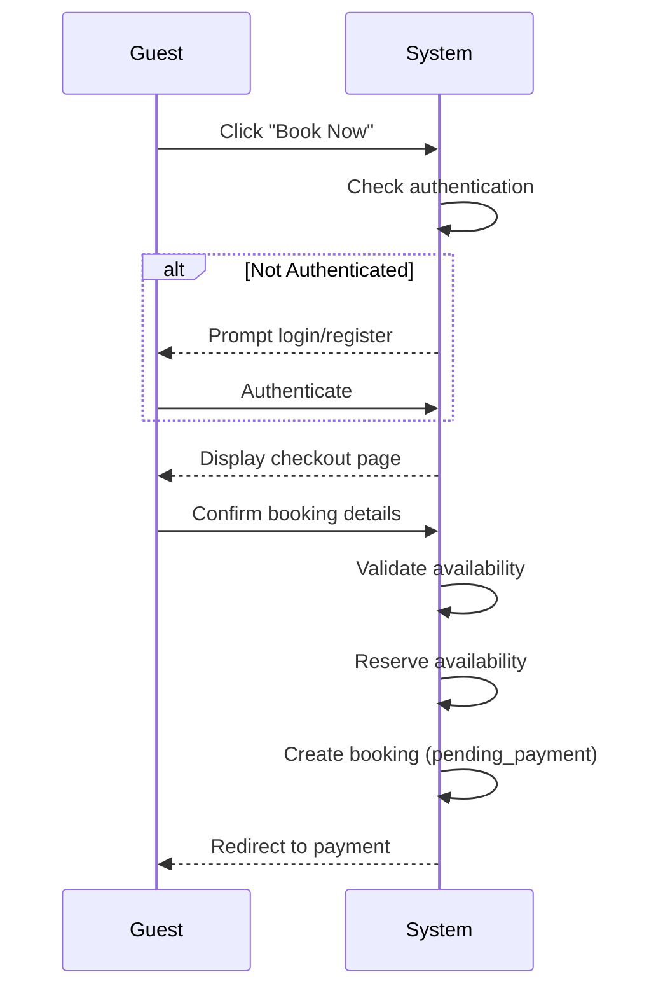

# UC-G03: Create Booking

| Field | Description |
|-------|-------------|
| **Use Case Name** | Create Booking |
| **Created By** | Product Team |
| **Created Date** | 2026-01-25 |
| **Last Updated By** | Product Team |
| **Last Updated Date** | 2026-01-25 |
| **Summary** | Guest initiates a booking request by selecting dates, room type, and number of guests. System validates availability, reserves the dates, and creates a pending booking record. |
| **Dependency** | UC-G02 (View Listing Details) |
| **Actors** | Primary: Guest |
| **Preconditions** | Guest is authenticated (or will authenticate in flow). Selected listing is available for desired dates. |
| **Trigger** | Guest clicks "Book Now" from listing page |
| **Main Sequence** | 1. Guest clicks "Book Now" from listing page<br>2. System redirects to checkout page (or prompts login if not authenticated)<br>3. Guest selects or confirms dates, room type, number of guests<br>4. System validates availability for selected dates<br>5. System displays price breakdown (base rate, fees, taxes)<br>6. Guest confirms booking details<br>7. System reserves availability for selected dates<br>8. System creates booking record with status 'pending_payment'<br>9. System redirects guest to payment flow |
| **Alternative Sequences** | Step 2: If guest not authenticated, System prompts login/register, preserves booking data temporarily<br>Step 3: If dates no longer available, System displays error "Selected dates no longer available" with available alternatives<br>Step 4: If availability reservation fails, System displays "Someone is booking this room. Please try again in a moment"<br>Step 7: If booking creation fails, System releases reservation and displays error with retry option |
| **Postconditions** | Booking record created (status: pending_payment). Availability reserved. Payment initiated. Notification queued. |
| **Nonfunctional Requirements** | Availability reservation timeout: 15 minutes. Zero double-bookings guarantee. Atomic booking creation. Payment gateway failover support. |
| **Business Requirements** | BR-003: Guest must provide valid contact information<br>BR-004: Availability reservation expires after 15 minutes if payment not completed |
| **Frequency of Use** | High |
| **Priority** | High |
| **Outstanding Questions** | Reservation timeout: 10 or 15 minutes? How to handle abandoned bookings (cleanup schedule)? |

---

## Sequence Diagram



---

## Black Box Compliance

✅ **COMPLIANT** - All steps describe external interactions only:
- Guest actions (click, confirm, authenticate)
- System responses (validate, reserve, create, redirect)

No internal components mentioned (databases, locks, services).

---

## Boundary Objects

| Boundary Object | Description | Data Elements |
|----------------|-------------|---------------|
| **BookingRequest** | Guest's booking initiation | listingId, roomId, checkInDate, checkOutDate, guestCount, specialRequests |
| **BookingConfirmation** | Created booking details | bookingId, status, reservationExpiresAt, priceBreakdown |
| **PriceBreakdown** | Detailed cost calculation | basePrice, cleaningFee, serviceFee, taxes, totalPrice, currency |
| **AvailabilityReservation** | Temporary hold on dates | reservationId, roomId, dateRange, expiresAt |
| **GuestDetails** | Guest information for booking | guestId, name, email, phone, specialRequests |
| **CheckoutSession** | Checkout page session data | sessionId, listingData, dateData, pricingData, expiresAt |

---

## Internal Software Objects

| Internal Object | Responsibility |
|-----------------|---------------|
| **BookingService** | Orchestrates booking creation flow |
| **AvailabilityService** | Manages availability reservations and locks |
| **PricingService** | Calculates total pricing with fees and taxes |
| **BookingRepository** | Persists booking records |
| **ReservationLockService** | Manages distributed locks for availability (Redis) |
| **GuestService** | Fetches guest details |
| **AuthService** | Validates authentication state |
| **BookingValidator** | Validates booking constraints (dates, capacity) |
| **NotificationService** | Queues booking notifications |
| **SessionService** | Manages temporary booking session data |

---

## Message Communication Sequence

### Booking Creation Flow

```
Guest → System: BookNow (HTTP POST /api/bookings/initiate)
    ↓
System → AuthService: Check authentication
    ← NotAuthenticated
System → Guest: Redirect to login (HTTP 302)
Guest → System: Authenticate
    ↓
System → BookingService: Create booking session
    ← SessionId
System → Guest: Checkout page (HTTP 200)
    ↓
Guest → System: ConfirmBooking (HTTP POST /api/bookings)
    ↓
System → BookingValidator: Validate constraints
    ← Valid
System → AvailabilityService: Check availability
    ← Available
System → ReservationLockService: Acquire lock (Redis, 15min TTL)
    ← LockAcquired (reservationId)
System → PricingService: Calculate total
    ← PriceBreakdown
System → BookingRepository: Create booking (status: pending_payment)
    ← BookingRecord
System → NotificationService: Queue notifications
    ← Queued
System → Guest: Redirect to payment (HTTP 302)
```

### Lock Expiration Flow

```
System (scheduler) → BookingRepository: Find expired pending bookings
    ← expiredBookings[]
System → ReservationLockService: Release locks
    ← Released
System → BookingRepository: Update status (expired)
```

### WebSocket: Real-time Availability

```
System → WebSocket: Broadcast booking.created event
Guest(s) viewing listing ← System: AvailabilityUpdate
```

---

## Expanded Alternative Sequences

### Step 2: Authentication States
| Condition | System Response | Recovery |
|-----------|-----------------|----------|
| Not logged in | Redirect to login | Preserve booking data in session |
| Session expired | Re-authenticate required | Restore booking session after login |
| Email not verified | Block with verification prompt | Verify email to continue |
| Account suspended | Block with message | Contact support |

### Step 3: Availability Changes
| Condition | System Response | Recovery |
|-----------|-----------------|----------|
| Dates became unavailable | Error: "No longer available" | Show alternative dates |
| Price increased since page load | Show new price | Confirm or cancel |
| Room capacity exceeded | Error: "Too many guests" | Suggest additional rooms |
| Minimum stay not met | Error: "Minimum X nights" | Adjust dates |

### Step 4: Reservation Failures
| Condition | System Response | Recovery |
|-----------|-----------------|----------|
| Concurrent booking attempt | Error: "Someone is booking this room" | Retry button with countdown |
| Lock acquisition timeout | Error: "Unable to reserve. Try again" | Auto-retry up to 3 times |
| Redis connection failure | Fallback to database lock | Degraded performance notice |
| Duplicate booking detected | Error: "You already have a booking" | Link to existing booking |

### Step 7: Booking Creation Failures
| Condition | System Response | Recovery |
|-----------|-----------------|----------|
| Database constraint violation | Error: "Booking creation failed" | Release lock, retry |
| Payment gateway unavailable | Queue for retry | Notify when payment available |
| Notification queue full | Continue booking | Log for later notification |
| Session expired | Error: "Session expired" | Restart booking flow |