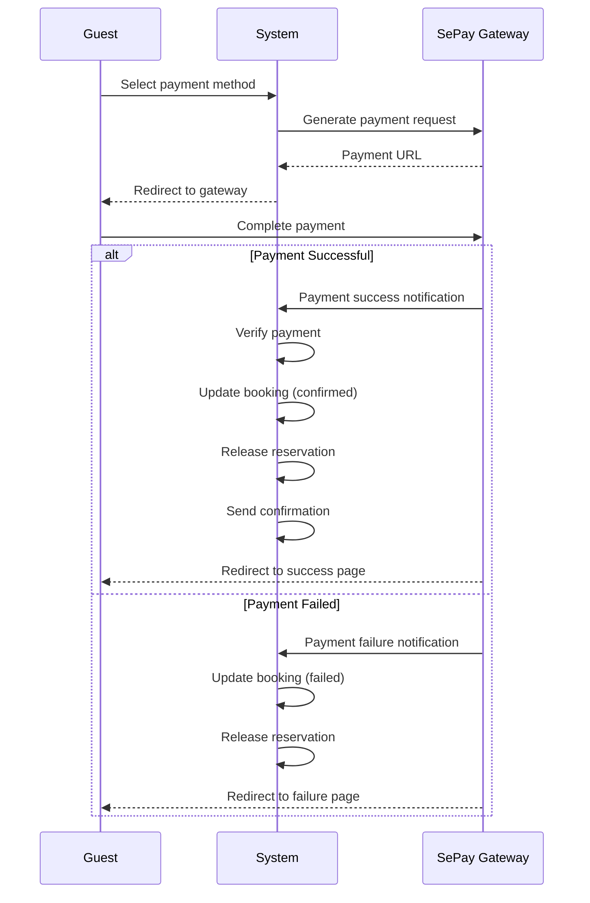

# UC-G04: Process Payment

| Field | Description |
|-------|-------------|
| **Use Case Name** | Process Payment |
| **Created By** | Product Team |
| **Created Date** | 2026-01-25 |
| **Last Updated By** | Product Team |
| **Last Updated Date** | 2026-01-25 |
| **Summary** | Guest completes payment for booking using payment gateway. System handles payment processing, verifies transaction, updates booking status, and sends confirmation. |
| **Dependency** | UC-G03 (Create Booking) |
| **Actors** | Primary: Guest Secondary: SePay Payment Gateway |
| **Preconditions** | Booking exists with valid 'pending_payment' status. Availability is currently reserved. Payment gateway is operational. |
| **Trigger** | Guest selects payment method and confirms payment |
| **Main Sequence** | 1. Guest selects payment method (VietQR/Bank Transfer) 2. System generates payment request with callback URLs 3. System redirects guest to payment gateway 4. Guest completes payment on payment gateway 5. Payment gateway redirects guest back with success/failure status 6. System receives and verifies payment notification 7. System updates booking status based on payment result 8. System releases availability reservation 9. System sends confirmation email/SMS to guest 10. System displays booking confirmation to guest |
| **Alternative Sequences** | Step 4: If payment cancelled by guest, System keeps booking pending for retry Step 4: If payment timeout, System marks booking as 'payment_failed' and releases reservation Step 6: If payment verification fails, System logs for manual review and keeps pending status Step 7: If payment successful, System updates booking to 'confirmed' and triggers confirmation notifications Step 7: If payment failed, System updates booking to 'payment_failed', releases reservation, allows retry |
| **Postconditions** | Booking status updated (confirmed/failed). Availability reservation released. Payment record created. Notifications sent. Analytics updated. |
| **Nonfunctional Requirements** | Payment processing timeout < 30 seconds. Idempotent payment notification processing. Secure payment verification. PCI DSS compliance (no card data stored). |
| **Business Requirements** | BR-005: Payment must be completed within 15 minutes of booking initiation BR-006: Confirmed bookings must receive email confirmation within 1 minute |
| **Frequency of Use** | High |
| **Priority** | High |
| **Outstanding Questions** | Payment retry limit? How to handle partial payments? Refund process automation? |

---

## Sequence Diagram

---

## Black Box Compliance

✅ **COMPLIANT** - All steps describe external interactions only:
- Guest actions (select payment, complete payment)
- System responses (generate request, verify, update, send)
- Payment Gateway actions (process payment, send notification)

No internal components mentioned (databases, APIs, webhooks).