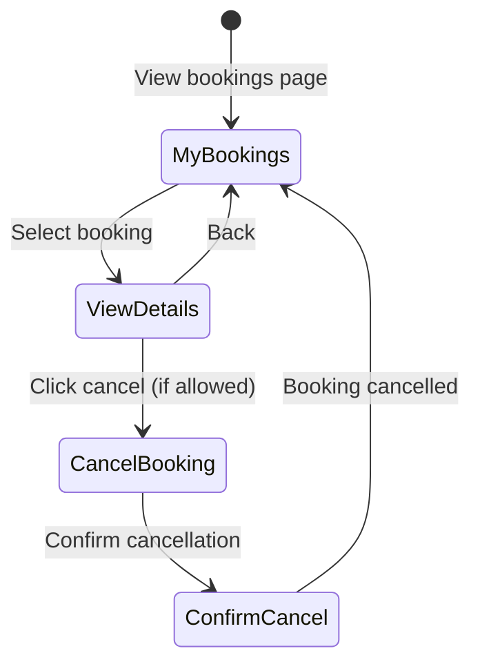

# UC-G05: Manage Bookings

| Field | Description |
|-------|-------------|
| **Use Case Name** | Manage Bookings |
| **Created By** | Product Team |
| **Created Date** | 2026-01-25 |
| **Last Updated By** | Product Team |
| **Last Updated Date** | 2026-01-25 |
| **Summary** | Authenticated guest views their booking history, details, and can cancel bookings within the allowed cancellation period. |
| **Dependency** | UC-G04 (Process Payment) |
| **Actors** | Primary: Guest<br>Secondary: Owner (receives cancellation notifications) |
| **Preconditions** | Guest is logged in. At least one booking exists for this guest. |
| **Trigger** | Guest navigates to "My Bookings" page |
| **Main Sequence** | 1. Guest navigates to "My Bookings" page<br>2. System retrieves all bookings for guest<br>3. System displays bookings grouped by status (upcoming, completed, cancelled)<br>4. Guest clicks on a booking to view details<br>5. System shows full booking details with available actions<br>6. Guest may cancel if within cancellation period<br>7. System processes cancellation and updates status |
| **Alternative Sequences** | Step 2: If no bookings found, System displays "You have no bookings yet" with CTA to search hostels<br>Step 4: If booking cancelled by owner, System displays "This booking was cancelled by the property"<br>Step 6: If outside cancellation period, System disables cancel button and shows "Cancellation period ended"<br>Step 6: If cancellation penalty applies, System shows refund amount before confirmation |
| **Postconditions** | Booking status updated (if cancelled). Refund initiated. Notifications sent to owner. Availability calendar updated. |
| **Nonfunctional Requirements** | Paginated display (20 per page). Real-time status updates. Cancellation policy enforcement. Refund calculation accuracy. |
| **Business Requirements** | BR-013: Full refund if cancelled 24h before check-in<br>BR-014: 50% refund if cancelled 48h before check-in<br>BR-015: No refund if cancelled less than 48h before check-in |
| **Frequency of Use** | Medium |
| **Priority** | High |
| **Outstanding Questions** | Cancellation policy details? Penalty structure? |

---

## Sequence Diagram



---

## Black Box Compliance

✅ **COMPLIANT** - All steps describe external interactions only.

---

## Boundary Objects

| Boundary Object | Description | Data Elements |
|----------------|-------------|---------------|
| **BookingList** | List of guest's bookings | bookings[], totalCount, page, filters |
| **BookingDetails** | Complete booking information | bookingId, listingDetails, dates, pricing, status, actions[] |
| **CancellationRequest** | Cancellation initiation | bookingId, reason, refundAmount |
| **CancellationConfirmation** | Cancellation result | cancelledAt, refundAmount, refundStatus |
| **BookingAction** | Available action on booking | actionType, label, enabled, reason |

---

## Internal Software Objects

| Internal Object | Responsibility |
|-----------------|---------------|
| **BookingService** | Manages booking CRUD operations |
| **CancellationService** | Handles booking cancellations and refunds |
| **RefundService** | Processes refund requests |
| **CancellationPolicyService** | Enforces cancellation rules and calculates penalties |
| **BookingRepository** | Queries guest bookings |
| **NotificationService** | Sends cancellation notifications |
| **OwnerNotificationService** | Notifies owners of cancellations |
| **AvailabilityService** | Releases availability on cancellation |
| **PaymentGatewayAdapter** | Initiates refund via payment gateway |
| **AuditLogService** | Logs all booking state changes |

---

## Message Communication Sequence

### View Bookings Flow

```
Guest → System: ViewBookings (HTTP GET /api/bookings)
    ↓
System → BookingRepository: Query guest bookings
    ← bookings[]
System → BookingService: Enrich with listing data
    ← enrichedBookings[]
System → Guest: BookingList (HTTP 200)
```

### View Booking Details Flow

```
Guest → System: ViewBooking (HTTP GET /api/bookings/:id)
    ↓
System → BookingRepository: Get booking
    ← booking
System → BookingService: Enrich with full details
    ← bookingDetails
System → CancellationPolicyService: Check cancellation eligibility
    ← cancellationInfo
System → Guest: BookingDetails (HTTP 200)
```

### Cancel Booking Flow

```
Guest → System: CancelBooking (HTTP POST /api/bookings/:id/cancel)
    ↓
System → CancellationPolicyService: Calculate refund
    ← refundAmount
System → Guest: Show confirmation (refundAmount, penalty)
Guest → System: ConfirmCancellation (HTTP POST /api/bookings/:id/confirm-cancel)
    ↓
System → CancellationService: Process cancellation
    ↓
System → BookingRepository: Update status (cancelled)
    ← updated
System → RefundService: Initiate refund
    ← refundId
System → AvailabilityService: Release availability
    ← released
System → OwnerNotificationService: Notify owner
    ← queued
System → NotificationService: Send confirmation to guest
    ← queued
System → AuditLogService: Log cancellation
    ← logged
System → Guest: CancellationConfirmation (HTTP 200)
```

### WebSocket: Real-time Booking Updates

```
System (payment webhook) → WebSocket: Broadcast booking.status_changed
Owner (viewing calendar) ← System: BookingCancelled (availability restored)
```

---

## Expanded Alternative Sequences

### Step 2: No Bookings Found
| Condition | System Response | Recovery |
|-----------|-----------------|----------|
| First-time user | Empty state with illustration | "Search for hostels" CTA |
| All bookings cancelled/archived | "No active bookings" message | View past bookings link |
| Database query timeout | Retry with loading indicator | Show error after 3 retries |

### Step 4: Booking Status States
| Condition | System Response | Recovery |
|-----------|-----------------|----------|
| Booking cancelled by owner | Show "Cancelled by property" | Reason displayed, refund info |
| Booking completed | Hide cancel option | Show "Write a Review" button |
| Booking pending confirmation | Show "Awaiting confirmation" | No cancel option |
| Booking no-show | Show "Marked as no-show" | Contact support for dispute |

### Step 6: Cancellation Policy Checks
| Condition | System Response | Recovery |
|-----------|-----------------|----------|
| >24h before check-in | Full refund option | Show full refund amount |
| 48-24h before check-in | 50% refund option | Show partial refund amount |
| <24h before check-in | No refund option | Show "Non-refundable" warning |
| Non-refundable rate | No refund allowed | Policy explanation |
| Special offer | Custom cancellation terms | Display specific terms |

### Step 7: Cancellation Failures
| Condition | System Response | Recovery |
|-----------|-----------------|----------|
| Refund initiation fails | Log for manual processing | "Refund processing" message |
| Availability release fails | Flag for manual cleanup | Cron job retry |
| Owner notification fails | Queue for retry | Async retry with backoff |
| Concurrent modification | Optimistic lock error | Retry with fresh data |