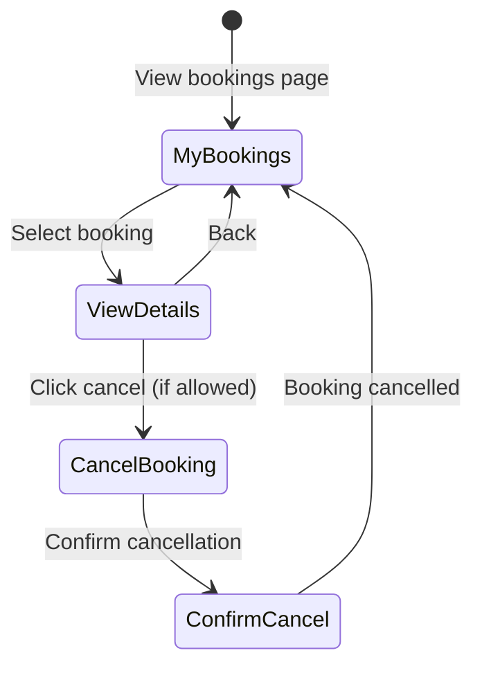

# UC-G05: Manage Bookings

| Field | Description |
|-------|-------------|
| **Use Case Name** | Manage Bookings |
| **Created By** | Product Team |
| **Created Date** | 2026-01-25 |
| **Last Updated By** | Product Team |
| **Last Updated Date** | 2026-01-25 |
| **Summary** | Authenticated guest views their booking history, details, and can cancel bookings within the allowed cancellation period. |
| **Dependency** | UC-G04 (Process Payment) |
| **Actors** | Primary: Guest Secondary: Owner (receives cancellation notifications) |
| **Preconditions** | Guest is logged in. At least one booking exists for this guest. |
| **Trigger** | Guest navigates to "My Bookings" page |
| **Main Sequence** | 1. Guest navigates to "My Bookings" page 2. System retrieves all bookings for guest 3. System displays bookings grouped by status (upcoming, completed, cancelled) 4. Guest clicks on a booking to view details 5. System shows full booking details with available actions 6. Guest may cancel if within cancellation period 7. System processes cancellation and updates status |
| **Alternative Sequences** | Step 2: If no bookings found, System displays "You have no bookings yet" with CTA to search hostels Step 4: If booking cancelled by owner, System displays "This booking was cancelled by the property" Step 6: If outside cancellation period, System disables cancel button and shows "Cancellation period ended" Step 6: If cancellation penalty applies, System shows refund amount before confirmation |
| **Postconditions** | Booking status updated (if cancelled). Refund initiated. Notifications sent to owner. Availability calendar updated. |
| **Nonfunctional Requirements** | Paginated display (20 per page). Real-time status updates. Cancellation policy enforcement. Refund calculation accuracy. |
| **Business Requirements** | BR-013: Full refund if cancelled 24h before check-in BR-014: 50% refund if cancelled 48h before check-in BR-015: No refund if cancelled less than 48h before check-in |
| **Frequency of Use** | Medium |
| **Priority** | High |
| **Outstanding Questions** | Cancellation policy details? Penalty structure? |

---

## Sequence Diagram

---

## Black Box Compliance

✅ **COMPLIANT** - All steps describe external interactions only.