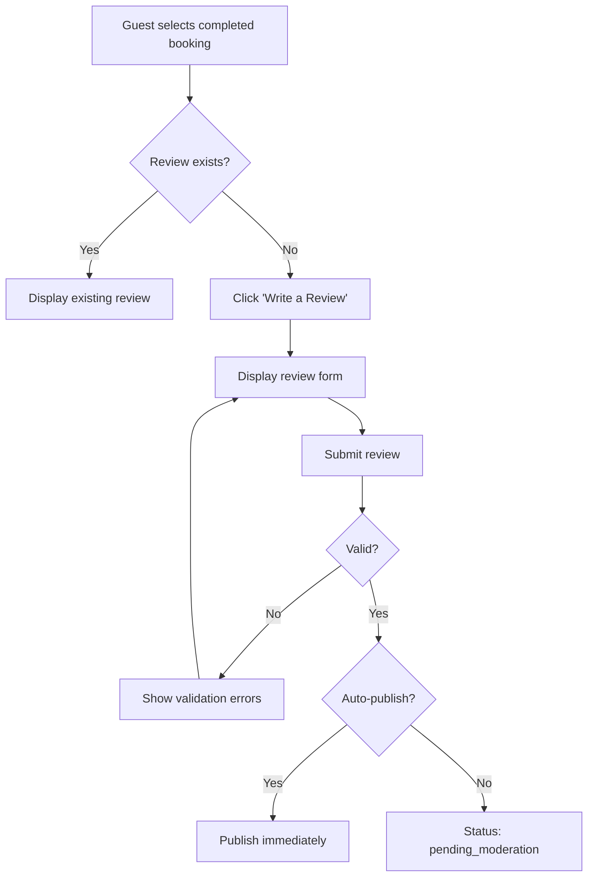

# UC-G06: Submit Review

| Field | Description |
|-------|-------------|
| **Use Case Name** | Submit Review |
| **Created By** | Product Team |
| **Created Date** | 2026-01-25 |
| **Last Updated By** | Product Team |
| **Last Updated Date** | 2026-01-25 |
| **Summary** | Guest who completed a booking submits a review with rating (1-5 stars) and text. Reviews are moderated before publishing. |
| **Dependency** | UC-G05 (Manage Bookings) |
| **Actors** | Primary: Guest Secondary: Admin (moderation), Owner (responds to reviews) |
| **Preconditions** | Guest is authenticated. Booking is completed. Stay date is in the past. No review exists for this booking. |
| **Trigger** | Guest clicks "Write a Review" on completed booking |
| **Main Sequence** | 1. Guest navigates to "My Bookings" and selects completed booking 2. Guest clicks "Write a Review" 3. System displays review form (rating 1-5, text, photos optional) 4. Guest submits review 5. System validates review (min length, rating required) 6. System creates review with status 'pending_moderation' 7. System queues notification for admin moderation |
| **Alternative Sequences** | Step 2: If review already exists, System displays existing review and disables submit Step 4: If validation fails, System shows inline errors (rating required, min 50 chars) Step 4: If profanity detected, System flags for moderation and allows submission with warning Step 6: If auto-publish enabled, System bypasses moderation and publishes immediately |
| **Postconditions** | Review created (pending_moderation or published). Listing rating recalculated (when published). Owner notified. |
| **Nonfunctional Requirements** | Max 5 photos per review. Photo size limit 5MB each. Profanity filter. Spam detection. Review aggregation for listings. |
| **Business Requirements** | BR-016: Only guests who completed stays can submit reviews BR-017: One review per booking |
| **Frequency of Use** | Low |
| **Priority** | Medium |
| **Outstanding Questions** | Can guests edit reviews after submission? Delete reviews? Time limit for submitting? |

---

## Sequence Diagram

---

## Black Box Compliance

✅ **COMPLIANT** - All steps describe external interactions only.