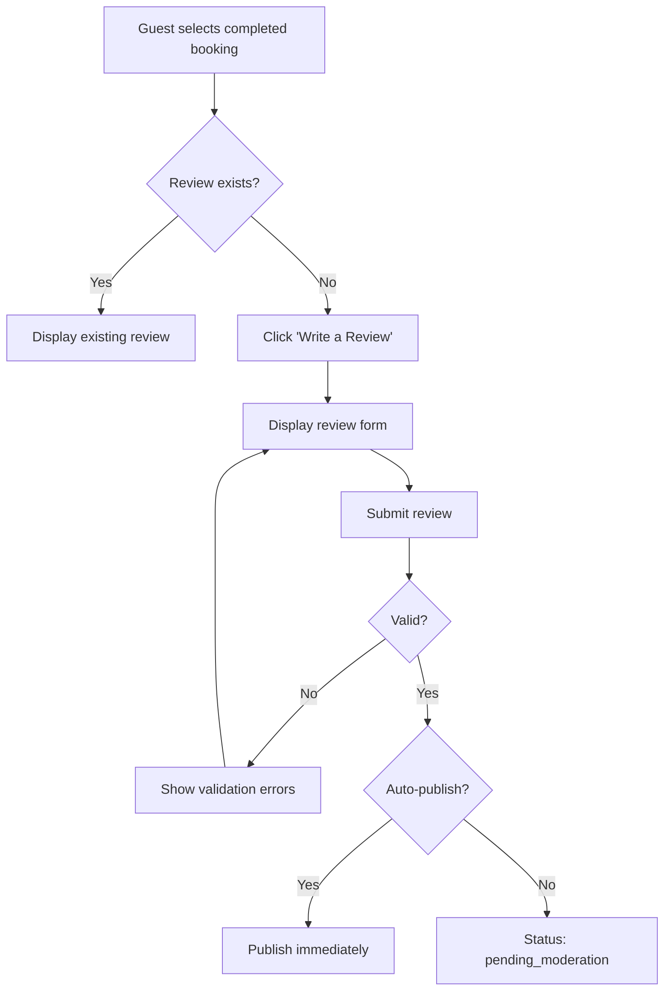

# UC-G06: Submit Review

| Field | Description |
|-------|-------------|
| **Use Case Name** | Submit Review |
| **Created By** | Product Team |
| **Created Date** | 2026-01-25 |
| **Last Updated By** | Product Team |
| **Last Updated Date** | 2026-01-25 |
| **Summary** | Guest who completed a booking submits a review with rating (1-5 stars) and text. Reviews are moderated before publishing. |
| **Dependency** | UC-G05 (Manage Bookings) |
| **Actors** | Primary: Guest<br>Secondary: Admin (moderation), Owner (responds to reviews) |
| **Preconditions** | Guest is authenticated. Booking is completed. Stay date is in the past. No review exists for this booking. |
| **Trigger** | Guest clicks "Write a Review" on completed booking |
| **Main Sequence** | 1. Guest navigates to "My Bookings" and selects completed booking<br>2. Guest clicks "Write a Review"<br>3. System displays review form (rating 1-5, text, photos optional)<br>4. Guest submits review<br>5. System validates review (min length, rating required)<br>6. System creates review with status 'pending_moderation'<br>7. System queues notification for admin moderation |
| **Alternative Sequences** | Step 2: If review already exists, System displays existing review and disables submit<br>Step 4: If validation fails, System shows inline errors (rating required, min 50 chars)<br>Step 4: If profanity detected, System flags for moderation and allows submission with warning<br>Step 6: If auto-publish enabled, System bypasses moderation and publishes immediately |
| **Postconditions** | Review created (pending_moderation or published). Listing rating recalculated (when published). Owner notified. |
| **Nonfunctional Requirements** | Max 5 photos per review. Photo size limit 5MB each. Profanity filter. Spam detection. Review aggregation for listings. |
| **Business Requirements** | BR-016: Only guests who completed stays can submit reviews<br>BR-017: One review per booking |
| **Frequency of Use** | Low |
| **Priority** | Medium |
| **Outstanding Questions** | Can guests edit reviews after submission? Delete reviews? Time limit for submitting? |

---

## Sequence Diagram



---

## Black Box Compliance

✅ **COMPLIANT** - All steps describe external interactions only.

---

## Boundary Objects

| Boundary Object | Description | Data Elements |
|----------------|-------------|---------------|
| **ReviewRequest** | Review submission data | bookingId, rating, categories{}, comment, photos[] |
| **ReviewResponse** | Created review details | reviewId, status, createdAt, listingInfo |
| **ReviewDetails** | Full review data | reviewId, rating, categories, comment, photos, authorInfo, verifiedStay |
| **ReviewPhoto** | Uploaded review photo | photoId, url, thumbnailUrl, caption |
| **RatingCategories** | Breakdown ratings | cleanliness, location, value, staff, facilities (1-5 each) |

---

## Internal Software Objects

| Internal Object | Responsibility |
|-----------------|---------------|
| **ReviewService** | Manages review CRUD operations |
| **ReviewValidator** | Validates review content and constraints |
| **ModerationService** | Handles review moderation queue |
| **ProfanityFilterService** | Detects and flags inappropriate content |
| **SpamDetectionService** | Identifies spam/fake reviews |
| **ReviewRepository** | Persists review records |
| **BookingRepository** | Verifies booking eligibility |
| **PhotoUploadService** | Handles review photo uploads |
| **NotificationService** | Notifies owner of new reviews |
| **ListingService** | Updates listing rating aggregates |
| **AuditLogService** | Logs review state changes |

---

## Message Communication Sequence

### Review Submission Flow

```
Guest → System: SubmitReview (HTTP POST /api/reviews)
    ↓
System → ReviewValidator: Validate request
    ← Valid
System → BookingRepository: Verify booking eligibility
    ← Completed booking found
System → ReviewRepository: Check existing review
    ← No existing review
System → ProfanityFilterService: Scan content
    ← Clean (or flagged)
System → SpamDetectionService: Check patterns
    ← Not spam
System → ReviewRepository: Create review (status: pending_moderation)
    ← ReviewRecord
System → NotificationService: Queue moderation notification
    ← Queued
System → Guest: ReviewResponse (HTTP 201)
```

### Auto-Publish Flow

```
System (config) → ReviewService: Check auto-publish setting
    ← Enabled
System → ReviewRepository: Update status (published)
    ← Updated
System → ListingService: Recalculate listing rating
    ← NewRating
System → NotificationService: Notify owner
    ← Queued
```

### Moderation Flow

```
Admin → System: ModerateReview (HTTP PUT /api/admin/reviews/:id)
    ↓
System → ReviewRepository: Update status
    ← Published/Rejected
System → ListingService: Update rating (if published)
    ← Updated
System → NotificationService: Notify guest
    ← Queued
```

---

## Expanded Alternative Sequences

### Step 2: Existing Review
| Condition | System Response | Recovery |
|-----------|-----------------|----------|
| Review already exists | Display existing review | Hide submit form |
| Draft review exists | Load draft for editing | Continue submission |
| Review deleted | Allow re-submission | Fresh review form |

### Step 4: Validation Failures
| Condition | System Response | Recovery |
|-----------|-----------------|----------|
| Rating not selected | Error: "Rating required" | Highlight rating field |
| Comment too short (<50 chars) | Error: "Min 50 characters" | Show character count |
| Comment too long (>2000 chars) | Error: "Max 2000 characters" | Truncate with warning |
| Invalid photo format | Error: "JPG/PNG only" | Show supported formats |
| Photo size exceeds 5MB | Error: "Max 5MB per photo" | Suggest compression |

### Step 4: Content Filtering
| Condition | System Response | Recovery |
|-----------|-----------------|----------|
| Profanity detected | Warning: "Inappropriate language" | Allow edit or submit with flag |
| Personal info detected | Warning: "Remove contact details" | Auto-redact, allow submit |
| Spam pattern detected | Warning: "Suspicious content" | Flag for manual review |
| Duplicate content | Warning: "Similar to existing review" | Allow with confirmation |

### Step 6: Moderation States
| Condition | System Response | Recovery |
|-----------|-----------------|----------|
| Auto-publish enabled | Skip moderation, publish immediately | Notify owner |
| Manual moderation required | Queue for review | "Under review" status |
| Content violation detected | Reject with reason | Guest notified, can appeal |
| Photo moderation | Hold review until photos approved | Publish text first |