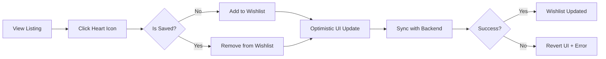

# UC-G07: Manage Wishlist

| Field | Description |
|-------|-------------|
| **Use Case Name** | Manage Wishlist |
| **Created By** | Product Team |
| **Created Date** | 2026-01-25 |
| **Last Updated By** | Product Team |
| **Last Updated Date** | 2026-01-25 |
| **Summary** | Guest saves listings to wishlist for later. Wishlist persists across sessions and can be shared. |
| **Dependency** | None (independent feature) |
| **Actors** | Primary: Guest |
| **Preconditions** | Guest is logged in (for persistence). |
| **Trigger** | Guest clicks "heart" icon on any listing |
| **Main Sequence** | 1. Guest clicks "heart" icon on listing 2. System adds/removes from wishlist (toggle) 3. System updates UI state immediately 4. System syncs with backend 5. Guest navigates to wishlist page 6. System displays all saved listings with current prices |
| **Alternative Sequences** | Step 1: If guest not logged in, System saves to local storage and prompts "Sign in to sync your wishlist" Step 3: If API call fails, System reverts optimistic update and shows error toast Step 5: If wishlist empty, System displays empty state with "Start exploring" CTA Step 5: If some listings unavailable, System shows "No longer available" badge with remove option |
| **Postconditions** | Wishlist updated. Analytics logged (if added). Email alerts queued for price drops (if opt-in). |
| **Nonfunctional Requirements** | Optimistic UI updates. Wishlist max 100 items. Real-time price updates. Shareable wishlist link. |
| **Business Requirements** | BR-018: Wishlist limited to 100 items per guest |
| **Frequency of Use** | Medium |
| **Priority** | Low |
| **Outstanding Questions** | Price drop notifications? Wishlist expiration policy? |

---

## Sequence Diagram

---

## Black Box Compliance

✅ **COMPLIANT** - All steps describe external interactions only.