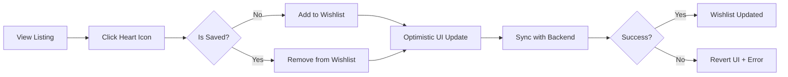

# UC-G07: Manage Wishlist

| Field | Description |
|-------|-------------|
| **Use Case Name** | Manage Wishlist |
| **Created By** | Product Team |
| **Created Date** | 2026-01-25 |
| **Last Updated By** | Product Team |
| **Last Updated Date** | 2026-01-25 |
| **Summary** | Guest saves listings to wishlist for later. Wishlist persists across sessions and can be shared. |
| **Dependency** | None (independent feature) |
| **Actors** | Primary: Guest |
| **Preconditions** | Guest is logged in (for persistence). |
| **Trigger** | Guest clicks "heart" icon on any listing |
| **Main Sequence** | 1. Guest clicks "heart" icon on listing<br>2. System adds/removes from wishlist (toggle)<br>3. System updates UI state immediately<br>4. System syncs with backend<br>5. Guest navigates to wishlist page<br>6. System displays all saved listings with current prices |
| **Alternative Sequences** | Step 1: If guest not logged in, System saves to local storage and prompts "Sign in to sync your wishlist"<br>Step 3: If API call fails, System reverts optimistic update and shows error toast<br>Step 5: If wishlist empty, System displays empty state with "Start exploring" CTA<br>Step 5: If some listings unavailable, System shows "No longer available" badge with remove option |
| **Postconditions** | Wishlist updated. Analytics logged (if added). Email alerts queued for price drops (if opt-in). |
| **Nonfunctional Requirements** | Optimistic UI updates. Wishlist max 100 items. Real-time price updates. Shareable wishlist link. |
| **Business Requirements** | BR-018: Wishlist limited to 100 items per guest |
| **Frequency of Use** | Medium |
| **Priority** | Low |
| **Outstanding Questions** | Price drop notifications? Wishlist expiration policy? |

---

## Sequence Diagram



---

## Black Box Compliance

✅ **COMPLIANT** - All steps describe external interactions only.

---

## Boundary Objects

| Boundary Object | Description | Data Elements |
|----------------|-------------|---------------|
| **WishlistItem** | Saved listing item | listingId, addedAt, currentPrice, thumbnailUrl |
| **WishlistResponse** | Wishlist operation result | action (added/removed), wishlistCount |
| **WishlistList** | Complete wishlist | items[], totalCount, priceUpdates[] |
| **PriceAlert** | Price drop notification | listingId, oldPrice, newPrice, dropPercentage |

---

## Internal Software Objects

| Internal Object | Responsibility |
|-----------------|---------------|
| **WishlistService** | Manages wishlist CRUD operations |
| **WishlistRepository** | Persists wishlist data |
| **ListingService** | Fetches current listing data |
| **PriceTrackerService** | Monitors price changes |
| **NotificationService** | Sends price drop alerts |
| **AnalyticsService** | Logs wishlist events |
| **LocalStorageSyncService** | Manages local storage fallback |

---

## Message Communication Sequence

### Add/Remove Wishlist Flow

```
Guest → System: ToggleWishlist (HTTP POST /api/wishlist/toggle)
    ↓
System → WishlistService: Process toggle
    ↓
System → WishlistRepository: Check existing
    ← Not found
System → WishlistRepository: Add item
    ← Added
System → AnalyticsService: Log event
    ← Logged
System → Guest: WishlistResponse (added)
    ↓
Guest UI: Optimistic update (heart filled)
```

### Sync Wishlist Flow (Logged In)

```
Guest → System: SyncWishlist (HTTP POST /api/wishlist/sync)
    ↓
System → LocalStorageSyncService: Get local wishlist
    ← localItems[]
System → WishlistRepository: Merge with server
    ← mergedItems
System → PriceTrackerService: Enable alerts for items
    ← enabled
System → Guest: WishlistList
```

### Price Drop Alert Flow

```
System (scheduler) → PriceTrackerService: Check prices
    ← priceChanges[]
System → NotificationService: Queue alerts
    ← queued
Guest ← System: Email/Push notification
```

---

## Expanded Alternative Sequences

### Step 1: Not Logged In
| Condition | System Response | Recovery |
|-----------|-----------------|----------|
| Guest not authenticated | Save to local storage | "Sign in to sync" prompt |
| Local storage full (100 items) | Error: "Wishlist full" | Remove items to add more |
| Local storage disabled | Show warning | Wishlist lost on refresh |

### Step 3: API Call Failures
| Condition | System Response | Recovery |
|-----------|-----------------|----------|
| Network timeout | Revert optimistic update | "Unable to save" toast |
| Server error (500) | Queue for retry | Background sync |
| Rate limit exceeded | Show "Try again later" | Exponential backoff |
| Listing deleted | Remove from wishlist | Silently clean up |

### Step 5: Empty Wishlist
| Condition | System Response | Recovery |
|-----------|-----------------|----------|
| No saved items | Empty state illustration | "Start exploring" CTA |
| All items unavailable | Show unavailable badge | "Remove unavailable" button |
| First-time user | Onboarding tooltip | How to use wishlist |

### Step 5: Price Updates
| Condition | System Response | Recovery |
|-----------|-----------------|----------|
| Price increased | Show old price strikethrough | "Price since you saved" badge |
| Price dropped | Highlight with green | "Price dropped X%" banner |
| Listing unavailable | "No longer available" badge | Remove option |
| Listing delisted | Hide from wishlist | Notification sent |