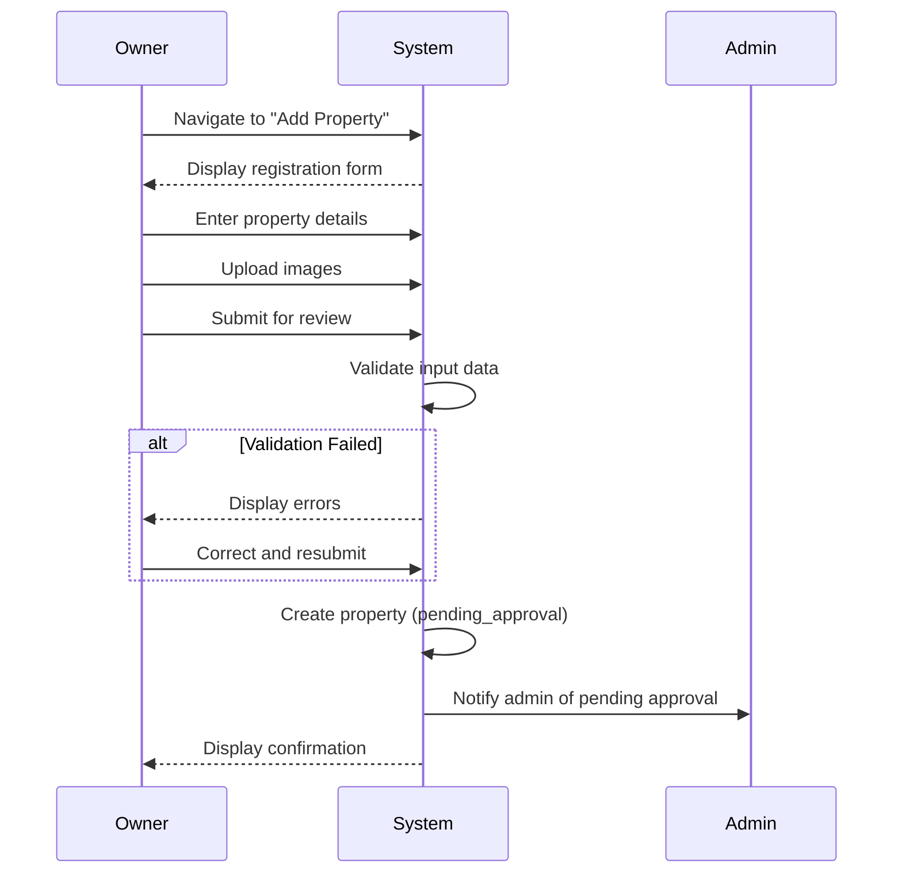

# UC-O01: Register Property

| Field | Description |
|-------|-------------|
| **Use Case Name** | Register Property |
| **Created By** | Product Team |
| **Created Date** | 2026-01-25 |
| **Last Updated By** | Product Team |
| **Last Updated Date** | 2026-01-25 |
| **Summary** | Owner registers a new hostel property with basic information. System validates input, creates property record, and submits for admin approval. |
| **Dependency** | None (first step for owners) |
| **Actors** | Primary: Owner<br>Secondary: Admin (receives notification) |
| **Preconditions** | Owner is authenticated. Owner account is verified (email/phone). |
| **Trigger** | Owner navigates to "Add Property" and clicks submit |
| **Main Sequence** | 1. Owner navigates to "Add Property"<br>2. System displays property registration form<br>3. Owner enters property details (name, address, type, description)<br>4. Owner uploads property images (cover + gallery)<br>5. Owner submits property for review<br>6. System validates all input data<br>7. System creates property with status 'pending_approval'<br>8. System notifies admin of pending approval<br>9. System displays confirmation to owner |
| **Alternative Sequences** | Step 4: If image upload fails, System displays error, allows retry or skip<br>Step 6: If validation fails, System displays inline errors (required fields, address format)<br>Step 6: If duplicate property detected, System warns "Similar property exists" but allows submission<br>Step 9: If auto-approve enabled, System sets status to 'active' immediately |
| **Postconditions** | Property created (pending_approval or active). Admin notified. Owner sees confirmation status. |
| **Nonfunctional Requirements** | Max 10 images per property. Image size limit 5MB each. Address validation (Vietnam provinces). Image processing and storage. |
| **Business Requirements** | BR-007: Property must be located in Vietnam<br>BR-008: Property requires valid address and contact information |
| **Frequency of Use** | Low (once per property) |
| **Priority** | High |
| **Outstanding Questions** | Should we require business license? How many properties per owner max? |

---

## Sequence Diagram



---

## Black Box Compliance

✅ **COMPLIANT** - All steps describe external interactions only:
- Owner actions (enter details, upload images, submit)
- System responses (validate, create, notify, display)

No internal components mentioned (databases, storage services, image processors).

---

## Boundary Objects

| Boundary Object | Description | Data Elements |
|----------------|-------------|---------------|
| **PropertyRegistration** | Property submission data | propertyName, address, type, description, images[], contactInfo |
| **PropertyResponse** | Created property details | propertyId, status, submittedAt, approvalETA |
| **PropertyImage** | Uploaded property image | imageId, url, thumbnailUrl, caption, order |
| **AddressInfo** | Property address data | street, ward, district, city, province, coordinates, country |
| **DuplicateWarning** | Similar property detection | similarPropertyId, similarityScore, matchReasons[] |

---

## Internal Software Objects

| Internal Object | Responsibility |
|-----------------|---------------|
| **PropertyService** | Manages property registration |
| **PropertyValidator** | Validates property data and constraints |
| **DuplicateDetectionService** | Identifies similar existing properties |
| **ImageUploadService** | Handles image uploads to S3 |
| **ImageProcessingService** | Generates thumbnails and WebP variants |
| **AddressValidationService** | Validates Vietnam addresses |
| **GeocodingService** | Converts addresses to coordinates |
| **PropertyRepository** | Persists property records |
| **NotificationService** | Notifies admins of pending approvals |
| **OwnerVerificationService** | Checks owner verification status |

---

## Message Communication Sequence

### Property Registration Flow

```
Owner → System: RegisterProperty (HTTP POST /api/properties)
    ↓
System → PropertyValidator: Validate data
    ← Valid
System → AddressValidationService: Validate address
    ← Valid Vietnam address
System → GeocodingService: Get coordinates
    ← {lat, lng}
System → DuplicateDetectionService: Check for duplicates
    ← No duplicates found
System → ImageUploadService: Upload images to S3
    ← imageUrls[]
System → ImageProcessingService: Generate thumbnails
    ← thumbnails[]
System → PropertyRepository: Create property (status: pending_approval)
    ← PropertyRecord
System → NotificationService: Queue admin notification
    ← Queued
System → Owner: PropertyResponse (HTTP 201)
```

### Image Upload Flow

```
Owner → System: UploadImage (HTTP POST /api/images/upload)
    ↓
System → ImageUploadService: Validate and upload
    ← imageId
System → ImageProcessingService: Process async
    ← Processing
System → Owner: ImageUploadResponse (HTTP 201)
```

### Admin Notification Flow

```
System → RabbitMQ: Publish property.pending_approval
    ↓
Admin Notification Worker → NotificationService: Send to admins
    ← Sent
```

---

## Expanded Alternative Sequences

### Step 4: Image Upload Failures
| Condition | System Response | Recovery |
|-----------|-----------------|----------|
| File too large (>5MB) | Error: "Max 5MB per image" | Compress and retry |
| Invalid format | Error: "JPG/PNG only" | Show supported formats |
| Network timeout | Retry upload | Auto-retry up to 3 times |
| S3 service error | Queue for retry | Background sync |
| Processing failed | Store original, mark for retry | Cron job retry |
| Max images exceeded (10) | Error: "Max 10 images" | Remove images to add more |

### Step 6: Validation Failures
| Condition | System Response | Recovery |
|-----------|-----------------|----------|
| Missing required fields | Inline errors | Highlight missing fields |
| Invalid Vietnam province | Error: "Select valid province" | Show province list |
| Invalid phone format | Error: "Invalid phone number" | Show format example |
| Description too short | Error: "Min 100 characters" | Character count |
| Website URL invalid | Error: "Invalid URL" | Allow empty, validate if present |

### Step 6: Duplicate Detection
| Condition | System Response | Recovery |
|-----------|-----------------|----------|
| Exact address match | Warning: "Property already exists" | Link to existing |
| Similar name + location | Warning: "Similar property found" | Allow with confirmation |
| Same owner, nearby | Info: "Your nearby property" | Show existing property |
| Suspicious similarity | Flag for review | Admin will investigate |

### Step 9: Auto-Approval
| Condition | System Response | Recovery |
|-----------|-----------------|----------|
| Verified owner + clean record | Auto-approve | Set status: active |
| New owner or flags | Manual review | Queue for approval |
| Insufficient info | Request more info | Prompt for details |
| Verification pending | Hold for verification | Notify when verified |