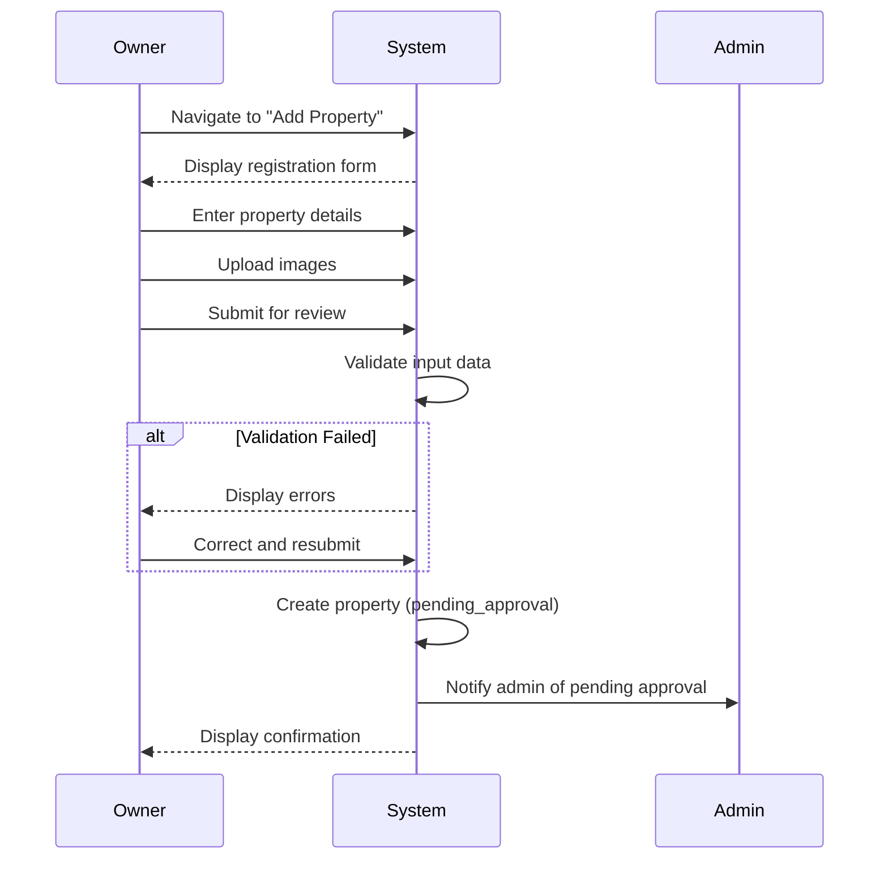

# UC-O01: Register Property

| Field | Description |
|-------|-------------|
| **Use Case Name** | Register Property |
| **Created By** | Product Team |
| **Created Date** | 2026-01-25 |
| **Last Updated By** | Product Team |
| **Last Updated Date** | 2026-01-25 |
| **Summary** | Owner registers a new hostel property with basic information. System validates input, creates property record, and submits for admin approval. |
| **Dependency** | None (first step for owners) |
| **Actors** | Primary: Owner Secondary: Admin (receives notification) |
| **Preconditions** | Owner is authenticated. Owner account is verified (email/phone). |
| **Trigger** | Owner navigates to "Add Property" and clicks submit |
| **Main Sequence** | 1. Owner navigates to "Add Property" 2. System displays property registration form 3. Owner enters property details (name, address, type, description) 4. Owner uploads property images (cover + gallery) 5. Owner submits property for review 6. System validates all input data 7. System creates property with status 'pending_approval' 8. System notifies admin of pending approval 9. System displays confirmation to owner |
| **Alternative Sequences** | Step 4: If image upload fails, System displays error, allows retry or skip Step 6: If validation fails, System displays inline errors (required fields, address format) Step 6: If duplicate property detected, System warns "Similar property exists" but allows submission Step 9: If auto-approve enabled, System sets status to 'active' immediately |
| **Postconditions** | Property created (pending_approval or active). Admin notified. Owner sees confirmation status. |
| **Nonfunctional Requirements** | Max 10 images per property. Image size limit 5MB each. Address validation (Vietnam provinces). Image processing and storage. |
| **Business Requirements** | BR-007: Property must be located in Vietnam BR-008: Property requires valid address and contact information |
| **Frequency of Use** | Low (once per property) |
| **Priority** | High |
| **Outstanding Questions** | Should we require business license? How many properties per owner max? |

---

## Sequence Diagram

---

## Black Box Compliance

✅ **COMPLIANT** - All steps describe external interactions only:
- Owner actions (enter details, upload images, submit)
- System responses (validate, create, notify, display)

No internal components mentioned (databases, storage services, image processors).