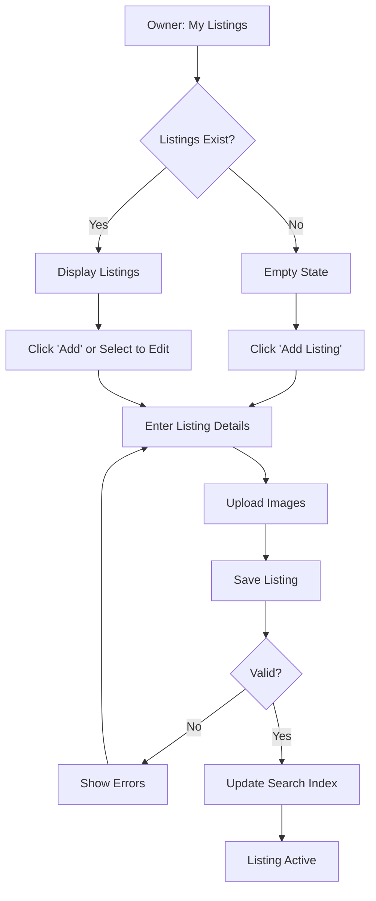

# UC-O02: Manage Listings

| Field | Description |
|-------|-------------|
| **Use Case Name** | Manage Listings |
| **Created By** | Product Team |
| **Created Date** | 2026-01-25 |
| **Last Updated By** | Product Team |
| **Last Updated Date** | 2026-01-25 |
| **Summary** | Owner creates, updates, and deactivates listings under their approved properties. Each listing has room types, pricing, and amenities. |
| **Dependency** | UC-O01 (Register Property) |
| **Actors** | Primary: Owner |
| **Preconditions** | Owner authenticated. At least one approved property exists. |
| **Trigger** | Owner navigates to "My Listings" |
| **Main Sequence** | 1. Owner navigates to "My Listings" 2. System displays all listings with status indicators 3. Owner clicks "Add Listing" or selects existing to edit 4. Owner enters listing details (room type, capacity, base price, amenities) 5. Owner uploads listing images 6. Owner saves listing 7. System updates listing 8. System initializes availability calendar |
| **Alternative Sequences** | Step 2: If no listings, System displays empty state with "Create your first listing" CTA Step 4: If duplicate listing detected, System warns "Similar listing exists" Step 7: If search index update fails, System queues for retry and shows warning to owner Step 8: If calendar initialization fails, System logs error for manual intervention |
| **Postconditions** | Listing created/updated. Search index updated. Calendar initialized. Audit log created. |
| **Nonfunctional Requirements** | Max 20 images per listing. Amenities predefined list. Price validation (min/max). Search index update reliability. |
| **Business Requirements** | BR-019: Room type must match property type BR-020: Pricing must be within platform limits |
| **Frequency of Use** | Medium |
| **Priority** | High |
| **Outstanding Questions** | How many listings per property? Should changes require re-approval? |

---

## Sequence Diagram

---

## Black Box Compliance

✅ **COMPLIANT** - All steps describe external interactions only.