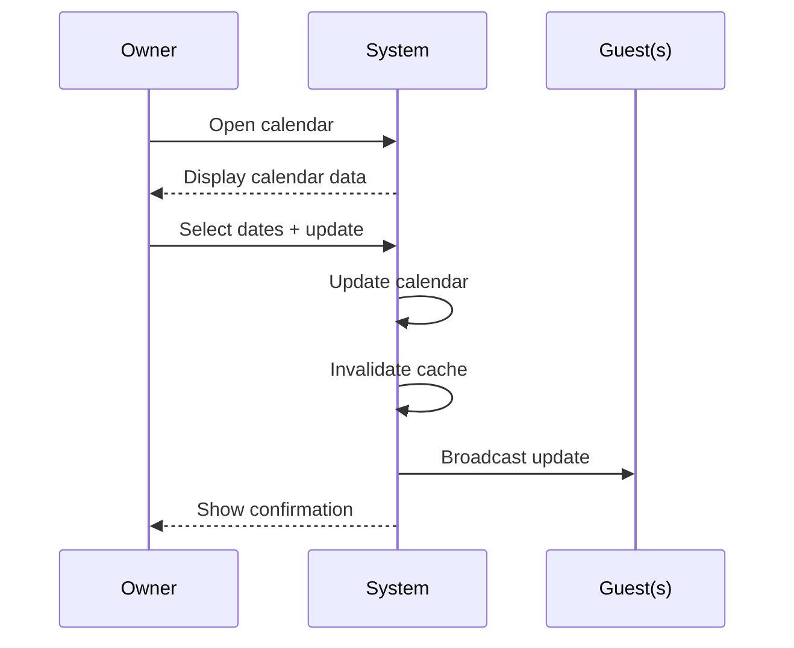

# UC-O03: Update Calendar

| Field | Description |
|-------|-------------|
| **Use Case Name** | Update Calendar |
| **Created By** | Product Team |
| **Created Date** | 2026-01-25 |
| **Last Updated By** | Product Team |
| **Last Updated Date** | 2026-01-25 |
| **Summary** | Owner manages availability and pricing for specific dates. Bulk update and season pricing supported. Changes sync in real-time to guests. |
| **Dependency** | UC-O02 (Manage Listings) |
| **Actors** | Primary: Owner<br>Secondary: Guests (see real-time updates) |
| **Preconditions** | Owner authenticated. Listing selected. Calendar data loaded. |
| **Trigger** | Owner opens calendar for a listing |
| **Main Sequence** | 1. Owner opens calendar for a listing<br>2. System displays calendar with current bookings and availability<br>3. Owner selects date range to update<br>4. Owner sets availability (available/unavailable) and/or price<br>5. Owner saves changes<br>6. System updates calendar<br>7. System invalidates cached data for affected dates<br>8. System broadcasts update to connected guests |
| **Alternative Sequences** | Step 3: If dates have confirmed bookings, System disables editing and shows "Dates with bookings cannot be modified"<br>Step 4: If price below minimum, System shows error and enforces minimum price<br>Step 6: If update fails, System rolls back changes and shows error<br>Step 7: If broadcast fails, System logs error but cache invalidation ensures consistency |
| **Postconditions** | Calendar updated. Cache invalidated. Real-time updates sent. Audit log created. |
| **Nonfunctional Requirements** | Real-time updates. Calendar view performance (1 year range). Bulk update API. Audit trail for all changes. |
| **Business Requirements** | BR-021: Dates with confirmed bookings cannot be modified<br>BR-022: Minimum price enforced by platform |
| **Frequency of Use** | Medium |
| **Priority** | Medium |
| **Outstanding Questions** | Advance booking limit? Season pricing templates? |

---

## Sequence Diagram



---

## Black Box Compliance

✅ **COMPLIANT** - All steps describe external interactions only.

---

## Boundary Objects

| Boundary Object | Description | Data Elements |
|----------------|-------------|---------------|
| **CalendarUpdate** | Calendar change request | listingId, dateRange, availability, priceOverride, minimumStay, maximumStay |
| **CalendarResponse** | Update result | updatedDates[], cacheInvalidated, broadcastStatus |
| **BulkUpdateRequest** | Batch calendar updates | listingId, updates[] (dateRange, settings) |
| **CalendarData** | Calendar view data | dates[], availability[], prices[], bookings[] |

---

## Internal Software Objects

| Internal Object | Responsibility |
|-----------------|---------------|
| **CalendarService** | Manages calendar CRUD operations |
| **AvailabilityService** | Updates availability records |
| **PricingService** | Validates and updates pricing |
| **BookingService** | Checks for conflicting bookings |
| **CacheInvalidationService** | Invalidates Redis cache |
| **WebSocketBroadcaster** | Broadcasts real-time updates |
| **CalendarRepository** | Persists calendar data |
| **BulkUpdateService** | Handles batch updates |
| **AuditLogService** | Logs calendar changes |

---

## Message Communication Sequence

### Calendar Update Flow

```
Owner → System: UpdateCalendar (HTTP PUT /api/listings/:id/calendar)
    ↓
System → BookingService: Check for confirmed bookings
    ← No bookings in range
System → PricingService: Validate price (if set)
    ← Valid (or enforced minimum)
System → AvailabilityService: Update availability
    ← Updated
System → PricingService: Update price override (if set)
    ← Updated
System → CalendarRepository: Save changes
    ← Saved
System → CacheInvalidationService: Invalidate cache keys
    ← Invalidated
System → WebSocketBroadcaster: Broadcast update
    ← Broadcast sent
System → AuditLogService: Log change
    ← Logged
System → Owner: CalendarResponse (HTTP 200)
```

### WebSocket Real-time Update Flow

```
Owner (WebSocket) → System: calendar.update event
    ↓
System → WebSocketBroadcaster: Broadcast to room:listing:{id}
Guest viewing listing ← System: availability.changed event
Guest viewing search results ← System: listing.updated event
```

### Bulk Update Flow

```
Owner → System: BulkUpdateCalendar (HTTP POST /api/listings/:id/calendar/bulk)
    ↓
System → BulkUpdateService: Process batch
    ← processingId
System → Owner: Accepted (HTTP 202)
    ↓
Async processing:
    System → AvailabilityService: Apply updates
    System → CacheInvalidationService: Invalidate
    System → WebSocketBroadcaster: Broadcast
```

---

## Expanded Alternative Sequences

### Step 3: Confirmed Bookings Conflict
| Condition | System Response | Recovery |
|-----------|-----------------|----------|
| Dates have confirmed bookings | Disable editing | Show "Booked by guest" badges |
| Partial overlap | Allow edit non-conflicting portion | Split date range option |
| Pending bookings | Warning: "Pending bookings exist" | Allow edit, auto-cancel pending |
| Check-in today | Block editing | "Too late to modify" message |

### Step 4: Price Validation
| Condition | System Response | Recovery |
|-----------|-----------------|----------|
| Below minimum platform price | Error: "Minimum price: X" | Enforce minimum |
| Above maximum platform price | Error: "Maximum price: Y" | Enforce maximum |
| Invalid price format | Error: "Invalid price" | Format example shown |
| Negative price | Error: "Price cannot be negative" | Set to zero option |

### Step 6: Update Failures
| Condition | System Response | Recovery |
|-----------|-----------------|----------|
| Database constraint violation | Rollback changes | Show error with details |
| Concurrent modification | Optimistic lock error | Refresh and retry |
| Cache invalidation failed | Log warning, continue | Background retry |
| WebSocket broadcast failed | Log for retry | Continue (cache invalidation ensures consistency) |

### Step 7: Broadcast Failures
| Condition | System Response | Recovery |
|-----------|-----------------|----------|
| No connected guests | Silent success | No action needed |
| WebSocket service down | Log for retry | Guest gets update on next request |
| Partial broadcast | Log failed connections | Retry failed connections |
| Rate limit exceeded | Queue for broadcast | Throttled delivery |