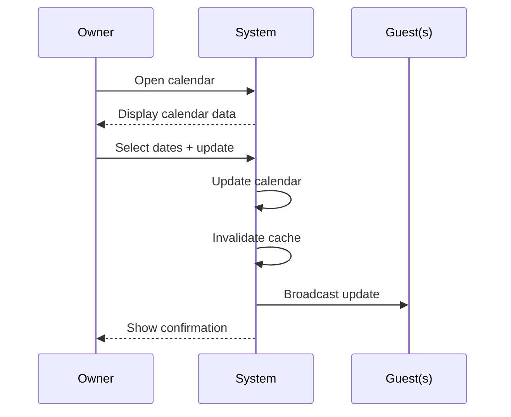

# UC-O03: Update Calendar

| Field | Description |
|-------|-------------|
| **Use Case Name** | Update Calendar |
| **Created By** | Product Team |
| **Created Date** | 2026-01-25 |
| **Last Updated By** | Product Team |
| **Last Updated Date** | 2026-01-25 |
| **Summary** | Owner manages availability and pricing for specific dates. Bulk update and season pricing supported. Changes sync in real-time to guests. |
| **Dependency** | UC-O02 (Manage Listings) |
| **Actors** | Primary: Owner Secondary: Guests (see real-time updates) |
| **Preconditions** | Owner authenticated. Listing selected. Calendar data loaded. |
| **Trigger** | Owner opens calendar for a listing |
| **Main Sequence** | 1. Owner opens calendar for a listing 2. System displays calendar with current bookings and availability 3. Owner selects date range to update 4. Owner sets availability (available/unavailable) and/or price 5. Owner saves changes 6. System updates calendar 7. System invalidates cached data for affected dates 8. System broadcasts update to connected guests |
| **Alternative Sequences** | Step 3: If dates have confirmed bookings, System disables editing and shows "Dates with bookings cannot be modified" Step 4: If price below minimum, System shows error and enforces minimum price Step 6: If update fails, System rolls back changes and shows error Step 7: If broadcast fails, System logs error but cache invalidation ensures consistency |
| **Postconditions** | Calendar updated. Cache invalidated. Real-time updates sent. Audit log created. |
| **Nonfunctional Requirements** | Real-time updates. Calendar view performance (1 year range). Bulk update API. Audit trail for all changes. |
| **Business Requirements** | BR-021: Dates with confirmed bookings cannot be modified BR-022: Minimum price enforced by platform |
| **Frequency of Use** | Medium |
| **Priority** | Medium |
| **Outstanding Questions** | Advance booking limit? Season pricing templates? |

---

## Sequence Diagram

---

## Black Box Compliance

✅ **COMPLIANT** - All steps describe external interactions only.