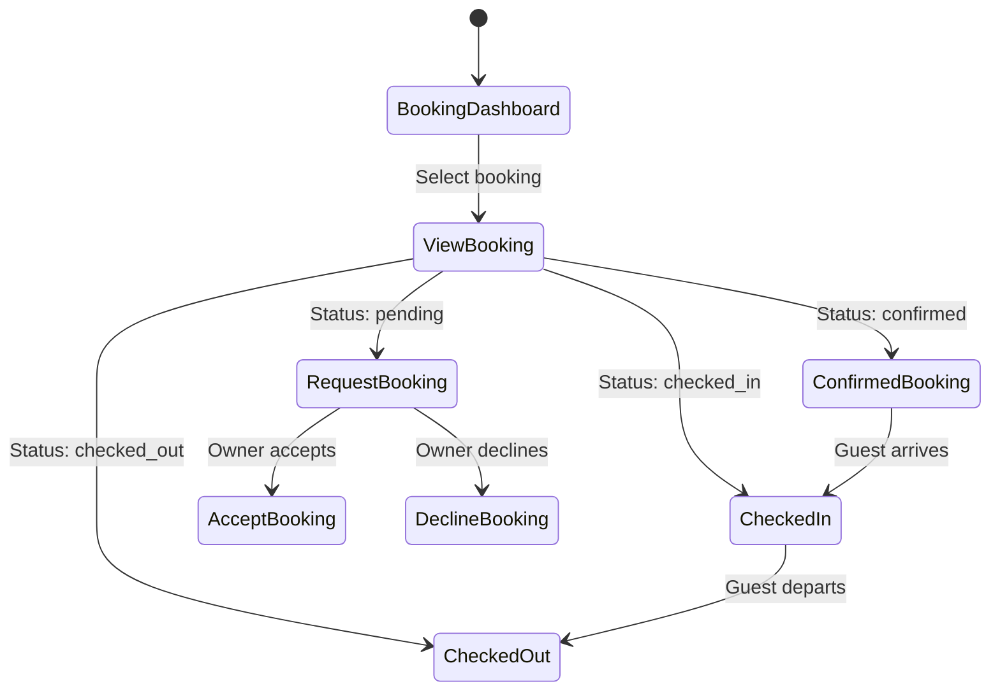

# UC-O04: Manage Bookings (Owner View)

| Field | Description |
|-------|-------------|
| **Use Case Name** | Manage Bookings (Owner View) |
| **Created By** | Product Team |
| **Created Date** | 2026-01-25 |
| **Last Updated By** | Product Team |
| **Last Updated Date** | 2026-01-25 |
| **Summary** | Owner views incoming bookings for their properties, can accept/decline requests, and manages guest communications. |
| **Dependency** | UC-G04 (Process Payment) - bookings created by guests |
| **Actors** | Primary: Owner Secondary: Guest (receives notifications) |
| **Preconditions** | Owner authenticated. Has active listings. |
| **Trigger** | Owner navigates to "Bookings" dashboard |
| **Main Sequence** | 1. Owner navigates to "Bookings" dashboard 2. System displays bookings grouped by status 3. Owner filters by listing, date range, status 4. Owner clicks booking to view details 5. System shows guest info, booking details, available actions 6. Owner may send message to guest 7. Owner may cancel booking (with penalty explanation) |
| **Alternative Sequences** | Step 2: If no bookings, System displays empty state with "No bookings yet" Step 5: If request booking (approval required), System shows "Accept" / "Decline" buttons Step 5: If instant booking, System shows confirmed status Step 6: If message sent, System delivers to guest Step 7: If cancelled by owner, System requires reason, notifies guest, processes refund |
| **Postconditions** | Booking status updated. Guest notified. Calendar updated (if cancelled). Analytics updated. |
| **Nonfunctional Requirements** | Real-time booking notifications. Message inbox integration. Cancellation policy enforcement. Export booking data (CSV). |
| **Business Requirements** | BR-023: Owner cancellations require reason and penalty explanation BR-024: Guest messages must be delivered within 1 minute |
| **Frequency of Use** | High |
| **Priority** | High |
| **Outstanding Questions** | Approval flow vs instant booking? Owner cancellation penalties? |

---

## Sequence Diagram

---

## Black Box Compliance

✅ **COMPLIANT** - All steps describe external interactions only.