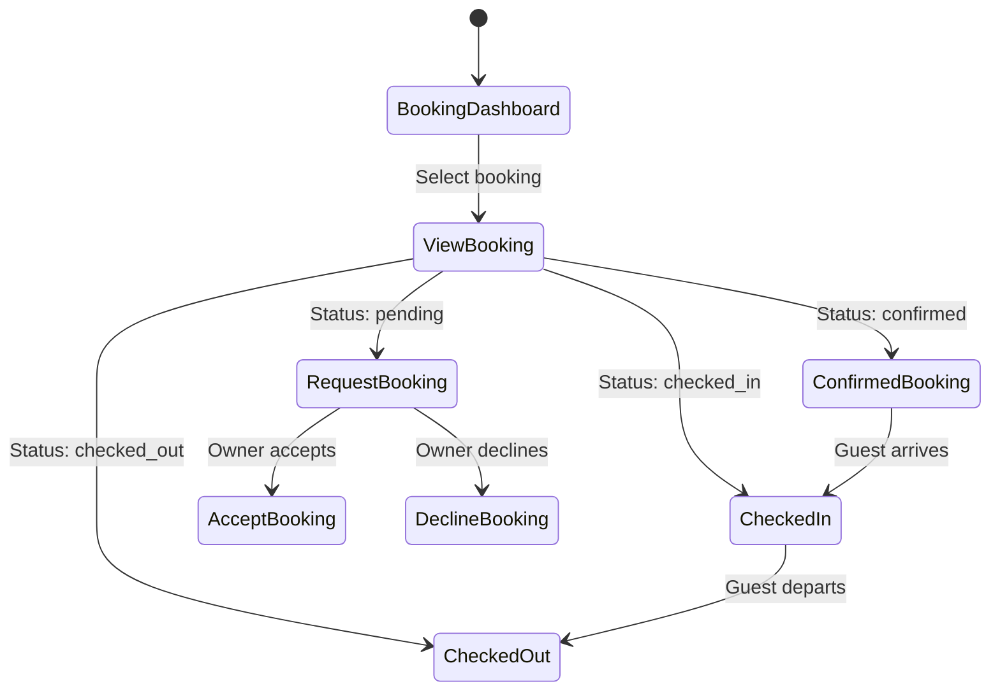

# UC-O04: Manage Bookings (Owner View)

| Field | Description |
|-------|-------------|
| **Use Case Name** | Manage Bookings (Owner View) |
| **Created By** | Product Team |
| **Created Date** | 2026-01-25 |
| **Last Updated By** | Product Team |
| **Last Updated Date** | 2026-01-25 |
| **Summary** | Owner views incoming bookings for their properties, can accept/decline requests, and manages guest communications. |
| **Dependency** | UC-G04 (Process Payment) - bookings created by guests |
| **Actors** | Primary: Owner<br>Secondary: Guest (receives notifications) |
| **Preconditions** | Owner authenticated. Has active listings. |
| **Trigger** | Owner navigates to "Bookings" dashboard |
| **Main Sequence** | 1. Owner navigates to "Bookings" dashboard<br>2. System displays bookings grouped by status<br>3. Owner filters by listing, date range, status<br>4. Owner clicks booking to view details<br>5. System shows guest info, booking details, available actions<br>6. Owner may send message to guest<br>7. Owner may cancel booking (with penalty explanation) |
| **Alternative Sequences** | Step 2: If no bookings, System displays empty state with "No bookings yet"<br>Step 5: If request booking (approval required), System shows "Accept" / "Decline" buttons<br>Step 5: If instant booking, System shows confirmed status<br>Step 6: If message sent, System delivers to guest<br>Step 7: If cancelled by owner, System requires reason, notifies guest, processes refund |
| **Postconditions** | Booking status updated. Guest notified. Calendar updated (if cancelled). Analytics updated. |
| **Nonfunctional Requirements** | Real-time booking notifications. Message inbox integration. Cancellation policy enforcement. Export booking data (CSV). |
| **Business Requirements** | BR-023: Owner cancellations require reason and penalty explanation<br>BR-024: Guest messages must be delivered within 1 minute |
| **Frequency of Use** | High |
| **Priority** | High |
| **Outstanding Questions** | Approval flow vs instant booking? Owner cancellation penalties? |

---

## Sequence Diagram



---

## Black Box Compliance

✅ **COMPLIANT** - All steps describe external interactions only.

---

## Boundary Objects

| Boundary Object | Description | Data Elements |
|----------------|-------------|---------------|
| **BookingListOwner** | Owner's booking list | bookings[], totalCount, filters, statusCounts |
| **BookingDetailsOwner** | Owner's booking view | bookingId, guestInfo, listingDetails, dates, pricing, status, messages[] |
| **BookingAction** | Available owner action | actionType (accept/decline/cancel), reason, penaltyInfo |
| **GuestMessage** | Message to guest | message, threadId, sentAt |
| **BookingDecision** | Accept/decline decision | bookingId, decision, reason, responseToGuest |

---

## Internal Software Objects

| Internal Object | Responsibility |
|-----------------|---------------|
| **BookingService** | Manages booking CRUD for owners |
| **BookingApprovalService** | Handles accept/decline flow |
| **CancellationService** | Processes owner cancellations |
| **GuestMessagingService** | Manages owner-guest messaging |
| **RefundService** | Calculates and processes refunds |
| **CancellationPolicyService** | Enforces cancellation penalties |
| **NotificationService** | Notifies guests of changes |
| **BookingRepository** | Queries owner's bookings |
| **AnalyticsService** | Updates booking analytics |
| **AuditLogService** | Logs booking state changes |

---

## Message Communication Sequence

### View Bookings Flow

```
Owner → System: ViewBookings (HTTP GET /api/owner/bookings)
    ↓
System → BookingRepository: Query owner's bookings
    ← bookings[]
System → BookingService: Enrich with guest/listing data
    ← enrichedBookings[]
System → Owner: BookingListOwner (HTTP 200)
```

### Accept Booking Flow

```
Owner → System: AcceptBooking (HTTP POST /api/owner/bookings/:id/accept)
    ↓
System → BookingRepository: Get booking
    ← booking (status: pending)
System → BookingApprovalService: Process acceptance
    ↓
System → BookingRepository: Update status (confirmed)
    ← Updated
System → NotificationService: Notify guest
    ← Queued
System → AuditLogService: Log acceptance
    ← Logged
System → Owner: BookingDecision (HTTP 200)
```

### Decline Booking Flow

```
Owner → System: DeclineBooking (HTTP POST /api/owner/bookings/:id/decline)
    ↓
System → BookingApprovalService: Process decline
    ↓
System → BookingRepository: Update status (declined)
    ← Updated
System → AvailabilityService: Release availability
    ← Released
System → NotificationService: Notify guest (with reason)
    ← Queued
System → RefundService: Process full refund
    ← Refunded
System → Owner: BookingDecision (HTTP 200)
```

### Cancel Booking Flow

```
Owner → System: CancelBooking (HTTP POST /api/owner/bookings/:id/cancel)
    ↓
System → CancellationPolicyService: Calculate penalty
    ← penaltyAmount
System → Owner: Show confirmation (penalty)
Owner → System: ConfirmCancellation
    ↓
System → CancellationService: Process with penalty
    ↓
System → BookingRepository: Update status (cancelled)
    ← Updated
System → RefundService: Refund guest (partial if penalty)
    ← RefundId
System → AvailabilityService: Release dates
    ← Released
System → NotificationService: Notify guest
    ← Queued
System → AuditLogService: Log cancellation
    ← Logged
System → Owner: CancellationConfirmation (HTTP 200)
```

### WebSocket: Real-time Booking Updates

```
Guest → System: Complete payment
    ↓
System → WebSocket: Broadcast booking.confirmed
Owner viewing dashboard ← System: NewBooking notification
```

---

## Expanded Alternative Sequences

### Step 4: Request vs Instant Booking
| Condition | System Response | Recovery |
|-----------|-----------------|----------|
| Request booking (approval required) | Show "Accept/Decline" buttons | 24h response window |
| Instant booking | Show "Confirmed" status | No action needed |
| Auto-approving property | Auto-accept | Notification sent |

### Step 5: Owner Cancellation Penalties
| Condition | System Response | Recovery |
|-----------|-----------------|----------|
| >24h before check-in | Warning: "Full refund required" | Show penalty amount |
| 24h before check-in | Error: "Too late to cancel" | Contact support option |
| Extenuating circumstances | Allow with justification | Flag for admin review |
| Habitual canceller | Warning: "Account at risk" | Show policy link |

### Step 6: Messaging Failures
| Condition | System Response | Recovery |
|-----------|-----------------|----------|
| Message not delivered | Queue for retry | "Sending..." indicator |
| Guest blocked owner | Error: "Unable to message" | Contact support option |
| Rate limit exceeded | "Try again later" | Cooldown timer |
| Message flagged for review | Hold for moderation | Notify when sent |

### Step 7: Concurrent Actions
| Condition | System Response | Recovery |
|-----------|-----------------|----------|
| Guest cancelled simultaneously | Merge state changes | Refresh to see final state |
| Admin suspended booking | Override owner action | Show admin action notice |
| Payment dispute opened | Block owner actions | "Under review" status |