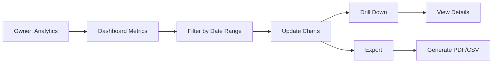

# UC-O05: View Analytics

| Field | Description |
|-------|-------------|
| **Use Case Name** | View Analytics |
| **Created By** | Product Team |
| **Created Date** | 2026-01-25 |
| **Last Updated By** | Product Team |
| **Last Updated Date** | 2026-01-25 |
| **Summary** | Owner accesses dashboard with key metrics: occupancy rate, revenue, booking trends, guest ratings, and top-performing listings. |
| **Dependency** | UC-O02 (Manage Listings) - requires listing data |
| **Actors** | Primary: Owner |
| **Preconditions** | Owner authenticated. Has booking history data. |
| **Trigger** | Owner navigates to "Analytics" |
| **Main Sequence** | 1. Owner navigates to "Analytics" 2. System displays dashboard with key metrics (cards) 3. Owner views charts: revenue over time, occupancy rate, booking sources 4. Owner filters by date range, listing 5. Owner drills down into specific metrics 6. System updates charts with filtered data |
| **Alternative Sequences** | Step 2: If no data available, System displays "No analytics data yet" with onboarding tips Step 5: If export requested, System generates CSV/PDF report for download |
| **Postconditions** | Analytics viewed. Export generated (if requested). |
| **Nonfunctional Requirements** | Chart rendering < 2s. Data aggregation efficiency. Export to PDF/CSV. Mobile-responsive dashboard. |
| **Business Requirements** | BR-025: Analytics data updated daily BR-026: Export limited to owner's own data |
| **Frequency of Use** | Medium |
| **Priority** | Medium |
| **Outstanding Questions** | Real-time vs daily aggregated data? Comparison to market averages? |

---

## Sequence Diagram

---

## Black Box Compliance

✅ **COMPLIANT** - All steps describe external interactions only.