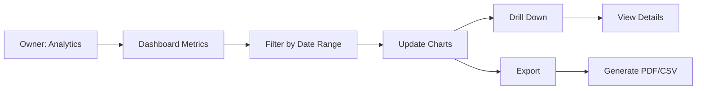

# UC-O05: View Analytics

| Field | Description |
|-------|-------------|
| **Use Case Name** | View Analytics |
| **Created By** | Product Team |
| **Created Date** | 2026-01-25 |
| **Last Updated By** | Product Team |
| **Last Updated Date** | 2026-01-25 |
| **Summary** | Owner accesses dashboard with key metrics: occupancy rate, revenue, booking trends, guest ratings, and top-performing listings. |
| **Dependency** | UC-O02 (Manage Listings) - requires listing data |
| **Actors** | Primary: Owner |
| **Preconditions** | Owner authenticated. Has booking history data. |
| **Trigger** | Owner navigates to "Analytics" |
| **Main Sequence** | 1. Owner navigates to "Analytics"<br>2. System displays dashboard with key metrics (cards)<br>3. Owner views charts: revenue over time, occupancy rate, booking sources<br>4. Owner filters by date range, listing<br>5. Owner drills down into specific metrics<br>6. System updates charts with filtered data |
| **Alternative Sequences** | Step 2: If no data available, System displays "No analytics data yet" with onboarding tips<br>Step 5: If export requested, System generates CSV/PDF report for download |
| **Postconditions** | Analytics viewed. Export generated (if requested). |
| **Nonfunctional Requirements** | Chart rendering < 2s. Data aggregation efficiency. Export to PDF/CSV. Mobile-responsive dashboard. |
| **Business Requirements** | BR-025: Analytics data updated daily<br>BR-026: Export limited to owner's own data |
| **Frequency of Use** | Medium |
| **Priority** | Medium |
| **Outstanding Questions** | Real-time vs daily aggregated data? Comparison to market averages? |

---

## Sequence Diagram



---

## Black Box Compliance

✅ **COMPLIANT** - All steps describe external interactions only.

---

## Boundary Objects

| Boundary Object | Description | Data Elements |
|----------------|-------------|---------------|
| **AnalyticsDashboard** | Dashboard data | kpiCards[], chartData[], dateRange, filters |
| **KPICard** | Single KPI display | metric, value, change, changeType (increase/decrease) |
| **ChartData** | Chart data points | series[], labels[], type (line/bar/pie) |
| **AnalyticsFilter** | Filter options | dateRange, listingIds, bookingStatus |
| **ExportRequest** | Export request | format, dateRange, includedMetrics |

---

## Internal Software Objects

| Internal Object | Responsibility |
|-----------------|---------------|
| **AnalyticsService** | Aggregates owner analytics |
| **BookingAnalyticsService** | Calculates booking metrics |
| **RevenueService** | Computes revenue data |
| **OccupancyService** | Calculates occupancy rates |
| **RatingService** | Aggregates review ratings |
| **ExportService** | Generates PDF/CSV exports |
| **AnalyticsRepository** | Queries analytics data |
| **CacheService** | Caches aggregated data (1-hour TTL) |
| **ScheduledReportService** | Manages automated reports |

---

## Message Communication Sequence

### View Analytics Flow

```
Owner → System: ViewAnalytics (HTTP GET /api/owner/analytics)
    ↓
System → CacheService: Check cache
    ← CacheMiss
System → AnalyticsRepository: Query data
    ← rawData
System → BookingAnalyticsService: Calculate booking metrics
    ← bookingMetrics
System → RevenueService: Calculate revenue
    ← revenueData
System → OccupancyService: Calculate occupancy
    ← occupancyData
System → RatingService: Aggregate ratings
    ← ratingData
System → AnalyticsService: Assemble dashboard
    ← dashboard
System → CacheService: Cache response
    ← Cached
System → Owner: AnalyticsDashboard (HTTP 200)
```

### Filter Update Flow

```
Owner → System: ApplyFilters (HTTP POST /api/owner/analytics/filter)
    ↓
System → CacheService: Invalidate old cache
System → AnalyticsRepository: Query with filters
    ← filteredData
System → AnalyticsService: Recalculate metrics
    ← dashboard
System → Owner: AnalyticsDashboard (HTTP 200)
```

### Export Flow

```
Owner → System: ExportAnalytics (HTTP POST /api/owner/analytics/export)
    ↓
System → ExportService: Generate PDF/CSV
    ← fileUrl
System → Owner: ExportResponse (HTTP 200)
    ↓
Owner → System: DownloadFile (HTTP GET fileUrl)
System → Owner: File download
```

---

## Expanded Alternative Sequences

### Step 2: No Data Available
| Condition | System Response | Recovery |
|-----------|-----------------|----------|
| New property, no bookings | Empty state with onboarding tips | "Complete your first booking" message |
| Date range outside history | "No data for selected period" | Suggest available date range |
| All bookings cancelled/pending | No metrics to show | "Waiting for completed stays" message |
| Cache timeout during load | Show loading indicator | Retry automatically |

### Step 5: Export Failures
| Condition | System Response | Recovery |
|-----------|-----------------|----------|
| PDF generation timeout | Retry with smaller date range | "Try shorter period" suggestion |
| File size too large | Compress or split | Multiple files option |
| Storage quota exceeded | Error: "Export quota reached" | Cleanup old exports |
| Format not supported | Default to CSV | "Format changed" notice |

### Data Accuracy States
| Condition | System Response | Recovery |
|-----------|-----------------|----------|
| Real-time mode selected | Switch to live queries | "Updated just now" badge |
| Cached data shown | Display "Last updated X min ago" | Refresh button available |
| Data pending aggregation | Show "Updating..." | Background refresh |
| Discrepancy detected | Flag for review | "Data may be incomplete" warning |