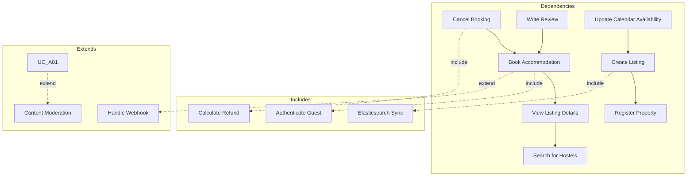

# Software Requirements Specification (SRS)
## Hostel Management System

**Version:** 1.1 (COMET BA critical fixes applied)
**Date:** 2026-01-25
**Status:** Draft
**Compliance:** IEEE 830-1998 Standard

---

## Table of Contents

1. [Introduction](#1-introduction)
2. [Overall Description](#2-overall-description)
3. [Functional Requirements](#3-functional-requirements)
4. [Non-Functional Requirements](#4-non-functional-requirements)
5. [External Interface Requirements](#5-external-interface-requirements)
6. [System Attributes](#6-system-attributes)
7. [Other Requirements](#7-other-requirements)

---

## 1. Introduction

### 1.1 Purpose

This Software Requirements Specification (SRS) document describes the functional and non-functional requirements for the Hostel Management System - a multi-tenant hostel booking and management platform designed for the Vietnam market.

### 1.2 Scope

The system enables:
- **Guests** to search, book, and review hostel accommodations
- **Owners** to register properties, manage listings, update availability, and view analytics
- **Admins** to approve listings, manage users, configure payments, and handle disputes

The platform supports:
- Multi-tenant architecture (single database, logical isolation)
- Bilingual interface (English/Vietnamese)
- Vietnam-specific payment gateways (VNPAY, Ngân Lượng, MoMo)
- Real-time availability management via WebSocket
- Elasticsearch-powered search with geospatial queries

### 1.3 Definitions, Acronyms, Abbreviations

| Term | Definition |
|------|------------|
| SRS | Software Requirements Specification |
| UC | Use Case |
| NFR | Non-Functional Requirement |
| ES | Elasticsearch |
| RDBMS | Relational Database Management System |
| WS | WebSocket |
| MQ | Message Queue |
| CDN | Content Delivery Network |

### 1.4 References

- IEEE Std 830-1998: IEEE Recommended Practice for Software Requirements Specifications
- Design Guidelines: `docs/design-guidelines.md`
- Use Case Specifications: `docs/use-cases/uc-guest.md`, `docs/use-cases/uc-owner.md`, `docs/use-cases/uc-admin.md`
- Non-Functional Requirements: `docs/non-functional-requirements.md`

### 1.5 Overview

Section 2 describes the system's overall functionality and actors. Section 3 details all functional requirements organized by actor type. Section 4 specifies non-functional requirements using Planguage notation. Section 5 defines external interfaces. Sections 6-7 cover system attributes and other constraints.

---

## 2. Overall Description

### 2.1 Product Perspective

The Hostel Management System is a **web-based multi-tenant platform** consisting of:

```
┌─────────────────────────────────────────────────────────────┐
│                      Presentation Layer                      │
│  ┌─────────────────────┐  ┌──────────────────────────────┐ │
│  │   Guest Website     │  │   Owner/Admin Dashboard      │ │
│  │   (Next.js 15)      │  │   (Next.js 15)               │ │
│  └─────────────────────┘  └──────────────────────────────┘ │
├─────────────────────────────────────────────────────────────┤
│                      Application Layer                       │
│  ┌─────────────────────────────────────────────────────────┐ │
│  │              NestJS API Gateway                         │ │
│  │  (REST API + WebSocket Gateway + Microservices)         │ │
│  └─────────────────────────────────────────────────────────┘ │
├─────────────────────────────────────────────────────────────┤
│                       Data Layer                             │
│  ┌──────┐  ┌──────┐  ┌──────┐  ┌──────┐  ┌──────┐        │
│  │ MySQL│  │  ES  │  │Redis │  │Rabbit│  │  S3  │        │
│  └──────┘  └──────┘  └──────┘  └──────┘  └──────┘        │
└─────────────────────────────────────────────────────────────┘
```

### 2.2 Product Functions

| Function | Description | Priority |
|----------|-------------|----------|
| Search & Discovery | Elasticsearch-based hostel search with filters | High |
| Booking Management | End-to-end booking flow with payment | High |
| Calendar Management | Real-time availability via WebSocket | High |
| Property Management | CRUD operations for properties/listings | Medium |
| User Management | Authentication, authorization, profiles | High |
| Review System | Guest reviews with moderation | Medium |
| Analytics | Business metrics dashboard | Medium |
| Admin Panel | Platform administration | Medium |

### 2.3 User Characteristics

| Actor | Description | Technical Skill |
|-------|-------------|-----------------|
| **Guest** | Travelers seeking hostel accommodations in Vietnam | Low to Medium |
| **Owner** | Hostel property managers | Medium |
| **Admin** | Platform administrators | High |

### 2.4 Constraints

| Constraint | Description |
|------------|-------------|
| **Multi-tenancy** | Single database, tenant isolation via `tenant_id` |
| **Deployment** | Self-hosted on AWS EC2 (Vietnam region) |
| **Payment** | Vietnam-specific gateways only (VNPAY, Ngân Lượng, MoMo) |
| **Language** | Bilingual support (EN/VI) required |
| **Compliance** | PCI DSS for payment handling, Vietnam data residency |

### 2.5 Assumptions and Dependencies

| Assumption/Dependency | Description |
|-----------------------|-------------|
| **Network** | Stable internet connectivity in target regions |
| **Payment Gateways** | API availability of Vietnam payment providers |
| **CDN** | AWS CloudFront for image delivery |
| **Maps** | Google Maps API or Vietnam-specific alternative |
| **SMS/Email** | Third-party notification services available |

---

## 3. Functional Requirements

This section specifies all functional requirements using the COMET methodology. See `docs/use-cases/` for detailed use case specifications.

### 3.1 Actor Summary

| Actor ID | Name | Type | Description |
|----------|------|------|-------------|
| ACT-001 | Guest | Human | Travelers booking accommodations |
| ACT-002 | Owner | Human | Property managers |
| ACT-003 | Admin | Human | Platform administrators |
| ACT-004 | Payment Gateway | External System | Vietnam payment providers |
| ACT-005 | Elasticsearch | External System | Search engine |

**Note:** WebSocket Server and Notification Service are internal components, not external actors. See system architecture documentation.

### 3.2 Guest Use Cases

#### UC-G01: Search Hostels
| Requirement | Statement |
|-------------|-----------|
| **FR-G01-01** | System SHALL allow guests to search by location, check-in/out dates, and guest count |
| **FR-G01-02** | System SHALL provide filters for price range, room type, amenities, and rating |
| **FR-G01-03** | System SHALL return search results within 500ms (p95) |
| **FR-G01-04** | System SHALL support geospatial search (radius-based) |
| **FR-G01-05** | System SHALL cache search results in Redis (5min TTL) |
| **FR-G01-06** | System SHALL display pagination (20 listings per page) |
| **FR-G01-07** | System SHALL validate check-out date is after check-in date |

#### UC-G02: View Listing Details
| Requirement | Statement |
|-------------|-----------|
| **FR-G02-01** | System SHALL display listing title, description, location, amenities |
| **FR-G02-02** | System SHALL display photo gallery (max 20 images, optimized via CDN) |
| **FR-G02-03** | System SHALL show availability calendar for selected dates |
| **FR-G02-04** | System SHALL display all verified reviews with ratings |
| **FR-G02-05** | System SHALL show pricing breakdown (base rate, fees, taxes) |
| **FR-G02-06** | System SHALL return 404 for inactive/unapproved listings |
| **FR-G02-07** | System SHALL increment view count asynchronously |

#### UC-G03: Book Accommodation
| Requirement | Statement |
|-------------|-----------|
| **FR-G03-01** | System SHALL require guest authentication before booking confirmation |
| **FR-G03-02** | System SHALL acquire distributed lock via Redis for selected dates |
| **FR-G03-03** | System SHALL create booking record with status `pending_payment` |
| **FR-G03-04** | System SHALL reserve availability in calendar service |
| **FR-G03-05** | System SHALL display price breakdown before confirmation |
| **FR-G03-06** | System SHALL release lock after 15 minutes if payment incomplete |
| **FR-G03-07** | System SHALL prevent double-booking via distributed lock |
| **FR-G03-08** | System SHALL support VNPAY, Ngân Lượng, MoMo payment gateways |
| **FR-G03-09** | System SHALL use idempotency keys for payment requests |
| **FR-G03-10** | System SHALL verify webhook signatures before processing |
| **FR-G03-11** | System SHALL update booking to `confirmed` on successful payment |
| **FR-G03-12** | System SHALL update booking to `payment_failed` on failure |
| **FR-G03-13** | System SHALL send confirmation email/SMS on success |
| **FR-G03-14** | System SHALL process webhooks within 5 seconds |

#### UC-G04: Cancel Booking
| Requirement | Statement |
|-------------|-----------|
| **FR-G04-01** | System SHALL display all bookings grouped by status |
| **FR-G04-02** | System SHALL allow cancellation within policy limits |
| **FR-G04-03** | System SHALL calculate refund amount based on timing |
| **FR-G04-04** | System SHALL notify owner on guest cancellation |
| **FR-G04-05** | System SHALL update calendar availability on cancellation |
| **FR-G04-06** | System SHALL show booking history with pagination |

#### UC-G05: Write Review
| Requirement | Statement |
|-------------|-----------|
| **FR-G05-01** | System SHALL allow one review per completed booking |
| **FR-G05-02** | System SHALL require rating (1-5 stars) and text (min 50 chars) |
| **FR-G05-03** | System SHALL allow up to 5 photos per review |
| **FR-G05-04** | System SHALL set review status to `pending_moderation` by default |
| **FR-G05-05** | System SHALL flag profanity for moderation |
| **FR-G05-06** | System SHALL update listing rating on approved review |

#### UC-G06: Save to Wishlist
| Requirement | Statement |
|-------------|-----------|
| **FR-G06-01** | System SHALL allow adding/removing listings to wishlist |
| **FR-G06-02** | System SHALL use optimistic UI updates |
| **FR-G06-03** | System SHALL persist wishlist for authenticated guests |
| **FR-G06-04** | System SHALL store wishlist in localStorage for guests |
| **FR-G06-05** | System SHALL limit wishlist to 100 items |
| **FR-G06-06** | System SHALL show current prices on wishlist page |

### 3.3 Owner Use Cases

#### UC-O01: Register Property
| Requirement | Statement |
|-------------|-----------|
| **FR-O01-01** | System SHALL require owner verification before property submission |
| **FR-O01-02** | System SHALL validate property address (Vietnam provinces) |
| **FR-O01-03** | System SHALL allow up to 10 property images |
| **FR-O01-04** | System SHALL create property with status `pending_approval` |
| **FR-O01-05** | System SHALL notify admin on new property submission |
| **FR-O01-06** | System SHALL detect potential duplicate properties |

#### UC-O02: Create Listing
| Requirement | Statement |
|-------------|-----------|
| **FR-O02-01** | System SHALL require approved property before listing creation |
| **FR-O02-02** | System SHALL allow up to 20 images per listing |
| **FR-O02-03** | System SHALL sync listing to Elasticsearch on save |
| **FR-O02-04** | System SHALL validate pricing (min/max enforcement) |
| **FR-O02-05** | System SHALL allow listing deactivation (soft delete) |
| **FR-O02-06** | System SHALL queue sync retry if Elasticsearch fails |

#### UC-O03: Update Calendar Availability
| Requirement | Statement |
|-------------|-----------|
| **FR-O03-01** | System SHALL display calendar with existing bookings |
| **FR-O03-02** | System SHALL prevent editing dates with confirmed bookings |
| **FR-O03-03** | System SHALL validate minimum price enforcement |
| **FR-O03-04** | System SHALL invalidate Redis cache on calendar update |
| **FR-O03-05** | System SHALL broadcast changes via WebSocket |
| **FR-O03-06** | System SHALL support bulk date range updates |
| **FR-O03-07** | System SHALL maintain audit trail of all changes |

#### UC-O04: View Booking Requests
| Requirement | Statement |
|-------------|-----------|
| **FR-O04-01** | System SHALL display bookings for owner's properties only |
| **FR-O04-02** | System SHALL group bookings by status |
| **FR-O04-03** | System SHALL allow owner cancellation with justification |
| **FR-O04-04** | System SHALL show guest contact details for confirmed bookings |
| **FR-O04-05** | System SHALL support booking status export (CSV) |

#### UC-O05: View Property Analytics
| Requirement | Statement |
|-------------|-----------|
| **FR-O05-01** | System SHALL display occupancy rate by date range |
| **FR-O05-02** | System SHALL show revenue trends with breakdown |
| **FR-O05-03** | System SHALL display guest rating averages |
| **FR-O05-04** | System SHALL allow filtering by listing and date range |
| **FR-O05-05** | System SHALL support export to PDF/CSV |
| **FR-O05-06** | System SHALL render charts within 2 seconds |

### 3.4 Admin Use Cases

#### UC-A01: Approve Property Listing
| Requirement | Statement |
|-------------|-----------|
| **FR-A01-01** | System SHALL display queue of `pending_approval` items |
| **FR-A01-02** | System SHALL allow approve/reject with reason |
| **FR-A01-03** | System SHALL sync to Elasticsearch on approval |
| **FR-A01-04** | System SHALL notify owner of approval decision |
| **FR-A01-05** | System SHALL enforce 48-hour review SLA |
| **FR-A01-06** | System SHALL maintain audit trail |

#### UC-A02: Suspend User Account
| Requirement | Statement |
|-------------|-----------|
| **FR-A02-01** | System SHALL display user list with search and filters |
| **FR-A02-02** | System SHALL allow user suspension with reason and duration |
| **FR-A02-03** | System SHALL allow permanent user ban with justification |
| **FR-A02-04** | System SHALL support account verification/unverification |
| **FR-A02-05** | System SHALL email users on status changes |
| **FR-A02-06** | System SHALL show user activity log |

#### UC-A03: Configure Payment Gateway
| Requirement | Statement |
|-------------|-----------|
| **FR-A03-01** | System SHALL support multiple payment gateway configs |
| **FR-A03-02** | System SHALL encrypt API credentials at rest |
| **FR-A03-03** | System SHALL provide connection test functionality |
| **FR-A03-04** | System SHALL allow commission rate configuration (%) |
| **FR-A03-05** | System SHALL log all configuration changes |
| **FR-A03-06** | System SHALL support test/production modes |

#### UC-A04: View System Analytics
| Requirement | Statement |
|-------------|-----------|
| **FR-A04-01** | System SHALL display platform-wide KPIs |
| **FR-A04-02** | System SHALL show business metrics (bookings, revenue) |
| **FR-A04-03** | System SHALL show user metrics (growth, active users) |
| **FR-A04-04** | System SHALL show technical metrics (response times, errors) |
| **FR-A04-05** | System SHALL allow date range and region filtering |
| **FR-A04-06** | System SHALL support scheduled reports via email |

#### UC-A05: Resolve Dispute
| Requirement | Statement |
|-------------|-----------|
| **FR-A05-01** | System SHALL display open disputes with priority |
| **FR-A05-02** | System SHALL allow evidence file uploads |
| **FR-A05-03** | System SHALL support refund rulings: guest, owner, split |
| **FR-A05-04** | System SHALL process refunds via payment gateway |
| **FR-A05-05** | System SHALL notify both parties of decision |
| **FR-A05-06** | System SHALL enforce 24h response, 72h resolution SLA |

### 3.5 Use Case Relationships



---

## 4. Non-Functional Requirements

All NFRs specified using **Planguage** notation.

### 4.1 Performance Requirements

| NFR ID | Statement | Scale | Target | Min | Max |
|--------|-----------|-------|--------|-----|-----|
| **NFR-P01** | Search response time | p95 latency | < 500ms | - | 2s |
| **NFR-P02** | Listing page load | p95 latency | < 2s | - | 5s |
| **NFR-P03** | Booking creation | p95 latency | < 1s | - | 3s |
| **NFR-P04** | Calendar update propagation | real-time | < 500ms | - | 2s |
| **NFR-P05** | Concurrent search users | throughput | 1000 | 500 | - |
| **NFR-P06** | Payment webhook timeout | timeout | < 5s | - | 10s |
| **NFR-P07** | API rate limit per user | requests/min | 60 | 30 | - |

### 4.2 Security Requirements

| NFR ID | Statement |
|--------|-----------|
| **NFR-S01** | All sensitive data (passwords, API keys) stored encrypted at rest |
| **NFR-S02** | HTTPS enforced for all endpoints (TLS 1.3+) |
| **NFR-S03** | JWT tokens with 15-minute access token expiry |
| **NFR-S04** | JWT refresh tokens with 7-day expiry stored in Redis |
| **NFR-S05** | Webhook signatures verified for all payment callbacks |
| **NFR-S06** | No credit card data stored (PCI DSS compliance) |
| **NFR-S07** | SQL injection prevention via parameterized queries |
| **NFR-S08** | XSS prevention via input sanitization and CSP headers |
| **NFR-S09** | CSRF protection for state-changing operations |
| **NFR-S10** | Multi-tenant isolation enforced at application layer |

### 4.3 Availability Requirements

| NFR ID | Statement | Scale | Target | Min |
|--------|-----------|-------|--------|-----|
| **NFR-A01** | Platform uptime | monthly % | 99.9% | 99.5% |
| **NFR-A02** | API endpoint uptime | monthly % | 99.9% | 99% |
| **NFR-A03** | Database uptime | monthly % | 99.95% | 99.9% |
| **NFR-A04** | Payment gateway availability | monthly % | 99.9% | - |
| **NFR-A05** | Max downtime incident | hours | 4 | - |

### 4.4 Usability Requirements

| NFR ID | Statement |
|--------|-----------|
| **NFR-U01** | Bilingual support (English/Vietnamese) |
| **NFR-U02** | WCAG 2.1 AA compliance minimum |
| **NFR-U03** | Mobile-responsive design (320px+) |
| **NFR-U04** | Vietnamese diacritics support in all text inputs |
| **NFR-U05** | Optimistic UI updates for better perceived performance |
| **NFR-U06** | Inline validation for all forms |
| **NFR-U07** | Loading states for async operations > 500ms |

### 4.5 Reliability Requirements

| NFR ID | Statement | Scale | Target | Min |
|--------|-----------|-------|--------|-----|
| **NFR-R01** | Zero double-bookings | incidents/year | 0 | - |
| **NFR-R02** | Payment success rate | % | 99% | 95% |
| **NFR-R03** | Elasticsearch sync success | % | 99.9% | 99% |
| **NFR-R04** | Email delivery success | % | 98% | 95% |
| **NFR-R05** | WebSocket connection uptime | % | 99% | 95% |

### 4.6 Scalability Requirements

| NFR ID | Statement | Scale | Target |
|--------|-----------|-------|--------|
| **NFR-SC01** | Max concurrent users | users | 10,000 |
| **NFR-SC02** | Max listings in system | count | 100,000 |
| **NFR-SC03** | Max bookings per day | count | 50,000 |
| **NFR-SC04** | Database storage growth | GB/month | 50 |
| **NFR-SC05** | Horizontal scaling support | mode | Active-Active |

### 4.7 Maintainability Requirements

| NFR ID | Statement |
|--------|-----------|
| **NFR-M01** | Code coverage minimum: 80% |
| **NFR-M02** | TypeScript strict mode enabled |
| **NFR-M03** | API documentation (OpenAPI 3.0) |
| **NFR-M04** | Comprehensive audit logging |
| **NFR-M05** | Centralized error tracking (ELK) |
| **NFR-M06** | Deployment without downtime |

### 4.8 Data Integrity Requirements

| NFR ID | Statement |
|--------|-----------|
| **NFR-D01** | ACID compliance for all transactions |
| **NFR-D02** | Referential integrity enforced |
| **NFR-D03** | Idempotent payment operations |
| **NFR-D04** | Atomic booking creation with lock |
| **NFR-D05** | Database backup daily (30-day retention) |

---

## 5. External Interface Requirements

### 5.1 User Interfaces

**Design System:** See `docs/design-guidelines.md`

- **Color System:** Primary blue (#3B82F6), Secondary gold (#F59E0B)
- **Typography:** Lexend (headings) + Source Sans 3 (body)
- **Responsive:** Mobile-first, 320px base
- **Accessibility:** WCAG 2.1 AA

### 5.2 Hardware Interfaces

| Interface | Specification |
|-----------|---------------|
| **Mobile** | iOS 13+, Android 8+ |
| **Desktop** | Chrome 90+, Firefox 88+, Safari 14+ |
| **Screen** | Min 320px width, 1024px recommended |

### 5.3 Software Interfaces

#### 5.3.1 Payment Gateway APIs

**VNPAY:**
- REST API v2.1
- Methods: Create Payment, Query Transaction, Refund
- Callback: POST webhook with signature verification

**Ngân Lượng:**
- SOAP API
- Methods: SetExpressCheckout, GetTransactionDetails
- Callback: POST notification

**MoMo:**
- REST API v2
- Methods: Create Payment, Confirm Transaction
- Callback: POST webhook

#### 5.3.2 Elasticsearch

- Version: 8.x
- Indices: `listings`, `locations`, `amenities`
- Query: Multi-match, geospatial, aggregations

#### 5.3.3 AWS S3 + CloudFront

- S3: Image storage, presigned URLs
- CloudFront: CDN distribution, signed URLs
- Lifecycle: Glacier after 90 days

### 5.4 Communication Interfaces

#### 5.4.1 WebSocket

**Endpoint:** `wss://api.hostelvn.com/ws`

**Events:**
```typescript
// Client → Server
{ type: 'subscribe_calendar', listingId: string }
{ type: 'ping' }

// Server → Client
{ type: 'calendar_updated', listingId: string, data: CalendarData }
{ type: 'booking_created', listingId: string, bookingId: string }
{ type: 'pong' }
```

#### 5.4.2 RabbitMQ

**Exchanges:**
- `bookings` (topic) - Booking lifecycle events
- `notifications` (fanout) - Email/SMS notifications
- `payments` (direct) - Payment processing

### 5.5 Data Formats

**API Response (JSON):**
```json
{
  "success": true,
  "data": { ... },
  "meta": {
    "page": 1,
    "perPage": 20,
    "total": 100
  },
  "errors": null
}
```

**Error Response (JSON):**
```json
{
  "success": false,
  "data": null,
  "meta": null,
  "errors": [
    {
      "code": "VALIDATION_ERROR",
      "message": "Invalid date range",
      "field": "checkOut"
    }
  ]
}
```

---

## 6. System Attributes

### 6.1 Reliability

See [Section 4.5](#45-reliability-requirements)

### 6.2 Availability

See [Section 4.3](#43-availability-requirements)

### 6.3 Security

See [Section 4.2](#42-security-requirements)

### 6.4 Maintainability

See [Section 4.7](#47-maintainability-requirements)

### 6.5 Portability

| Attribute | Requirement |
|-----------|-------------|
| **Deployment** | Docker containerization |
| **Environment** | Development, Staging, Production |
| **Cloud** | AWS EC2 (Vietnam region: ap-southeast-1) |
| **Database** | MySQL 8.0 (self-hosted) |

---

## 7. Other Requirements

### 7.1 Legal Requirements

| Requirement | Description |
|-------------|-------------|
| **Data Privacy** | Vietnam Cybersecurity Law compliance |
| **Payment** | State Bank of Vietnam regulations |
| **Consumer Protection** | Vietnam e-commerce transaction laws |
| **Hosting** | Data residency in Vietnam |
| **GDPR** | Optional EU user data handling |

### 7.2 Regulatory Compliance

| Standard | Compliance |
|----------|------------|
| **PCI DSS** | Level 4 (no card data stored) |
| **ISO 27001** | Target for Phase 2 |
| **SOC 2** | Not required (B2B2C model) |

### 7.3 Documentation Requirements

| Document | Status |
|----------|--------|
| API Documentation | OpenAPI 3.0 |
| User Manual | Video tutorials + FAQ |
| Admin Guide | Internal wiki |
| Runbook | Incident response procedures |

### 7.4 Migration Requirements

| Requirement | Description |
|-------------|-------------|
| **Data Import** | CSV bulk import for initial listings |
| **User Migration** | OAuth providers (Google, Facebook) |
| **Legacy Support** | None (greenfield project) |

---

## Appendix A: Requirements Traceability Matrix

| Use Case | FR Count | NFR Count | Dependencies |
|----------|----------|-----------|--------------|
| UC-G01: Search for Hostels | 7 | 3 | ES, Redis |
| UC-G02: View Listing Details | 7 | 2 | S3, MySQL |
| UC-G03: Book Accommodation | 14 | 4 | Redis, MySQL, Payment Gateway |
| UC-G04: Cancel Booking | 6 | 1 | MySQL |
| UC-G05: Write Review | 6 | 1 | MySQL |
| UC-G06: Save to Wishlist | 6 | 0 | MySQL, Redis |
| UC-O01: Register Property | 6 | 0 | S3, MySQL |
| UC-O02: Create Listing | 6 | 2 | ES, MySQL |
| UC-O03: Update Calendar Availability | 7 | 3 | Redis, WS |
| UC-O04: View Booking Requests | 5 | 0 | MySQL |
| UC-O05: View Property Analytics | 6 | 1 | MySQL |
| UC-A01: Approve Property Listing | 6 | 0 | ES, MySQL |
| UC-A02: Suspend User Account | 6 | 0 | MySQL |
| UC-A03: Configure Payment Gateway | 6 | 1 | Encrypted storage |
| UC-A04: View System Analytics | 6 | 0 | ELK |
| UC-A05: Resolve Dispute | 6 | 1 | MySQL, Payment |

**Totals:** 16 Use Cases, 100 Functional Requirements, 21 Non-Functional Requirements

---

## Appendix B: Glossary

| Term | Definition |
|------|------------|
| **Booking** | Reservation of accommodation for specific dates |
| **Listing** | Individual room/accommodation type under a property |
| **Property** | Physical hostel location with multiple listings |
| **Tenant** | Logical isolation unit for multi-tenancy |
| **Lock** | Redis-based distributed lock for preventing double-booking |
| **Webhook** | HTTP callback from payment gateway |
| **Optimistic UI** | Immediate UI update before server confirmation |

---

## Appendix C: Change History

| Version | Date | Author | Changes |
|---------|------|--------|---------|
| 1.0 | 2026-01-25 | System | Initial SRS creation |

---

**Document Status:** Draft
**Next Review:** 2026-02-01
**Approved By:** [Pending]