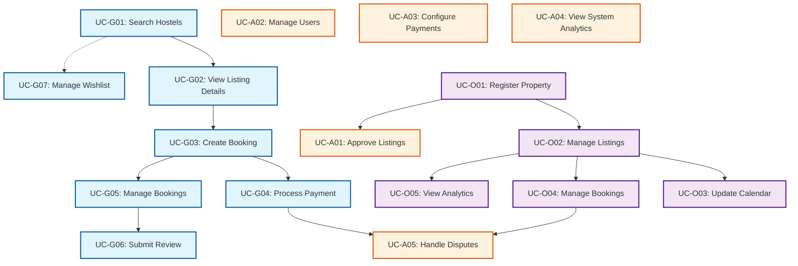

# Use Case Overview

**Project:** Hostel Management System
**Version:** 1.0
**Last Updated:** 2026-01-25
**Total Use Cases:** 17

---

[← Back to Model Index](./index.md)

---

## 1.1 Use Case Summary Table

| ID | Use Case | Actor | Priority | Dependency | Frequency |
|----|----------|-------|----------|------------|-----------|
| **UC-G01** | Search Hostels | Guest | High | None | High |
| **UC-G02** | View Listing Details | Guest | High | G01 | High |
| **UC-G03** | Create Booking | Guest | High | G02 | High |
| **UC-G04** | Process Payment | Guest | High | G03 | High |
| **UC-G05** | Manage Bookings | Guest | High | G03 | High |
| **UC-G06** | Submit Review | Guest | Medium | G05 | Medium |
| **UC-G07** | Manage Wishlist | Guest | Low | G01 | Low |
| **UC-O01** | Register Property | Owner | High | None | Low |
| **UC-O02** | Manage Listings | Owner | High | O01 | High |
| **UC-O03** | Update Calendar | Owner | Medium | O02 | Medium |
| **UC-O04** | Manage Bookings (Owner) | Owner | High | O02 | High |
| **UC-O05** | View Analytics | Owner | Medium | O02 | Medium |
| **UC-A01** | Approve Listings | Admin | High | O01 | Medium |
| **UC-A02** | Manage Users | Admin | High | None | Medium |
| **UC-A03** | Configure Payments | Admin | High | None | Low |
| **UC-A04** | View System Analytics | Admin | Medium | None | Low |
| **UC-A05** | Handle Disputes | Admin | High | G04, O04 | Low |

## 1.2 Actor Definitions

### Primary Actors

| Actor | Description | Goals |
|-------|-------------|-------|
| **Guest** | Unauthenticated or authenticated user searching for accommodations | Find, book, pay for hostels |
| **Owner** | Property manager with hostel listings | Manage properties, bookings, revenue |
| **Admin** | System administrator with platform oversight | Approve content, manage users, configure system |

### Secondary Actors

| Actor | Description | Involved In |
|-------|-------------|-------------|
| **Payment Gateway** | External payment processing (Stripe, PayPal, SePay) | G04 (Process Payment) |
| **Email Service** | Transactional email delivery | All notifications |
| **SMS Service** | SMS notifications (optional) | Critical alerts |

## 1.3 Use Case Dependencies Diagram



## 1.4 Priority Distribution Analysis

| Priority | Guest | Owner | Admin | Total | % |
|----------|-------|-------|-------|-------|---|
| **High** | 6 | 3 | 3 | 12 | 71% |
| **Medium** | 1 | 2 | 2 | 5 | 29% |
| **Low** | 1 | 0 | 0 | 1 | 6% |
| **Total** | 7 | 5 | 5 | 17 | 100% |

### Key Insights

- **71% of use cases are high priority** (MVP focused)
- **Guest-facing use cases have highest priority** (customer acquisition)
- **Owner management is critical** (supply side)
- **Admin use cases support platform operations**

## 1.5 Use Case Grouping by Actor

### Guest Use Cases (7)

**High Priority (6):**
- UC-G01: Search Hostels
- UC-G02: View Listing Details
- UC-G03: Create Booking
- UC-G04: Process Payment
- UC-G05: Manage Bookings

**Medium Priority (1):**
- UC-G06: Submit Review

**Low Priority (1):**
- UC-G07: Manage Wishlist

### Owner Use Cases (5)

**High Priority (3):**
- UC-O01: Register Property
- UC-O02: Manage Listings
- UC-O04: Manage Bookings

**Medium Priority (2):**
- UC-O03: Update Calendar
- UC-O05: View Analytics

### Admin Use Cases (5)

**High Priority (3):**
- UC-A01: Approve Listings
- UC-A02: Manage Users
- UC-A03: Configure Payments

**Medium Priority (2):**
- UC-A04: View System Analytics
- UC-A05: Handle Disputes

## 1.6 Use Case Flow Sequences

### Guest Booking Flow

```
Search (G01) → View Details (G02) → Create Booking (G03)
    ↓
Process Payment (G04) → Manage Bookings (G05) → Submit Review (G06)
```

**Independent:** Wishlist (G07) - can be accessed anytime

### Owner Property Setup Flow

```
Register Property (O01) → Manage Listings (O02) → Update Calendar (O03)
                                    ↓
                            Manage Bookings (O04)
                                    ↓
                            View Analytics (O05)
```

### Admin Approval Flow

```
Register Property (O01) → Approve Listings (A01)
```

**Independent:** All other admin use cases

## 1.7 Cross-Actor Interactions

### Owner ↔ Guest

- **G03 (Create Booking)** creates booking → **O04 (Manage Bookings)** owner views
- **G06 (Submit Review)** submitted → Owner notified
- **O02 (Manage Listings)** updates → **G01/G02** see changes

### Admin ↔ Owner

- **O01 (Register Property)** submitted → **A01 (Approve Listings)** admin reviews
- **A02 (Manage Users)** admin actions → Owner account status changes

### Admin ↔ Guest

- **G04 (Process Payment)** disputed → **A05 (Handle Disputes)** admin resolves
- **A02 (Manage Users)** admin actions → Guest account status changes

---

**Next:** [Boundary Object Model](./02-boundary-objects.md)
