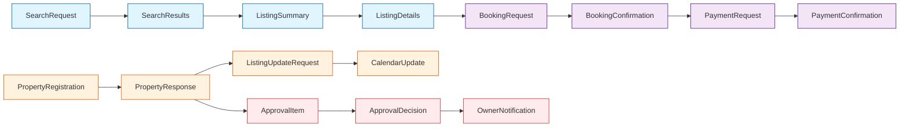

# Boundary Object Model

**Project:** Hostel Management System
**Version:** 1.0
**Last Updated:** 2026-01-25

---

[← Back to Model Index](./index.md)

---

Boundary objects are data structures that cross system boundaries between actors and the system.

## 2.1 Consolidated Boundary Objects Catalog

### Search & Discovery Objects

| Object | Used In | Data Elements |
|--------|---------|---------------|
| **SearchRequest** | G01 | location, checkInDate, checkOutDate, guestCount, priceRange, amenities[], roomType[], rating |
| **SearchResults** | G01 | totalCount, results[], page, pageSize, sortBy, filters |
| **ListingSummary** | G01, G07 | listingId, title, thumbnailUrl, location, basePrice, currency, rating, reviewCount, amenities[], availableStatus |
| **FilterOptions** | G01 | priceRange, locations[], amenityOptions[], roomTypeOptions[], ratingRange |
| **SuggestionItem** | G01 | suggestedLocation, suggestedDates, nearbyListings[] |

### Listing & Property Objects

| Object | Used In | Data Elements |
|--------|---------|---------------|
| **ListingDetails** | G02 | listingId, title, description, images[], amenities, location, pricing, availability, reviews[], ownerInfo |
| **PropertyRegistration** | O01 | propertyName, address, type, description, images[], contactInfo |
| **PropertyResponse** | O01 | propertyId, status, submittedAt, approvalETA |
| **PropertyImage** | O01, O02 | imageId, url, thumbnailUrl, caption, order |
| **AddressInfo** | O01 | street, ward, district, city, province, coordinates, country |
| **ListingUpdateRequest** | O02 | listingId, updates{} |
| **DuplicateWarning** | O01 | similarPropertyId, similarityScore, matchReasons[] |

### Booking & Availability Objects

| Object | Used In | Data Elements |
|--------|---------|---------------|
| **BookingRequest** | G03 | listingId, roomId, checkInDate, checkOutDate, guestCount, specialRequests |
| **BookingConfirmation** | G03 | bookingId, status, reservationExpiresAt, priceBreakdown |
| **PriceBreakdown** | G03, G04 | basePrice, cleaningFee, serviceFee, taxes, totalPrice, currency |
| **AvailabilityReservation** | G03 | reservationId, roomId, dateRange, expiresAt |
| **GuestDetails** | G03, G05 | guestId, name, email, phone, specialRequests |
| **CheckoutSession** | G03 | sessionId, listingData, dateData, pricingData, expiresAt |
| **CalendarUpdate** | O03 | listingId, dateRange[], availableStatus, pricing |
| **BookingResponse** | G05, O04 | bookingId, status, dates, pricing, guestInfo/ownerInfo |

### Payment Objects

| Object | Used In | Data Elements |
|--------|---------|---------------|
| **PaymentRequest** | G04 | bookingId, amount, currency, paymentMethod, returnUrl |
| **PaymentConfirmation** | G04 | paymentId, transactionId, status, paidAt, gatewayResponse |
| **RefundRequest** | A05, O04 | bookingId, refundAmount, reason |
| **RefundResponse** | A05, O04 | refundId, status, refundAmount, processedAt |

### Review & Rating Objects

| Object | Used In | Data Elements |
|--------|---------|---------------|
| **ReviewSubmission** | G06 | bookingId, rating, comment, images[], tags[] |
| **ReviewResponse** | G06 | reviewId, status, submittedAt, moderationETA |
| **ReviewDisplay** | G02 | reviewId, rating, comment, author, date, verified |

### User Management Objects

| Object | Used In | Data Elements |
|--------|---------|---------------|
| **UserRegistration** | A02, G03 | name, email, phone, password, role |
| **UserUpdate** | A02, O02, G05 | userId, updates{} |
| **UserResponse** | A02 | userId, name, email, role, status, createdAt |
| **AccountSuspension** | A02 | userId, reason, suspendedUntil |

### Analytics Objects

| Object | Used In | Data Elements |
|--------|---------|---------------|
| **AnalyticsRequest** | O05, A04 | dateRange, metrics[], filters |
| **AnalyticsResponse** | O05, A04 | metrics{}, trends[], comparisons |

### Admin Objects

| Object | Used In | Data Elements |
|--------|---------|---------------|
| **ApprovalQueue** | A01 | items[], totalCount, priority, submittedDate |
| **ApprovalItem** | A01 | propertyId/listingId, ownerInfo, images[], status, submittedAt |
| **ApprovalDecision** | A01 | decision (approve/reject), reason, conditions[], effectiveDate |
| **OwnerNotification** | O01, A01 | notificationType, decision, reason, nextSteps |
| **DisputeRequest** | A05 | disputeId, bookingId, type, description, evidence[] |
| **DisputeResolution** | A05 | resolution, actionTaken, compensation |

## 2.2 Object Relationships and Data Flow



## 2.3 Cross-Use Case Object Reuse

### Highly Reusable Objects

| Object | Use Cases | Reuse Count |
|--------|-----------|-------------|
| **ListingSummary** | G01 (search), G07 (wishlist) | 2 |
| **BookingResponse** | G05 (guest view), O04 (owner view) | 2 |
| **UserUpdate** | A02 (admin), O02 (owner profile), G05 (guest profile) | 3 |
| **PriceBreakdown** | G03 (booking), G04 (payment) | 2 |
| **PropertyImage** | O01 (registration), O02 (management) | 2 |

### Shared Data Elements

| Element | Use Case Count | Contexts |
|---------|----------------|----------|
| **location** | 12/17 | Search, listings, properties, analytics |
| **status** | 17/17 | All use cases (booking, payment, property, user) |
| **dates** | 9/17 | Booking, availability, analytics, check-in/out |
| **pricing** | 8/17 | Booking, payment, listing, analytics |
| **userId** | 10/17 | All authenticated operations |
| **images[]** | 4/17 | Property registration, listing details, reviews |

## 2.4 Object Lifecycle Patterns

### Request-Response Pattern

Most boundary objects follow this lifecycle:

```
Request Object → System Processing → Response Object
```

**Examples:**
- SearchRequest → SearchResults
- BookingRequest → BookingConfirmation
- PaymentRequest → PaymentConfirmation
- ReviewSubmission → ReviewResponse

### State Update Pattern

Objects that carry state changes:

```
Update Request → System Processing → Updated Response
```

**Examples:**
- ListingUpdateRequest → ListingResponse
- CalendarUpdate → CalendarResponse
- UserUpdate → UserResponse

### Event Notification Pattern

Objects that carry event data:

```
Event Trigger → Notification Object → Delivery
```

**Examples:**
- BookingConfirmation (to owner)
- ApprovalDecision (to owner)
- PaymentConfirmation (to guest)

---

**Next:** [Internal Object Model](./03-internal-objects.md)
