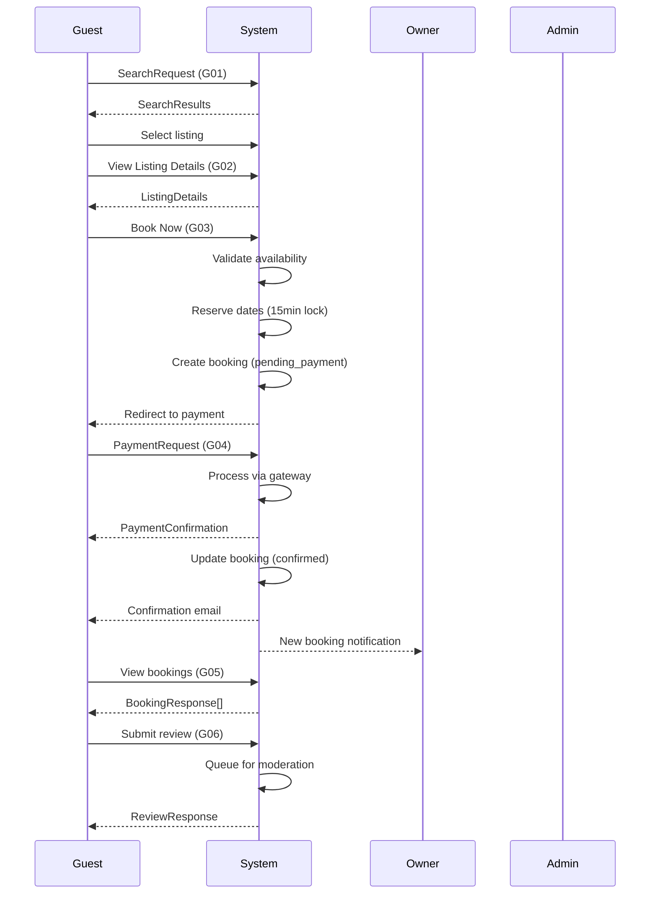
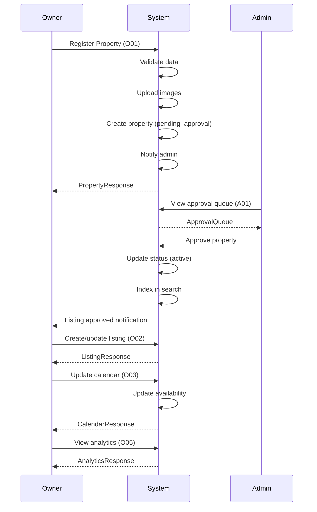
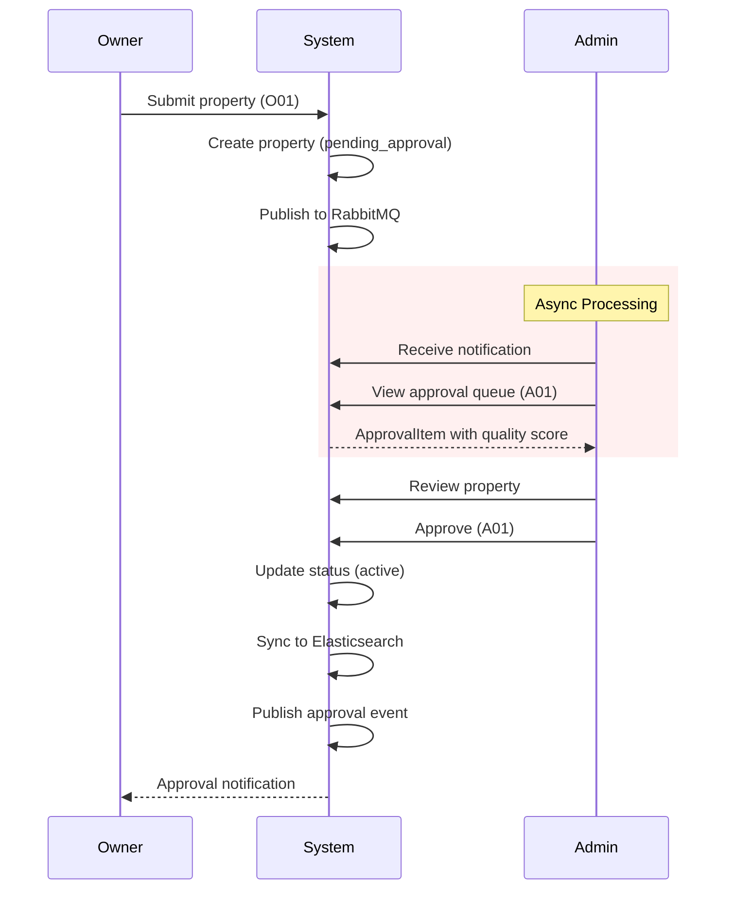
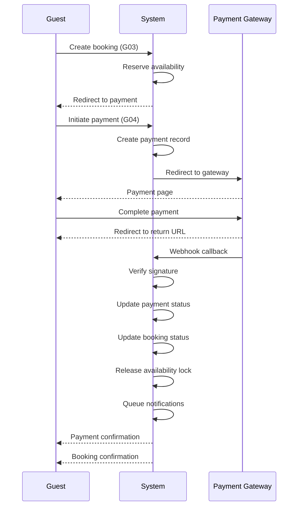

# Sequence Model

**Project:** Hostel Management System
**Version:** 1.0
**Last Updated:** 2026-01-25

---

[← Back to Model Index](./index.md)

---

## 5.1 Core Booking Flow Sequence

The complete guest booking journey from search to review.

### Key State Transitions

1. Search → Selection → Booking Initiation
2. Pending Payment → Confirmed → Completed/Cancelled
3. Completed → Reviewed

### Critical Locks

- Availability lock: 15 minutes (Redis)
- Payment lock: Until gateway response

## 5.2 Property Setup Flow Sequence

Owner journey from property registration to listing management.

### Key State Transitions

1. Draft → Pending Approval → Active/Rejected
2. Active → Listed → Bookable

### Approval SLA

48 hours (A01)

## 5.3 Admin Approval Flow Sequence

### Async Processing

- Property submission → RabbitMQ → Admin notification worker
- Approval decision → RabbitMQ → Search index worker

## 5.4 Payment Processing Flow

### Payment States

1. pending → processing → completed/failed
2. Webhook timeout: 5 minutes
3. Retry on failure: 3 attempts

---

**Next:** [Error Handling Model](./06-error-handling.md)
