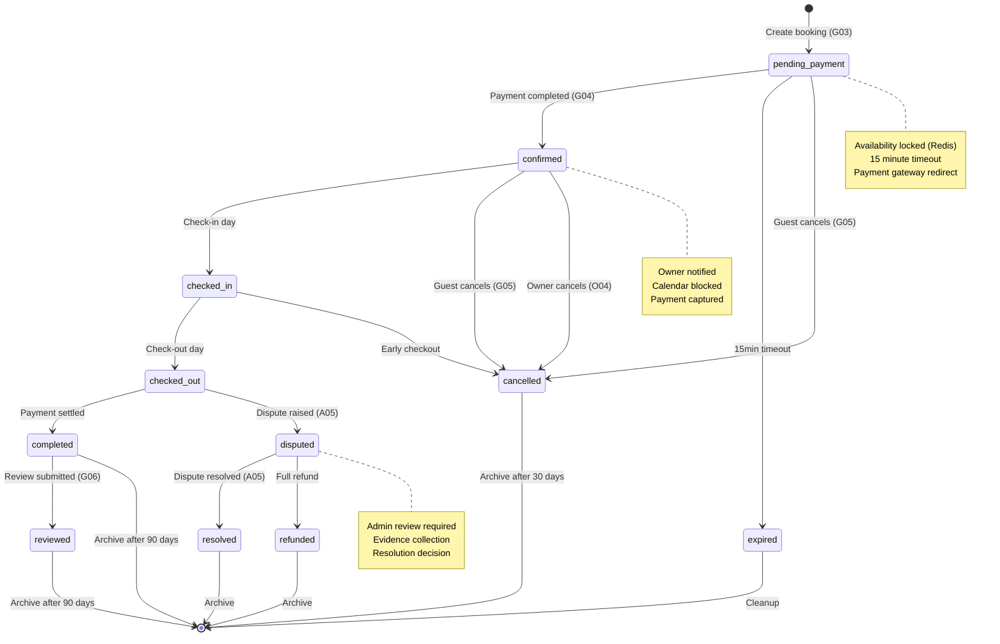
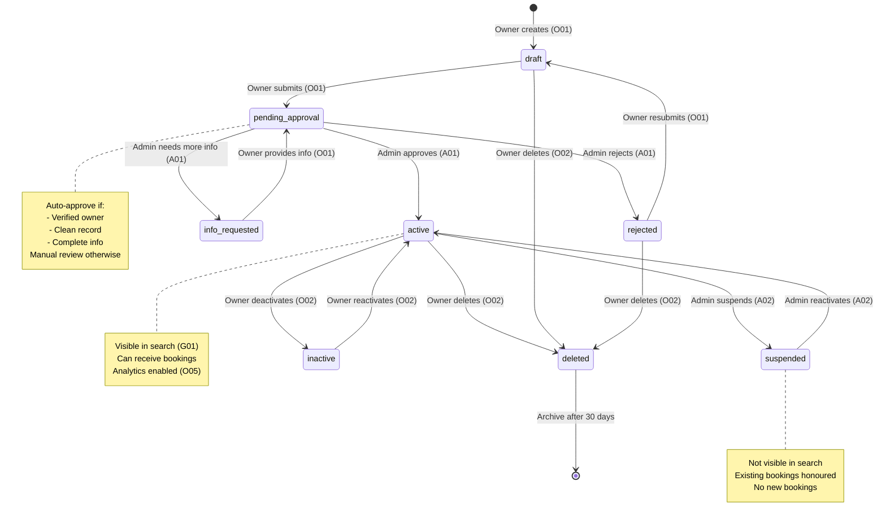
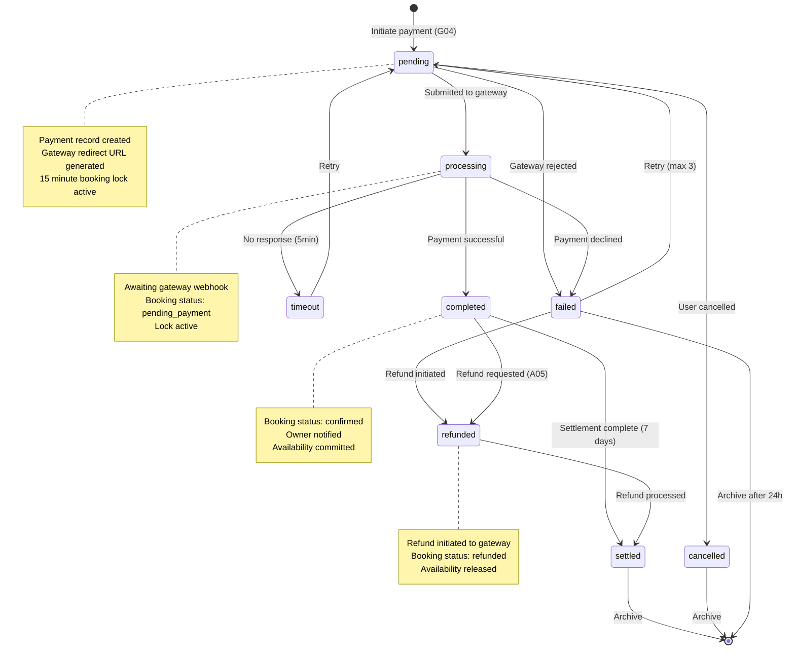
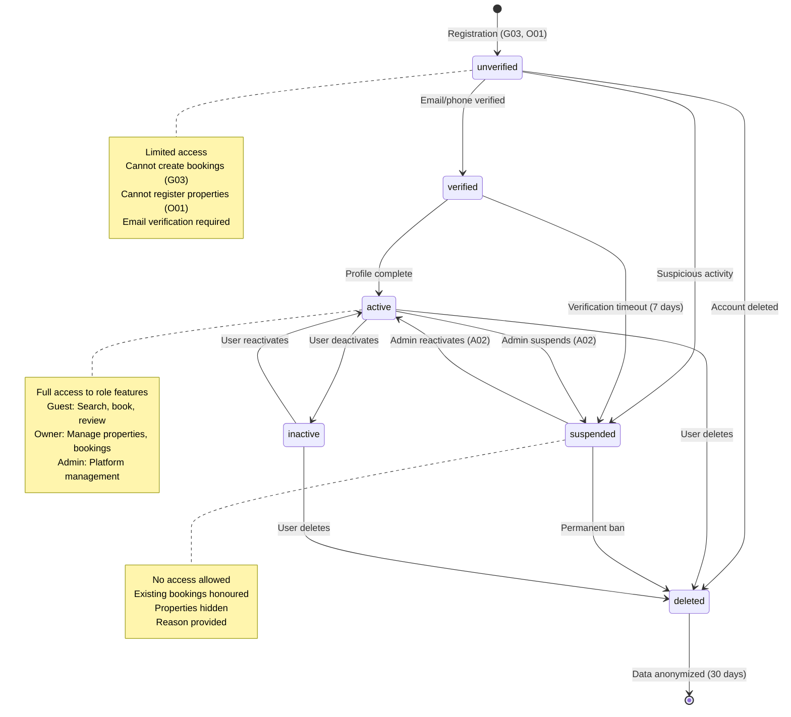

# State Machine Models

**Project:** Hostel Management System
**Version:** 1.0
**Last Updated:** 2026-01-25

---

[← Back to Model Index](./index.md)

---

## 7.1 Booking Lifecycle State Machine

### State Transitions

| From | To | Trigger | Use Case |
|------|-------|---------|----------|
| pending_payment | confirmed | Payment success | G04 |
| pending_payment | expired | 15min timeout | System |
| pending_payment | cancelled | Guest cancels | G05 |
| confirmed | checked_in | Check-in date | System |
| confirmed | cancelled | Guest cancels | G05 |
| confirmed | cancelled | Owner cancels | O04 |
| checked_in | checked_out | Check-out date | System |
| checked_out | completed | Payment settled | System |
| checked_out | disputed | Dispute raised | A05 |
| completed | reviewed | Review submitted | G06 |

### Business Rules

- Full refund if cancelled > 48h before check-in
- 50% refund if cancelled 24-48h before check-in
- No refund if cancelled < 24h before check-in
- Owner can cancel with penalty (100% refund to guest)

## 7.2 Property/Listing State Machine

### State Transitions

| From | To | Trigger | Use Case |
|------|-------|---------|----------|
| draft | pending_approval | Submit for review | O01 |
| pending_approval | active | Admin approval | A01 |
| pending_approval | rejected | Admin rejection | A01 |
| pending_approval | active | Auto-approve | O01 |
| rejected | draft | Resubmit | O01 |
| active | suspended | Admin suspension | A02 |
| active | inactive | Owner deactivation | O02 |
| inactive | active | Owner reactivation | O02 |
| suspended | active | Admin reactivation | A02 |

### Auto-Approval Criteria

- Owner verified (email/phone)
- No prior violations
- Complete property information
- Quality score > 80%

## 7.3 Payment State Machine

### State Transitions

| From | To | Trigger | Timeout |
|------|-------|---------|----------|
| pending | processing | Gateway accepts | N/A |
| pending | failed | Gateway rejects | N/A |
| pending | cancelled | User cancels | 15min |
| processing | completed | Webhook success | 5min |
| processing | failed | Webhook failed | 5min |
| processing | timeout | No webhook | 5min |
| failed | pending | Retry | Immediate |
| completed | refunded | Refund request | N/A |
| completed | settled | Settlement | 7 days |

### Error Handling

- Max retries: 3
- Retry delay: Exponential backoff
- Timeout: 5 minutes for webhook
- Fallback: Manual reconciliation

## 7.4 User Account State Machine

### State Transitions

| From | To | Trigger | Use Case |
|------|-------|---------|----------|
| unverified | verified | Email/phone verified | System |
| unverified | suspended | Suspicious activity | A02 |
| verified | active | Profile complete | System |
| verified | suspended | Verification timeout | System |
| active | suspended | Admin suspension | A02 |
| active | inactive | User deactivation | User |
| suspended | active | Admin reactivation | A02 |
| inactive | active | User reactivation | User |

### Role-Based Access

| State | Guest Access | Owner Access | Admin Access |
|-------|-------------|--------------|--------------|
| unverified | Read-only | None | None |
| verified | Limited | None | None |
| active | Full | Full | Full |
| suspended | None | None | None |
| inactive | None | None | None |

---

[← Back to Model Index](./index.md)
