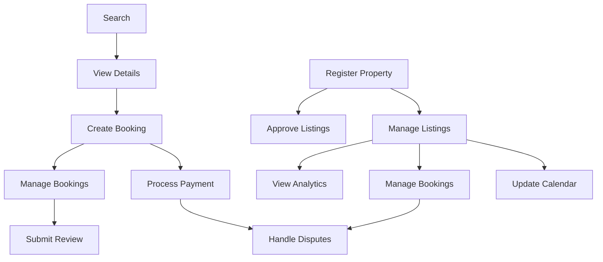

# Use Case Model

**Project:** Hostel Management System
**Version:** 1.0
**Last Updated:** 2026-01-25
**Total Use Cases:** 17

---

## Overview

This document provides a comprehensive model of all 17 use cases for the Hostel Management System, synthesizing boundary objects, internal software objects, message communication patterns, sequence flows, error handling strategies, and state machine models.

## Contents

### Core Model Documents

- **[Use Case Overview](./01-use-case-overview.md)** - Summary table, actor definitions, dependency diagram, priority analysis
- **[Boundary Object Model](./02-boundary-objects.md)** - Consolidated catalog of data structures crossing system boundaries
- **[Internal Object Model](./03-internal-objects.md)** - Service layer, repositories, validators, and adapters
- **[Message Communication Model](./04-message-communication.md)** - HTTP API patterns, WebSocket events, RabbitMQ messaging
- **[Sequence Model](./05-sequence-flows.md)** - Core booking, property setup, admin approval, and payment flows
- **[Error Handling Model](./06-error-handling.md)** - Common error patterns, recovery strategies, fallback mechanisms, SLAs
- **[State Machine Models](./07-state-machines.md)** - Booking lifecycle, property/listing, payment, and user account states

### Quick Reference

| Section | Description | LOC |
|---------|-------------|-----|
| [Use Case Overview](./01-use-case-overview.md) | Summary of all 17 use cases with dependencies | ~150 |
| [Boundary Objects](./02-boundary-objects.md) | 30+ boundary objects with data elements | ~180 |
| [Internal Objects](./03-internal-objects.md) | Services, repositories, validators, adapters | ~150 |
| [Message Communication](./04-message-communication.md) | HTTP APIs, WebSocket, RabbitMQ patterns | ~200 |
| [Sequence Flows](./05-sequence-flows.md) | 4 core sequence diagrams with flows | ~150 |
| [Error Handling](./06-error-handling.md) | Error patterns, recovery, SLAs | ~150 |
| [State Machines](./07-state-machines.md) | 4 state machines with transitions | ~200 |

## Use Case Distribution

```
Guest Use Cases:    7 (6 high, 1 medium, 1 low)
Owner Use Cases:    5 (3 high, 2 medium)
Admin Use Cases:    5 (3 high, 2 medium)
────────────────────────────────────────────
Total:             17 (12 high, 5 medium, 1 low)
```

## Key Model Components

### Boundary Objects (30+ objects)
Data structures crossing system boundaries between actors and the system:
- Search & Discovery: SearchRequest, SearchResults, ListingSummary
- Listing & Property: PropertyRegistration, ListingDetails, AddressInfo
- Booking & Availability: BookingRequest, BookingConfirmation, PriceBreakdown
- Payment: PaymentRequest, PaymentConfirmation, RefundRequest
- Reviews: ReviewSubmission, ReviewResponse, ReviewDisplay
- User Management: UserRegistration, UserUpdate, AccountSuspension
- Analytics: AnalyticsRequest, AnalyticsResponse
- Admin: ApprovalQueue, ApprovalDecision, DisputeRequest

### Internal Software Objects (40+ objects)
Services, repositories, validators, and adapters implementing business logic:
- **Core Services**: SearchService, ListingService, BookingService, PaymentService
- **Repositories**: ListingRepository, BookingRepository, PropertyRepository
- **Validators**: BookingValidator, PaymentValidator, PropertyValidator
- **Adapters**: StripeAdapter, PayPalAdapter, SePayAdapter, EmailAdapter

### Message Communication Patterns
- **HTTP REST**: 40+ endpoints across Guest, Owner, Admin APIs
- **WebSocket**: 10 real-time events for booking, payment, notifications
- **RabbitMQ**: 10 message types with routing keys for async processing

### State Machines (4 machines)
- **Booking Lifecycle**: 12 states from pending_payment to reviewed
- **Property/Listing**: 8 states from draft to deleted
- **Payment**: 10 states from pending to settled
- **User Account**: 7 states from unverified to deleted

### Error Handling (5 patterns)
- Validation errors with inline messages
- Authentication/authorization with redirect/retry
- Resource not found with suggestions
- Concurrency conflicts with retry logic
- Service unavailable with fallback mechanisms

## Use Case Dependencies



## Related Documentation

- [Use Case Specifications](../requirements/use-cases/) - Detailed use case documents
- [System Requirements](../requirements/SRS.md) - Software Requirements Specification
- [System Architecture](../system-architecture.md) - Technical architecture
- [Design Guidelines](../design-guidelines.md) - Design principles and patterns

## Version History

| Version | Date | Changes | Author |
|---------|------|---------|--------|
| 1.0 | 2026-01-25 | Initial comprehensive model | Product Team |

---

**Next:** [Use Case Overview](./01-use-case-overview.md)
