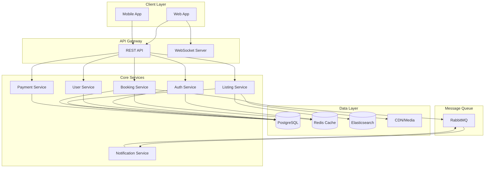
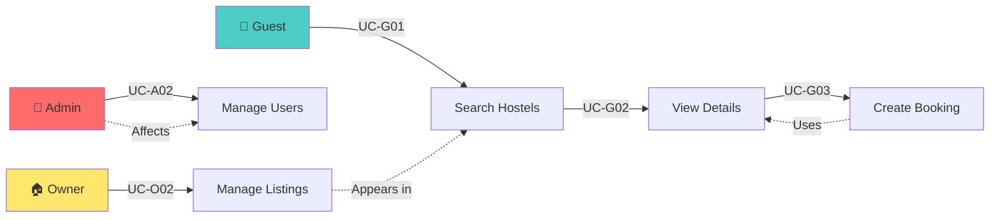
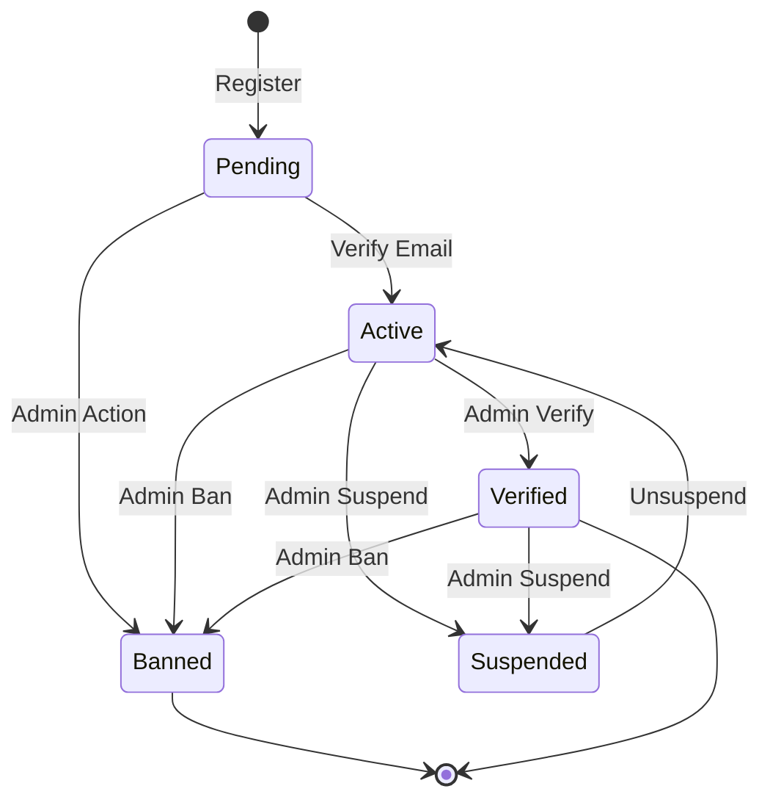
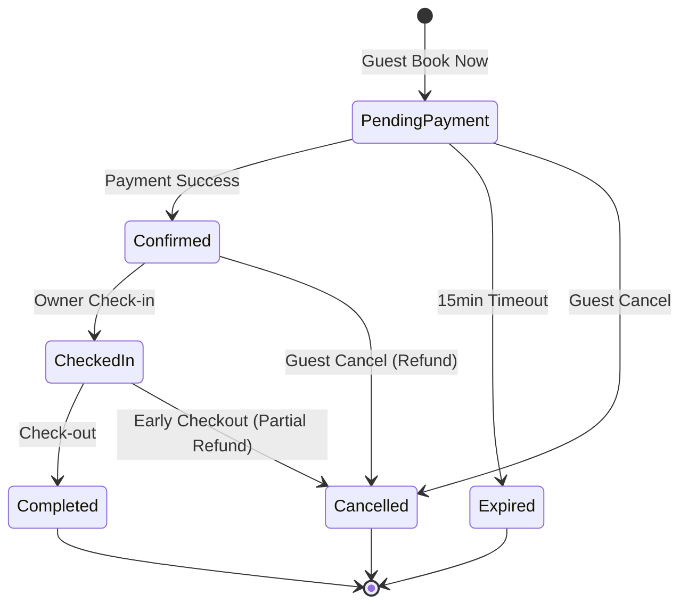
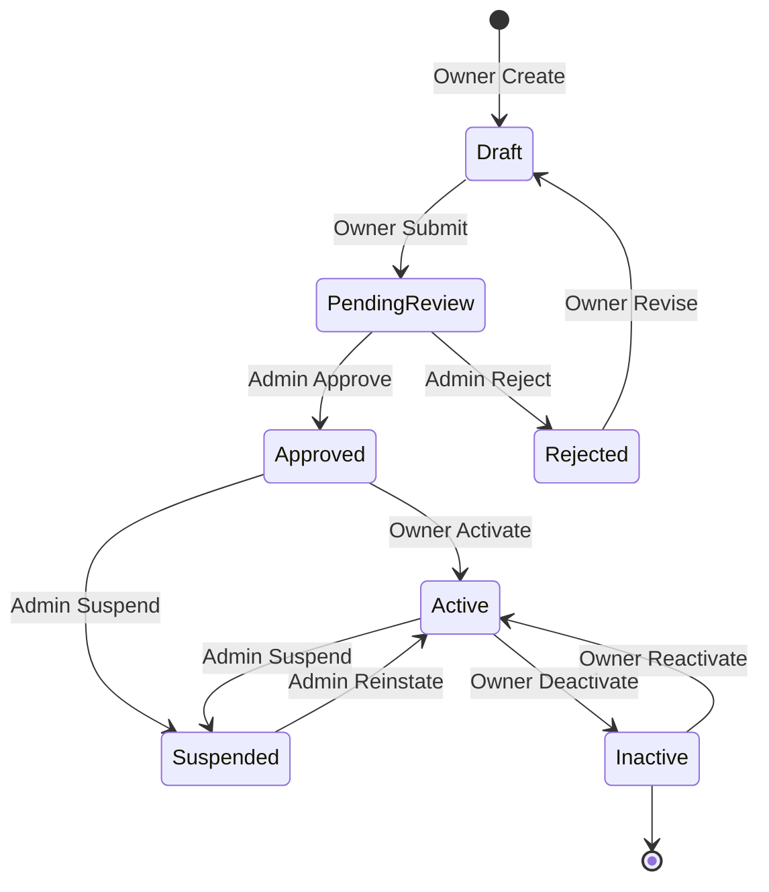
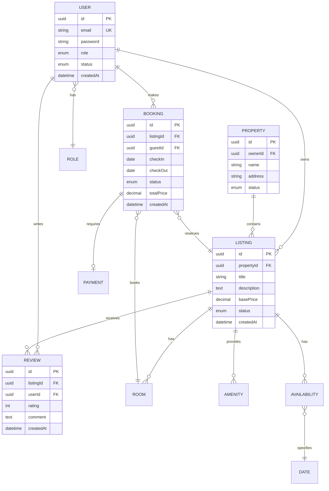
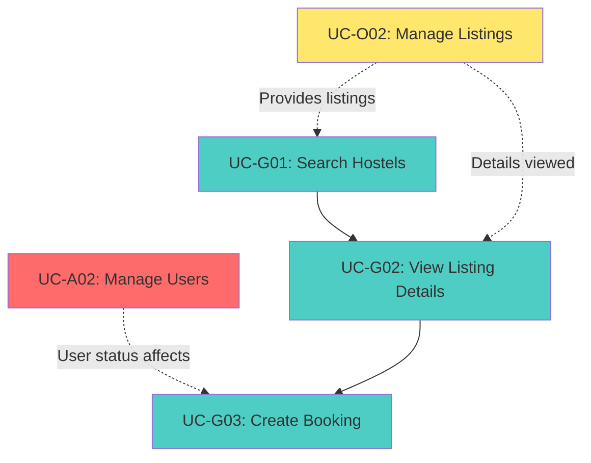
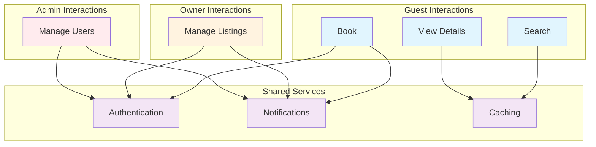
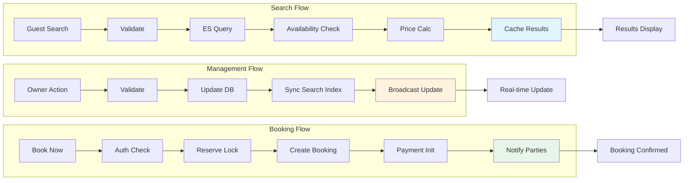

# Hostel Management System - Use Cases Documentation

Comprehensive documentation covering admin, guest, and owner interactions with detailed architectural patterns and implementation specifications.

---

## Key Insights

- **Zero Double-Booking Guarantee**: Distributed locking (Redis) ensures atomic availability reservations
- **15-Minute Booking Window**: Pending payments expire automatically with cleanup scheduler
- **Real-time Availability**: WebSocket broadcasts keep listings synchronized across clients
- **Search Performance**: 500ms p95 response with Elasticsearch + 5-minute cache layer
- **Admin Actions Cascade**: User suspension/ban triggers booking cancellations and token invalidation

---

## Quick Reference: Use Case Overview

| Use Case | Actor | Priority | Frequency | Complexity | Dependencies |
|----------|-------|----------|-----------|------------|--------------|
| **UC-A02**: Manage Users | Admin | High | Medium | High | None |
| **UC-G01**: Search Hostels | Guest | High | High | Medium | UC-G02 |
| **UC-G02**: View Listing Details | Guest | High | High | Medium | UC-G01 |
| **UC-G03**: Create Booking | Guest | High | High | High | UC-G02 |
| **UC-O02**: Manage Listings | Owner | High | Medium | Medium | UC-O01 |

---

## System Architecture Overview

---

## Actor-Role Interactions

---

## Entity State Machines

### User State Machine

### Booking State Machine

### Listing State Machine

---

## Entity Relationships

---

## Contents

### Actor-Specific Use Cases

- **[Admin Use Cases](./admin-use-cases.md)**
  - [UC-A02: Manage Users](./admin-use-cases.md#uc-a02-manage-users) - User management, suspension, banning, verification

- **[Guest Use Cases](./guest-use-cases.md)**
  - [UC-G01: Search Hostels](./guest-use-cases.md#uc-g01-search-hostels) - Search with filters and availability checking
  - [UC-G02: View Listing Details](./guest-use-cases.md#uc-g02-view-listing-details) - Comprehensive listing information display
  - [UC-G03: Create Booking](./guest-use-cases.md#uc-g03-create-booking) - Booking initiation with availability reservation

- **[Owner Use Cases](./owner-use-cases.md)**
  - [UC-O02: Manage Listings](./owner-use-cases.md#uc-o02-manage-listings) - Listing creation, updates, and management

### Cross-Use Case Dependencies

### Component Interaction Overview

---

## Data Flow Architecture

---

## Document Information

- **Document Version**: 2.0 (Enhanced)
- **Last Updated**: 2026-01-29
- **Author**: Product Team
- **Status**: Comprehensive Use Cases Documentation with Architecture Patterns

---

## References

- [System Architecture](../system-architecture.md)
- [Code Standards](../code-standards.md)
- [Project Overview](../project-overview-pdr.md)
- [Codebase Summary](../codebase-summary.md)

---

**Document Purpose**: This document provides comprehensive architectural and implementation specifications for all core use cases, including detailed sequence diagrams with error handling, state machines for entity lifecycle management, entity relationships, and component interaction patterns to support full system implementation and testing.
