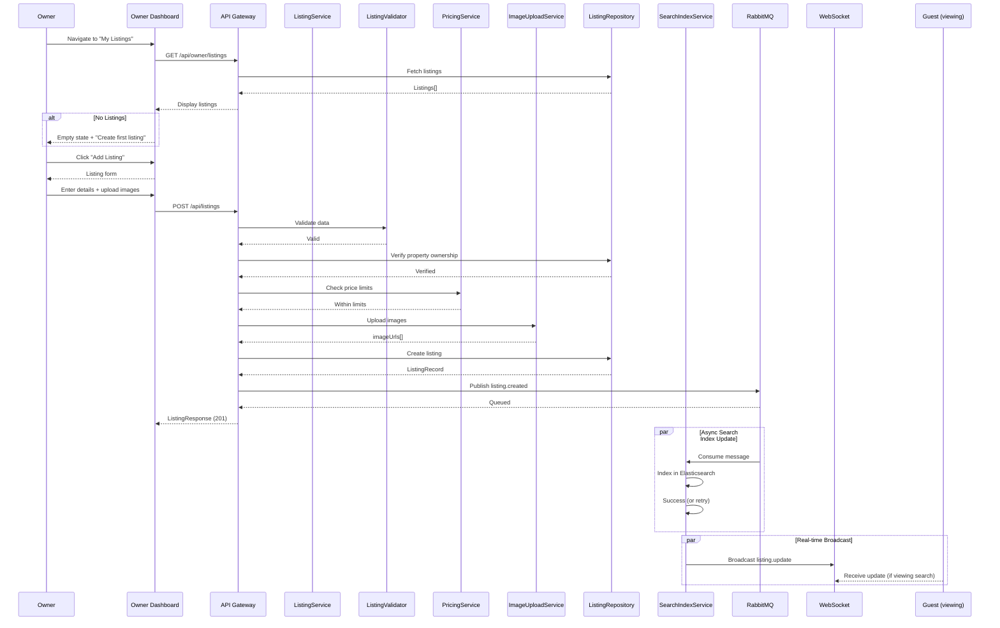

# Owner Use Cases

## UC-O02: Manage Listings

| Field | Description |
|-------|-------------|
| **Use Case Name** | Manage Listings |
| **Created By** | Product Team |
| **Created Date** | 2026-01-25 |
| **Last Updated By** | Product Team |
| **Last Updated Date** | 2026-01-25 |
| **Summary** | Owner creates, updates, and deactivates listings under their approved properties. Each listing has room types, pricing, and amenities. |
| **Dependency** | UC-O01 (Register Property) |
| **Actors** | Primary: Owner |
| **Preconditions** | Owner authenticated. At least one approved property exists. |
| **Trigger** | Owner navigates to "My Listings" |
| **Main Sequence** | 1. Owner navigates to "My Listings"<br>2. System displays all listings with status indicators<br>3. Owner clicks "Add Listing" or selects existing to edit<br>4. Owner enters listing details (room type, capacity, base price, amenities)<br>5. Owner uploads listing images<br>6. Owner saves listing<br>7. System updates listing<br>8. System initializes availability calendar |
| **Alternative Sequences** | Step 2: If no listings, System displays empty state with "Create your first listing" CTA<br>Step 4: If duplicate listing detected, System warns "Similar listing exists"<br>Step 7: If search index update fails, System queues for retry and shows warning to owner<br>Step 8: If calendar initialization fails, System logs error for manual intervention |
| **Postconditions** | Listing created/updated. Search index updated. Calendar initialized. Audit log created. |
| **Nonfunctional Requirements** | Max 20 images per listing. Amenities predefined list. Price validation (min/max). Search index update reliability. |
| **Business Requirements** | BR-019: Room type must match property type<br>BR-020: Pricing must be within platform limits |
| **Frequency of Use** | Medium |
| **Priority** | High |
| **Outstanding Questions** | How many listings per property? Should changes require re-approval? |

### Sequence Diagram



### Boundary Objects

| Boundary Object | Description | Data Elements |
|----------------|-------------|---------------|
| **ListingDetails** | Listing form data | propertyId, title, description, roomType, capacity, basePrice, currency, amenities[] |
| **ListingResponse** | Created/updated listing | listingId, status, searchIndexStatus, updatedAt |
| **ListingImage** | Listing media | imageId, url, order, caption |
| **AmenityItem** | Amenity selection | amenityId, name, category |
| **PriceValidation** | Price constraint check | minPrice, maxPrice, platformLimits |

### Internal Software Objects

| Internal Object | Responsibility |
|-----------------|---------------|
| **ListingService** | Manages listing CRUD operations |
| **ListingValidator** | Validates listing constraints |
| **PricingService** | Validates and enforces price limits |
| **AmenityService** | Manages available amenities |
| **ImageUploadService** | Handles listing image uploads |
| **SearchIndexService** | Syncs listings to Elasticsearch |
| **ListingRepository** | Persists listing records |
| **PropertyRepository** | Verifies property ownership |
| **NotificationService** | Notifies of search index issues |
| **AuditLogService** | Logs listing changes |

### Message Communication Sequence

#### Create/Update Listing Flow
```
Owner → System: CreateListing (HTTP POST /api/listings)
    ↓
System → ListingValidator: Validate data
    ← Valid
System → PropertyRepository: Verify property ownership
    ← Verified
System → PricingService: Check price limits
    ← Within limits
System → ImageUploadService: Upload images
    ← imageUrls[]
System → ListingRepository: Create listing
    ← ListingRecord
System → SearchIndexService: Sync to Elasticsearch
    ← Indexed
System → AuditLogService: Log creation
    ← Logged
System → Owner: ListingResponse (HTTP 201)
```

#### Search Index Sync Flow
```
System → RabbitMQ: Publish listing.created
    ↓
Search Index Worker → SearchIndexService: Index in Elasticsearch
    ← Success (or Failure)
    ↓
If Failure → NotificationService: Alert admins
    ← Alerted
```

### Expanded Alternative Sequences

#### Step 4: Duplicate Detection
| Condition | System Response | Recovery |
|-----------|-----------------|----------|
| Same room type + property | Warning: "Similar listing exists" | Allow with confirmation |
| Same capacity + price range | Warning: "May duplicate existing" | Show existing listing |
| Different property | No warning | Continue normally |

#### Step 7: Search Index Failures
| Condition | System Response | Recovery |
|-----------|-----------------|----------|
| Elasticsearch down | Queue for retry | Listing created, "Pending search" badge |
| Index timeout | Retry in background | Notify when indexed |
| Partial success | Warning: "Some fields not searchable" | Re-sync available |
| Connection lost | Queue in RabbitMQ | Worker will retry |

#### Step 8: Calendar Initialization
| Condition | System Response | Recovery |
|-----------|-----------------|----------|
| Date range invalid | Error: "Invalid date range" | Prompt for valid dates |
| Database constraint | Log error, manual fix | Flag for admin review |
| Async init succeeded | Silent success | Calendar ready |
| Init timeout | Background retry | Notify when ready |

**Related Use Cases**: [UC-G01: Search Hostels](./guest-use-cases.md#uc-g01-search-hostels) (listings appear in search), [UC-G02: View Listing Details](./guest-use-cases.md#uc-g02-view-listing-details) (details displayed)

---

[← Back to Use Cases Index](./index.md)
