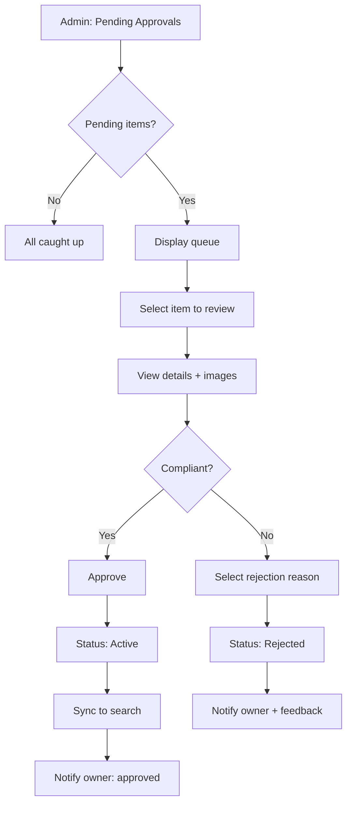
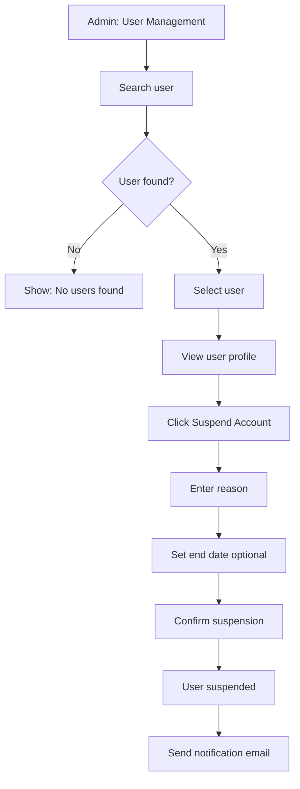
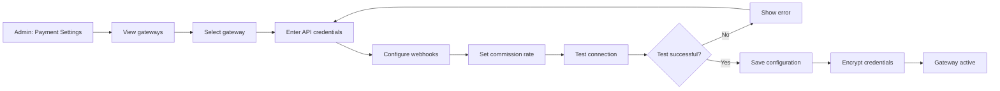
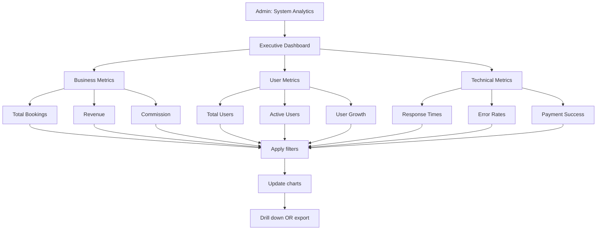

# Admin Use Cases - Detailed Specifications
## Hostel Management System

**Version:** 1.2 (Critical & high priority fixes applied)
**Date:** 2026-01-25
**Methodology:** COMET

---

## Use Case Acceptance Criteria Validation

All use cases pass ALL three COMET criteria:
- **C1:** Provides a useful result to the actor
- **C2:** Is a sequence (multiple steps), not a single action
- **C3:** Treats system as black box (external behavior only)

---

## UC-A01: Approve Property Listing

**C1 (Useful Result):** Property/listing becomes visible to guests, owner notified
**C2 (Sequence):** View pending → Review details → Approve/Reject → System updates → Notify owner
**C3 (Black Box):** Admin reviews, makes decision; search sync internal

| Section | Content |
|---------|---------|
| **Use Case ID** | UC-A01 |
| **Name** | Approve Property Listing |
| **Priority** | High |
| **Complexity** | Low |
| **Summary** | Admin reviews pending property/listing submissions for compliance and quality, then approves or rejects. Owner receives notification of decision. |
| **Primary Actor** | Admin |
| **Preconditions** | Admin is authenticated, Has approval permissions, Pending items exist |
| **Main Sequence** | 1. Admin navigates to "Pending Approvals" 2. System displays queue of pending items 3. Admin selects an item to review 4. System displays property/listing details and images 5. Admin reviews for compliance and quality 6. Admin approves or rejects 7. System updates status 8. Owner receives notification 9. If approved, listing appears in search |
| **Alternative Sequences** | **2a. Queue empty:** System shows "All caught up!" **6a. Reject:** Admin selects rejection reason, system notifies owner with feedback **9a. Sync fails:** System queues for retry |
| **Business Rules** | SLA: Review within 48 hours, Rejection requires reason |
| **NFR References** | NFR-M08: Audit logging, NFR-D04: ES sync <2s |
| **Post Conditions** | Status updated, Owner notified, Search updated (if approved) |

---

## UC-A02: Suspend User Account

**C1 (Useful Result):** User account disabled, user cannot login
**C2 (Sequence):** Search user → Select account → Enter reason → Confirm → System suspends → Notify user
**C3 (Black Box):** Admin suspends, user blocked; database update internal

| Section | Content |
|---------|---------|
| **Use Case ID** | UC-A02 |
| **Name** | Suspend User Account |
| **Priority** | Medium |
| **Complexity** | Low |
| **Summary** | Admin suspends a user account for policy violations, preventing login and disabling all bookings. User receives notification with reason. |
| **Primary Actor** | Admin |
| **Preconditions** | Admin is authenticated, Has user management permissions, User exists |
| **Main Sequence** | 1. Admin navigates to "User Management" 2. Admin searches for user by email or name 3. Admin selects user from results 4. System displays user profile and activity 5. Admin clicks "Suspend Account" 6. Admin enters suspension reason 7. Optionally, admin sets suspension end date 8. Admin confirms suspension 9. System suspends user account 10. User receives email notification |
| **Alternative Sequences** | **2a. User not found:** System shows "No users found" **5a. User already suspended:** System shows current status **7a. No end date:** Suspension is indefinite until admin reactivates **9a. Suspension fails:** System shows error, allows retry |
| **Business Rules** | Suspended users cannot login, Existing bookings are cancelled |
| **NFR References** | NFR-M08: 100% audit logging, NFR-S15: Tenant isolation |
| **Post Conditions** | User status: suspended, User notified, Bookings cancelled |

---

## UC-A03: Configure Payment Gateway

**C1 (Useful Result):** Payment gateway active, system can process payments
**C2 (Sequence):** Select gateway → Enter credentials → Configure webhooks → Test → Save → Active
**C3 (Black Box):** Admin enters config, system stores; encryption internal

| Section | Content |
|---------|---------|
| **Use Case ID** | UC-A03 |
| **Name** | Configure Payment Gateway |
| **Priority** | High |
| **Complexity** | Medium |
| **Summary** | Admin configures payment gateway settings (VNPAY, Ngân Lượng, MoMo) including API credentials, webhook URLs, and commission rates. |
| **Primary Actor** | Admin |
| **Preconditions** | Admin is authenticated, Has payment configuration permissions, Gateway account obtained |
| **Main Sequence** | 1. Admin navigates to "Payment Settings" 2. System displays configured gateways 3. Admin selects a gateway to configure 4. Admin enters API credentials (merchant ID, secret key) 5. Admin configures webhook URLs 6. Admin sets platform commission rate 7. Admin tests connection 8. System validates credentials 9. Admin saves configuration 10. Gateway becomes active |
| **Alternative Sequences** | **4a. Invalid credentials:** System shows error, doesn't save **7a. Test fails:** System shows error details, allows retest **9a. Save fails:** System shows error, keeps values for retry |
| **Business Rules** | API credentials encrypted at rest, Commission rate 5-20%, Test mode supported |
| **NFR References** | NFR-S07: AES-256 encryption, NFR-M08: Audit logging |
| **Post Conditions** | Gateway configured, Credentials encrypted, Test transaction recorded |

---

## UC-A04: View System Analytics

**C1 (Useful Result):** Admin sees platform-wide metrics for decision making
**C2 (Sequence):** Open dashboard → View KPIs → Filter by criteria → Drill down
**C3 (Black Box):** Admin views charts; aggregation/querying internal

| Section | Content |
|---------|---------|
| **Use Case ID** | UC-A04 |
| **Name** | View System Analytics |
| **Priority** | Medium |
| **Complexity** | Medium |
| **Summary** | Admin accesses platform-wide analytics dashboard showing total bookings, revenue, user growth, search trends, and system performance metrics. |
| **Primary Actor** | Admin |
| **Preconditions** | Admin is authenticated, Has analytics permissions, Analytics data available |
| **Main Sequence** | 1. Admin navigates to "System Analytics" 2. System displays executive dashboard with KPIs 3. Admin views sections: Business metrics, User metrics, Technical metrics 4. Admin selects date range filter 5. Admin selects region filter 6. System updates charts with filtered data 7. Admin optionally drills down into specific metric 8. Admin optionally exports report |
| **Alternative Sequences** | **8a. Export requested:** System generates PDF/Excel report **8b. Real-time mode:** System switches to live metrics view |
| **Business Rules** | Data aggregation: hourly/daily/monthly, Admin sees all data |
| **NFR References** | NFR-P11: Chart rendering <2s, NFR-U02: Color contrast |
| **Post Conditions** | Analytics viewed, Export generated (if requested) |

---

## UC-A05: Resolve Dispute

**C1 (Useful Result):** Dispute settled, refund processed (if applicable), parties notified
**C2 (Sequence):** View dispute → Review evidence → Make ruling → Process refund → Notify parties
**C3 (Black Box):** Admin reviews, decides; refund processing internal

| Section | Content |
|---------|---------|
| **Use Case ID** | UC-A05 |
| **Name** | Resolve Dispute |
| **Priority** | High |
| **Complexity** | High |
| **Summary** | Admin manages disputes between guests and owners by reviewing evidence, making a ruling on refunds, and processing the decision. Both parties are notified. |
| **Primary Actor** | Admin |
| **Preconditions** | Admin is authenticated, Has dispute resolution permissions, Dispute submitted |
| **Main Sequence** | 1. Admin navigates to "Disputes" 2. System displays list of open disputes with priority 3. Admin selects a dispute 4. System displays dispute details, messages, evidence 5. Admin reviews booking details and evidence 6. Optionally, admin requests more information 7. Admin makes ruling: refund to guest, payment to owner, or split 8. Admin enters ruling justification 9. Admin confirms ruling 10. System processes refund (if applicable) 11. Both parties notified of decision |
| **Alternative Sequences** | **2a. No disputes:** System shows "No open disputes" **6a. Evidence insufficient:** Admin selects "Request More Information", enters specific evidence needed, system notifies parties, admin waits for response **7a. Escalate:** Admin flags for legal team review **10a. Refund fails:** System logs for manual processing, notifies admin |
| **Business Rules** | SLA: Respond within 24h, resolve within 72h, Ruling options: full refund to guest, payment to owner, split refund |
| **NFR References** | NFR-M08: Audit logging, NFR-A05: 4h max recovery |
| **Post Conditions** | Dispute resolved, Refund processed, Parties notified, Analytics updated |

```mermaid
stateDiagram-v2
    [*] --> OpenDisputes: Admin views disputes
    OpenDisputes --> ReviewDispute: Select dispute
    ReviewDispute --> RequestInfo: Need more evidence
    RequestInfo --> ReviewDispute: Evidence received
    ReviewDispute --> MakeRuling: Ready to decide

    MakeRuling --> RefundGuest: Full refund to guest
    MakeRuling --> RefundOwner: Payment to owner
    MakeRuling --> SplitRefund: Split refund
    MakeRuling --> Escalate: Legal review needed

    RefundGuest --> NotifyParties: Decision sent
    RefundOwner --> NotifyParties
    SplitRefund --> NotifyParties
    Escalate --> LegalReview: External review

    NotifyParties --> Resolved: Dispute closed
    LegalReview --> Resolved
    Resolved --> [*]
```

---

## Admin Use Case Summary

| ID | Name | C1 (Useful) | C2 (Sequence) | C3 (Black Box) | Priority |
|----|------|-------------|---------------|----------------|----------|
| UC-A01 | Approve Property Listing | ✓ | ✓ | ✓ | High |
| UC-A02 | Suspend User Account | ✓ | ✓ | ✓ | Medium |
| UC-A03 | Configure Payment Gateway | ✓ | ✓ | ✓ | High |
| UC-A04 | View System Analytics | ✓ | ✓ | ✓ | Medium |
| UC-A05 | Resolve Dispute | ✓ | ✓ | ✓ | High |

**Total: 5 Use Cases**

---

## Complete Use Case Registry

| Category | Count | Use Cases |
|----------|-------|-----------|
| **Guest** | 6 | Search, View Details, Book, Cancel, Review, Wishlist |
| **Owner** | 5 | Register Property, Create Listing, Update Calendar, View Bookings, Analytics |
| **Admin** | 5 | Approve Listing, Suspend User, Configure Payments, Analytics, Resolve Dispute |
| **Grand Total** | **16** | |

---

## Outstanding Questions

No unresolved questions identified at this time. All use cases are fully specified with clear preconditions, postconditions, and alternative sequences.

---

**Document Version:** 1.0 (Revised)
**Last Updated:** 2026-01-25
**Methodology:** COMET