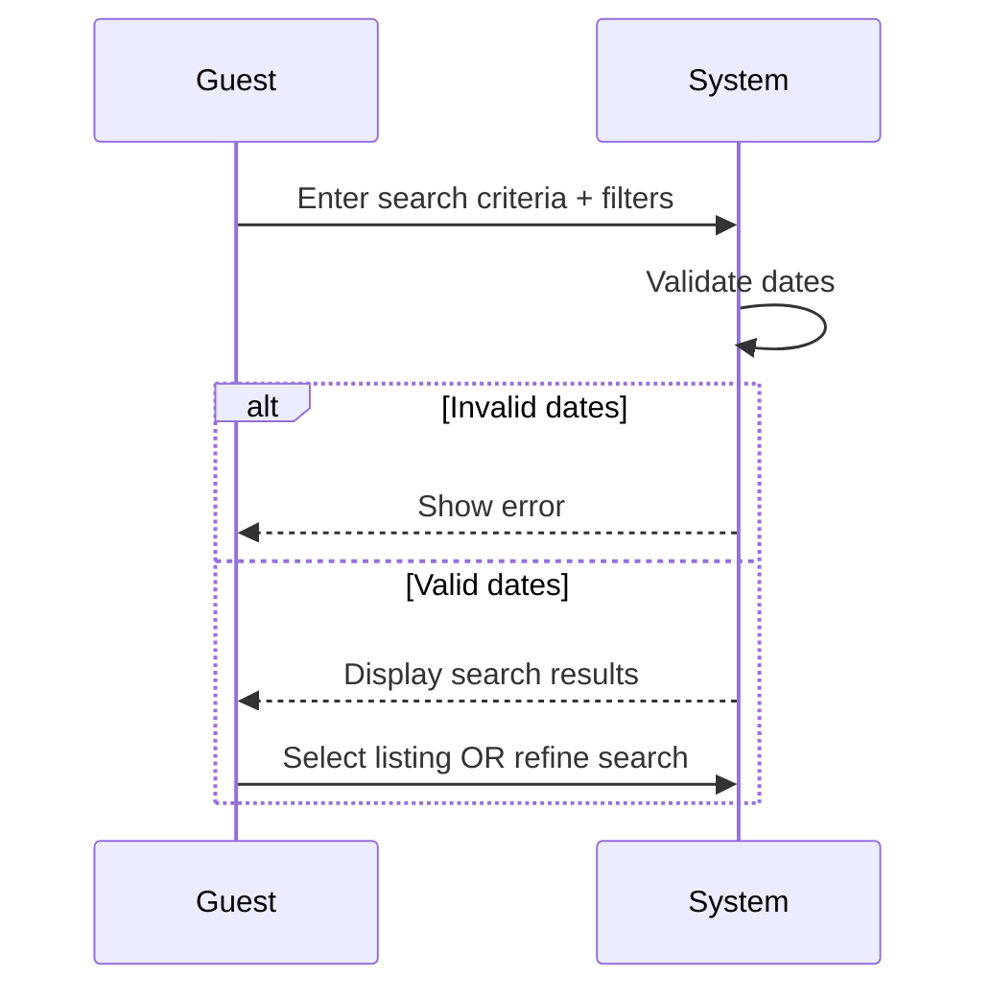
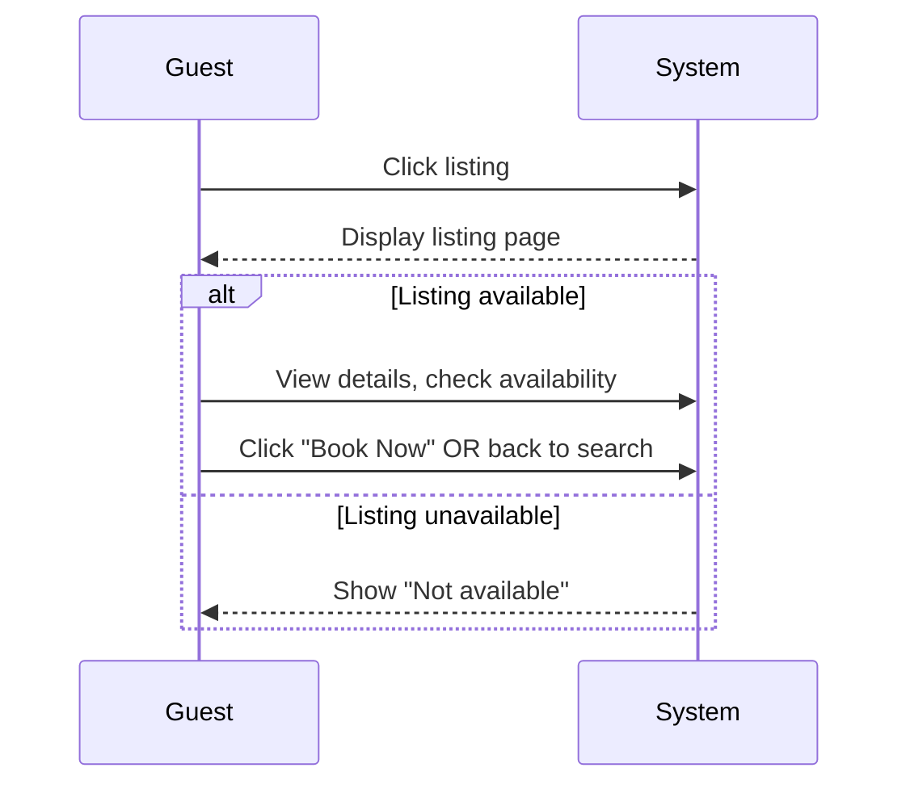
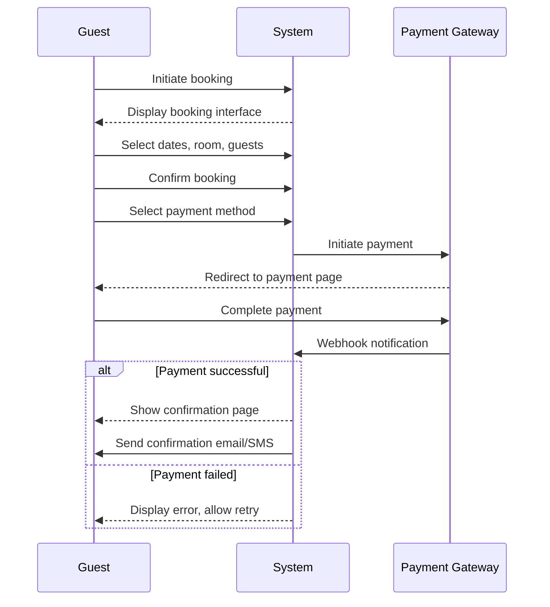
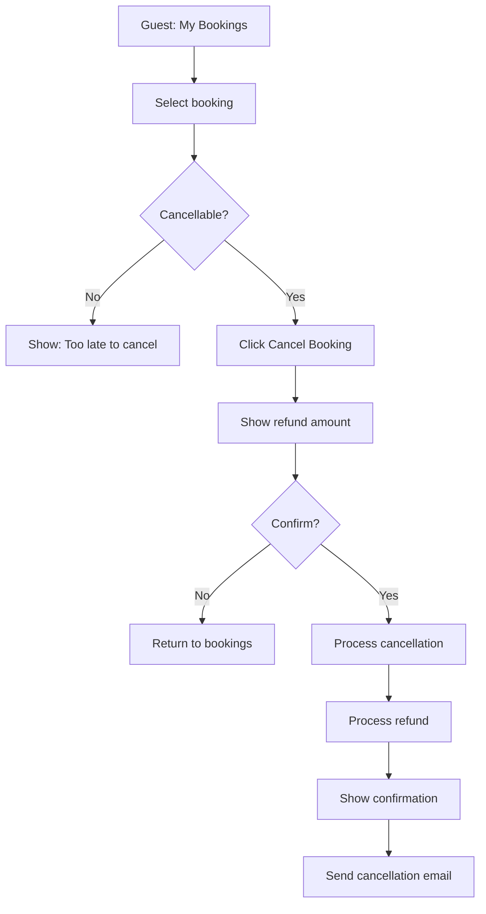
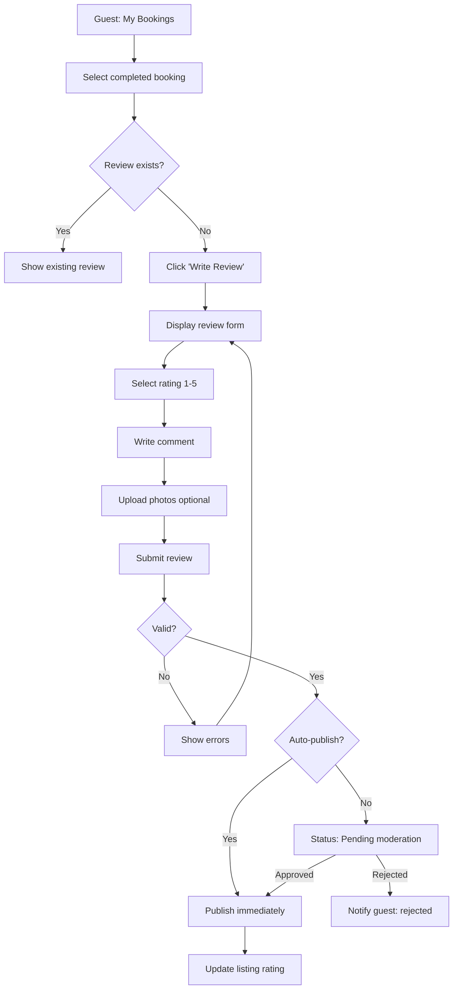
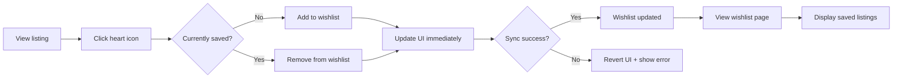

# Guest Use Cases - Detailed Specifications
## Hostel Management System

**Version:** 1.2 (Critical & high priority fixes applied)
**Date:** 2026-01-25
**Methodology:** COMET (Component-Object-Based Enterprise Modeling)

---

## Use Case Acceptance Criteria Validation

All use cases below pass ALL three COMET criteria:
- **C1:** Provides a useful result to the actor
- **C2:** Is a sequence (multiple steps), not a single action
- **C3:** Treats system as black box (external behavior only)

---

## UC-G01: Search for Hostels

**C1 (Useful Result):** Guest receives list of available hostels matching criteria
**C2 (Sequence):** Enter criteria → System validates → System searches → Results displayed
**C3 (Black Box):** Describes guest input and results, not how Elasticsearch works

| Section | Content |
|---------|---------|
| **Use Case ID** | UC-G01 |
| **Name** | Search for Hostels |
| **Priority** | High |
| **Complexity** | High |
| **Summary** | Guest searches for available hostels using location, dates, and filters. System returns matching results with availability and pricing. |
| **Primary Actor** | Guest |
| **Preconditions** | Guest is on homepage or search page |
| **Main Sequence** | 1. Guest enters search criteria (location, check-in/out, guest count) 2. Guest applies filters (price, amenities, room type) 3. Guest submits search 4. System validates dates 5. System displays search results with pagination 6. Guest may refine search or select a listing |
| **Alternative Sequences** | **4a. Invalid dates:** System shows error, guest corrects **5a. No results:** System shows suggestions for nearby locations or date adjustments **6a. System degraded:** System shows partial results with notice |
| **Business Rules** | Check-out must be after check-in by at least 1 night |
| **NFR References** | NFR-P01: <500ms search response |
| **Post Conditions** | Search results displayed, criteria saved for session |

---

## UC-G02: View Listing Details

**C1 (Useful Result):** Guest sees complete information to make booking decision
**C2 (Sequence):** Select listing → System fetches details → System displays full page
**C3 (Black Box):** Guest clicks, receives page; no internal implementation shown

| Section | Content |
|---------|---------|
| **Use Case ID** | UC-G02 |
| **Name** | View Listing Details |
| **Priority** | High |
| **Complexity** | Low |
| **Summary** | Guest views detailed information about a specific hostel including photos, amenities, pricing, reviews, and availability calendar. |
| **Primary Actor** | Guest |
| **Preconditions** | Guest selected a listing from search or has direct link |
| **Main Sequence** | 1. Guest clicks on a listing 2. System displays listing page with all sections 3. Guest views photos, description, amenities 4. Guest checks availability calendar 5. Guest reads reviews from past guests 6. Guest proceeds to booking or returns to search |
| **Alternative Sequences** | **2a. Listing not found:** System shows 404 with suggestions **2b. Listing inactive:** System shows "Not available" message **4a. No availability:** System shows nearest available dates |
| **Business Rules** | Only approved listings are visible to guests |
| **NFR References** | NFR-P02: <2s page load, NFR-U02: WCAG 2.1 AA |
| **Post Conditions** | Listing viewed, view count incremented |

---

## UC-G03: Book Accommodation

**C1 (Useful Result):** Guest receives confirmed booking with payment completed
**C2 (Sequence):** Select dates → Confirm details → Pay → Receive confirmation
**C3 (Black Box):** Guest provides inputs, receives confirmation; internal payment processing hidden

| Section | Content |
|---------|---------|
| **Use Case ID** | UC-G03 |
| **Name** | Book Accommodation |
| **Priority** | High |
| **Complexity** | High |
| **Summary** | Guest completes full booking flow: selects dates, room type, confirms details, makes payment via Vietnam gateway, and receives booking confirmation. |
| **Primary Actor** | Guest |
| **Preconditions** | Guest is authenticated, Listing is available for selected dates |
| **Main Sequence** | 1. Guest initiates booking from listing view 2. System displays booking interface 3. Guest selects check-in/out dates, room type, guest count 4. System displays price breakdown 5. Guest confirms booking details 6. Guest selects payment method from available options 7. Guest completes payment process 8. System confirms booking and displays confirmation 9. Guest receives confirmation email/SMS |
| **Alternative Sequences** | **3a. Dates unavailable:** System shows error with available alternatives **5a. Guest not logged in:** System prompts login, preserves booking data **7a. Payment cancelled:** System shows cancellation, allows retry **7b. Payment fails:** System shows error, allows retry **7c. Payment timeout:** System releases booking, allows restart |
| **Business Rules** | BR-G03-01: 15-minute payment window BR-G03-02: No double-booking guarantee BR-G03-03: Price includes base rate + fees + VAT BR-G03-04: Supported payment gateways: VNPAY, Ngan Luong, MoMo |
| **NFR References** | NFR-R01: Zero double-bookings, NFR-S12: No card storage |
| **Post Conditions** | **Success:** Booking confirmed (status: confirmed), Payment recorded, Owner notified, Calendar updated **Failure:** Booking not created, Payment not charged, Guest receives error message, Lock released |

---

## UC-G04: Cancel Booking

**C1 (Useful Result):** Guest cancels booking and receives refund confirmation
**C2 (Sequence):** View booking → Select cancel → Confirm → System processes refund
**C3 (Black Box):** Guest cancels, receives confirmation; refund processing hidden

| Section | Content |
|---------|---------|
| **Use Case ID** | UC-G04 |
| **Name** | Cancel Booking |
| **Priority** | Medium |
| **Complexity** | Medium |
| **Summary** | Guest cancels an existing booking within the allowed cancellation period. System calculates refund based on timing and processes it. |
| **Primary Actor** | Guest |
| **Preconditions** | Guest is authenticated, Booking exists and is cancellable |
| **Main Sequence** | 1. Guest accesses booking management 2. Guest selects a booking to cancel 3. Guest selects cancellation option 4. System displays cancellation policy and refund amount 5. Guest confirms cancellation 6. System cancels the booking 7. System processes refund 8. System displays cancellation confirmation 9. Guest receives cancellation email |
| **Alternative Sequences** | **3a. Cancellation period expired:** System disables cancel button, shows "Too late to cancel" **4a. Full refund:** System shows 100% refund **4b. Partial refund:** System shows partial refund amount **4c. No refund:** System shows "No refund available" **7a. Refund fails:** System logs for manual processing, notifies guest |
| **Business Rules** | BR-G04-01: Full refund if cancelled 24+ hours before check-in BR-G04-02: 50% refund if cancelled 24-48 hours before BR-G04-03: No refund if cancelled <24 hours before |
| **NFR References** | NFR-R05: Transaction atomicity |
| **Post Conditions** | **Success:** Booking status: cancelled, Refund initiated, Owner notified, Calendar availability restored **Failure:** Booking remains active, No refund processed, Guest receives error message |

---

## UC-G05: Write Review

**C1 (Useful Result):** Guest submits review and it's recorded/published
**C2 (Sequence):** Select booking → Rate → Write comment → Submit → System publishes/moderates
**C3 (Black Box):** Guest inputs review, receives submission confirmation; moderation internal

| Section | Content |
|---------|---------|
| **Use Case ID** | UC-G05 |
| **Name** | Write Review |
| **Priority** | Low |
| **Complexity** | Medium |
| **Summary** | Guest who completed a stay submits a review with rating (1-5 stars) and text comment. System publishes review after moderation. |
| **Primary Actor** | Guest |
| **Preconditions** | Guest is authenticated, Booking is completed, Stay date has passed |
| **Main Sequence** | 1. Guest navigates to "My Bookings" 2. Guest selects a completed booking 3. Guest clicks "Write Review" 4. System displays review form 5. Guest selects rating (1-5 stars) 6. Guest writes text comment 7. Guest optionally uploads photos 8. Guest submits review 9. System validates review 10. System confirms submission and states "Under review" 11. System publishes review after moderation |
| **Alternative Sequences** | **3a. Review already exists:** System shows existing review, disables submit **9a. Validation fails:** System shows inline errors **10a. Auto-publish enabled:** System publishes immediately **11a. Review rejected:** System notifies guest of rejection |
| **Business Rules** | BR-G05-01: One review per booking BR-G05-02: Minimum 50 characters, maximum 2000 BR-G05-03: Maximum 5 photos, 5MB each |
| **NFR References** | NFR-S10: XSS prevention, NFR-M08: Audit logging |
| **Post Conditions** | Review submitted (pending or published), Listing rating updated (when published), Owner notified |

---

## UC-G06: Save to Wishlist

**C1 (Useful Result):** Guest saves listing for later access
**C2 (Sequence):** Click save → System adds to wishlist → Guest accesses saved list
**C3 (Black Box):** Guest clicks heart, item saved; storage method hidden

| Section | Content |
|---------|---------|
| **Use Case ID** | UC-G06 |
| **Name** | Save to Wishlist |
| **Priority** | Low |
| **Complexity** | Low |
| **Summary** | Guest saves hostel listings to a wishlist for later viewing. Wishlist persists across sessions and shows current pricing. |
| **Primary Actor** | Guest |
| **Preconditions** | None (can be done by guests or authenticated users) |
| **Main Sequence** | 1. Guest views a listing on search or detail page 2. Guest clicks heart icon to save 3. System adds listing to wishlist 4. Icon changes to filled heart 5. Guest navigates to wishlist page 6. System displays all saved listings with current prices |
| **Alternative Sequences** | **2a. Not logged in:** System saves to browser storage, prompts sign-in **2b. Already saved:** System removes from wishlist (toggle) **3a. Save fails:** System reverts icon, shows error **6a. Listing no longer available:** System shows "No longer available" badge |
| **Business Rules** | BR-G06-01: Maximum 100 items per wishlist BR-G06-02: Wishlist expires after 30 days for non-logged-in guests |
| **NFR References** | NFR-U10: Optimistic UI updates |
| **Post Conditions** | Wishlist updated, Analytics logged |

---

## Guest Use Case Summary

| ID | Name | C1 (Useful) | C2 (Sequence) | C3 (Black Box) | Priority |
|----|------|-------------|---------------|----------------|----------|
| UC-G01 | Search for Hostels | ✓ | ✓ | ✓ | High |
| UC-G02 | View Listing Details | ✓ | ✓ | ✓ | High |
| UC-G03 | Book Accommodation | ✓ | ✓ | ✓ | High |
| UC-G04 | Cancel Booking | ✓ | ✓ | ✓ | Medium |
| UC-G05 | Write Review | ✓ | ✓ | ✓ | Low |
| UC-G06 | Save to Wishlist | ✓ | ✓ | ✓ | Low |

**Total: 6 Use Cases** (reduced from 7 by combining Create Booking + Process Payment)

---

## Outstanding Questions

No unresolved questions identified at this time. All use cases are fully specified with clear preconditions, postconditions, and alternative sequences.

---

**Document Version:** 1.0 (Revised)
**Last Updated:** 2026-01-25
**Methodology:** COMET