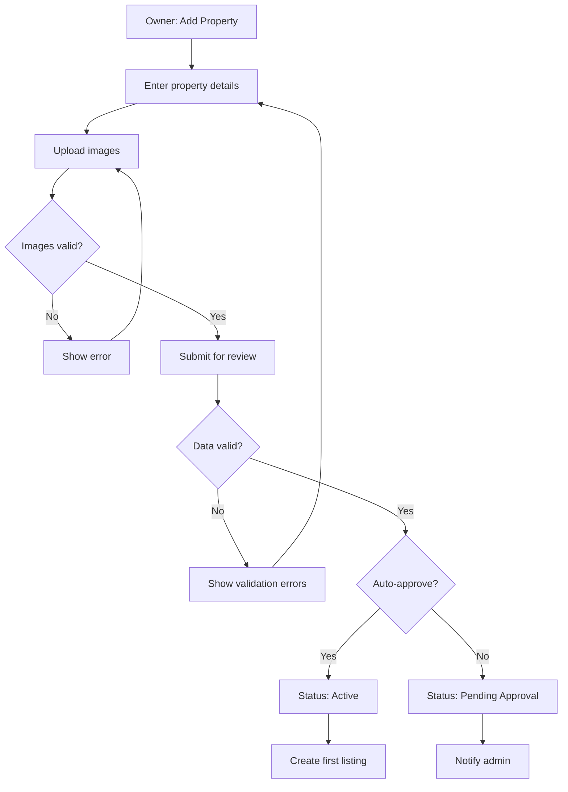
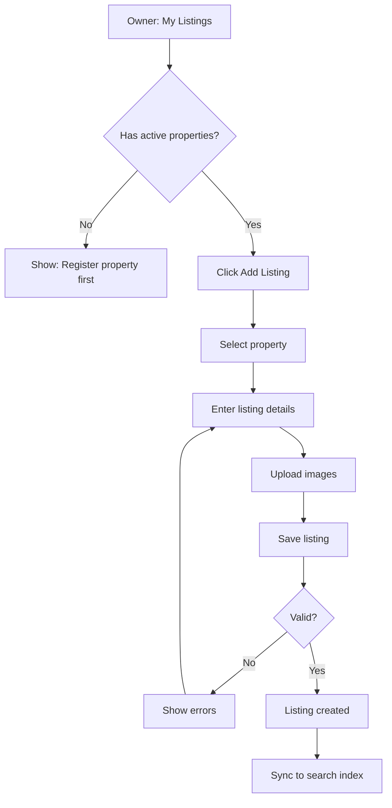
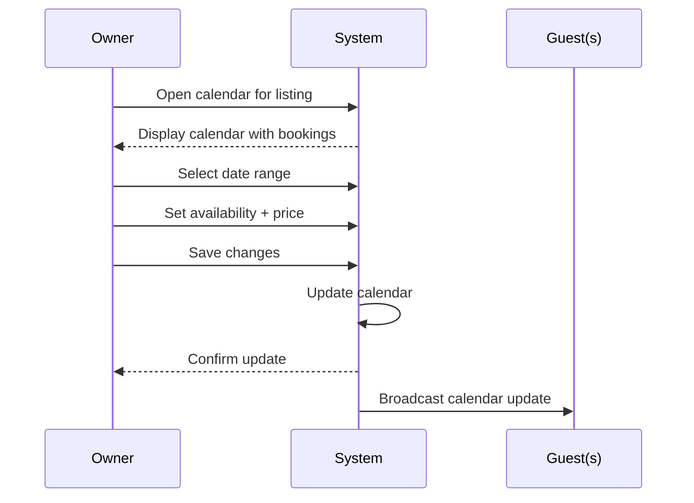
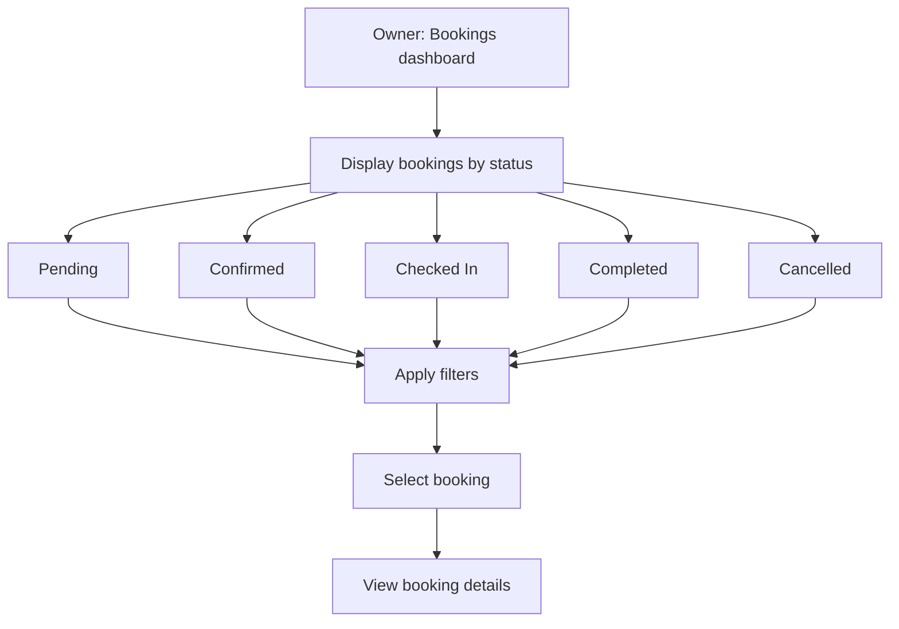
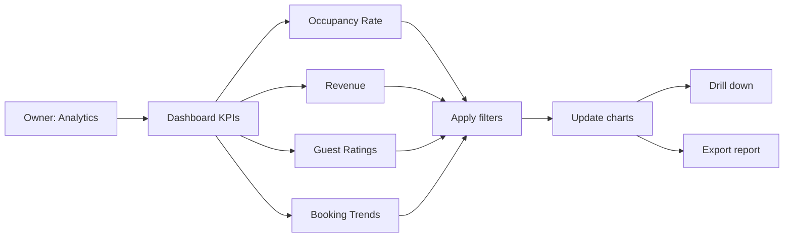

# Owner Use Cases - Detailed Specifications
## Hostel Management System

**Version:** 1.2 (Critical & high priority fixes applied)
**Date:** 2026-01-25
**Methodology:** COMET

---

## Use Case Acceptance Criteria Validation

All use cases pass ALL three COMET criteria:
- **C1:** Provides a useful result to the actor
- **C2:** Is a sequence (multiple steps), not a single action
- **C3:** Treats system as black box (external behavior only)

---

## UC-O01: Register Property

**C1 (Useful Result):** Owner submits property for review and receives confirmation
**C2 (Sequence):** Enter details → Upload images → Submit → System confirms submission
**C3 (Black Box):** Owner provides property info, receives submission confirmation; approval process internal

| Section | Content |
|---------|---------|
| **Use Case ID** | UC-O01 |
| **Name** | Register Property |
| **Priority** | High |
| **Complexity** | Medium |
| **Summary** | Owner registers a new hostel property with basic information and images. Property is submitted for admin approval before becoming visible. |
| **Primary Actor** | Owner |
| **Preconditions** | Owner is authenticated and verified |
| **Main Sequence** | 1. Owner navigates to "Add Property" 2. Owner enters property details (name, address, type, description) 3. Owner uploads property images (cover + gallery) 4. Owner submits property for review 5. System validates input 6. System confirms property submitted 7. Owner sees "Under Review" status |
| **Alternative Sequences** | **3a. Image upload fails:** System shows error, allows retry or skip **5a. Validation fails:** System shows inline errors **5b. Duplicate detected:** System warns but allows submission **7a. Auto-approve enabled:** Property becomes active immediately |
| **Business Rules** | Maximum 10 images per property, Address must be in Vietnam |
| **NFR References** | NFR-S09: SQL injection prevention, NFR-U07: Mobile responsive |
| **Post Conditions** | Property created (status: pending_approval), Admin notified |

---

## UC-O02: Create Listing

**C1 (Useful Result):** Owner creates new listing under property, listing becomes bookable
**C2 (Sequence):** Select property → Enter details → Upload images → Save → System confirms
**C3 (Black Box):** Owner provides listing info, receives creation confirmation; sync internal

| Section | Content |
|---------|---------|
| **Use Case ID** | UC-O02 |
| **Name** | Create Listing |
| **Priority** | High |
| **Complexity** | Medium |
| **Summary** | Owner creates a new listing (room type) under an approved property with capacity, pricing, and amenities. Listing becomes searchable after creation. |
| **Primary Actor** | Owner |
| **Preconditions** | Owner is authenticated, At least one property is active |
| **Main Sequence** | 1. Owner navigates to "My Listings" 2. Owner clicks "Add Listing" 3. Owner selects property (if multiple) 4. Owner enters listing details (room type, capacity, price, amenities) 5. Owner uploads listing images 6. Owner saves listing 7. System confirms listing created 8. Listing appears in search results |
| **Alternative Sequences** | **2a. No properties:** System shows "Register property first" **5a. Image upload fails:** System shows error, allows retry **7a. Sync fails:** System queues for retry, shows warning |
| **Business Rules** | Maximum 20 images per listing, Price must be within min/max range |
| **NFR References** | NFR-D04: ES sync <2s, NFR-M08: Audit logging |
| **Post Conditions** | Listing created, Search index updated, Calendar initialized |

---

## UC-O03: Update Calendar Availability

**C1 (Useful Result):** Owner updates availability/pricing, guests see real-time changes
**C2 (Sequence):** Open calendar → Select dates → Set price/availability → Save → System broadcasts
**C3 (Black Box):** Owner updates calendar, changes propagate; broadcasting/sync internal

| Section | Content |
|---------|---------|
| **Use Case ID** | UC-O03 |
| **Name** | Update Calendar Availability |
| **Priority** | High |
| **Complexity** | High |
| **Summary** | Owner updates availability and pricing for specific dates on their listings. Changes are immediately visible to guests searching. |
| **Primary Actor** | Owner |
| **Preconditions** | Owner is authenticated, Listing exists |
| **Main Sequence** | 1. Owner navigates to "My Listings" 2. Owner selects a listing 3. Owner opens calendar view 4. System displays calendar with existing bookings 5. Owner selects date range to update 6. Owner sets availability (available/unavailable) 7. Optionally, owner sets custom price 8. Owner saves changes 9. System confirms update 10. Guests see updated availability immediately |
| **Alternative Sequences** | **5a. Dates have confirmed bookings:** System disables editing, shows "Cannot modify booked dates" **7a. Price below minimum:** System shows error, enforces minimum **9a. Update fails:** System shows error, preserves previous values **9b. System unavailable:** System queues update for retry, notifies owner of delay, retries every 5 minutes for 1 hour |
| **Business Rules** | Confirmed booking dates cannot be modified, Minimum price enforced |
| **NFR References** | NFR-P04: <500ms calendar propagation, NFR-M08: Audit logging |
| **Post Conditions** | Calendar updated, Cache invalidated, Guests see changes, Audit log created |

---

## UC-O04: View Booking Requests

**C1 (Useful Result):** Owner sees all incoming bookings with guest details
**C2 (Sequence):** Open dashboard → View bookings list → Filter/select → View details
**C3 (Black Box):** Owner views bookings; storage/retrieval internal

| Section | Content |
|---------|---------|
| **Use Case ID** | UC-O04 |
| **Name** | View Booking Requests |
| **Priority** | Medium |
| **Complexity** | Low |
| **Summary** | Owner views all incoming bookings for their properties with guest details, booking status, and available actions. |
| **Primary Actor** | Owner |
| **Preconditions** | Owner is authenticated, Has active listings |
| **Main Sequence** | 1. Owner navigates to "Bookings" dashboard 2. System displays bookings grouped by status 3. Owner views booking list with guest info 4. Owner applies filters (date, listing, status) 5. Owner selects a booking to view details 6. System shows full booking details 7. Owner sees available actions |
| **Alternative Sequences** | **2a. No bookings:** System shows empty state with "No bookings yet" **5a. Booking has notes:** System displays special requests from guest **7a. Instant booking:** Owner sees "Confirmed" status only |
| **Business Rules** | Owner sees bookings for their properties only |
| **NFR References** | NFR-U07: Mobile responsive, NFR-U10: Optimistic UI |
| **Post Conditions** | Bookings viewed, Owner has information needed |

---

## UC-O05: View Property Analytics

**C1 (Useful Result):** Owner sees performance metrics to make business decisions
**C2 (Sequence):** Open dashboard → View KPIs → Apply filters → Drill down
**C3 (Black Box):** Owner views charts; aggregation internal

| Section | Content |
|---------|---------|
| **Use Case ID** | UC-O05 |
| **Name** | View Property Analytics |
| **Priority** | Medium |
| **Complexity** | Medium |
| **Summary** | Owner accesses dashboard showing key performance metrics including occupancy rate, revenue, booking trends, and guest ratings for their properties. |
| **Primary Actor** | Owner |
| **Preconditions** | Owner is authenticated, Has booking history |
| **Main Sequence** | 1. Owner navigates to "Analytics" 2. System displays dashboard with KPI cards 3. Owner views charts (revenue, occupancy, ratings) 4. Owner selects date range filter 5. Owner selects specific listing 6. System updates charts with filtered data 7. Owner optionally exports report |
| **Alternative Sequences** | **2a. No data available:** System shows "No analytics yet" with onboarding tips **7a. Export requested:** System generates PDF/CSV for download |
| **Business Rules** | Data aggregation by day/week/month, Owner sees only their properties |
| **NFR References** | NFR-P11: Chart rendering <2s, NFR-U02: Color contrast |
| **Post Conditions** | Analytics viewed, Export generated (if requested) |

---

## Owner Use Case Summary

| ID | Name | C1 (Useful) | C2 (Sequence) | C3 (Black Box) | Priority |
|----|------|-------------|---------------|----------------|----------|
| UC-O01 | Register Property | ✓ | ✓ | ✓ | High |
| UC-O02 | Create Listing | ✓ | ✓ | ✓ | High |
| UC-O03 | Update Calendar Availability | ✓ | ✓ | ✓ | High |
| UC-O04 | View Booking Requests | ✓ | ✓ | ✓ | Medium |
| UC-O05 | View Property Analytics | ✓ | ✓ | ✓ | Medium |

**Total: 5 Use Cases**

---

## Outstanding Questions

No unresolved questions identified at this time. All use cases are fully specified with clear preconditions, postconditions, and alternative sequences.

---

**Document Version:** 1.0 (Revised)
**Last Updated:** 2026-01-25
**Methodology:** COMET