# Use Case Descriptions - Hostel Management System

**Version:** 1.0
**Last Updated:** 2026-01-11
**Total Use Cases:** 17

---

## Table of Contents

1. [Guest Use Cases](#guest-use-cases) (7)
2. [Owner Use Cases](#owner-use-cases) (5)
3. [Admin Use Cases](#admin-use-cases) (5)
4. [Use Case Template](#use-case-template)
5. [Summary Matrix](#summary-matrix)

---

## Use Case Template

Each use case follows this 10-section format:

| Section | Description |
|---------|-------------|
| 1. Use Case Name | Unique identifier and name |
| 2. Summary | Brief description of the use case |
| 3. Dependency | Related use cases or prerequisites |
| 4. Actors | Primary and secondary actors involved |
| 5. Preconditions | State required before use case begins |
| 6. Main Sequence | Step-by-step happy path |
| 7. Alternative Sequences | Error handling and edge cases |
| 8. Nonfunctional Requirements | Performance, security, usability constraints |
| 9. Post Condition | System state after successful completion |
| 10. Outstanding Questions | Unresolved items for clarification |

---

## Use Case Overview Diagram

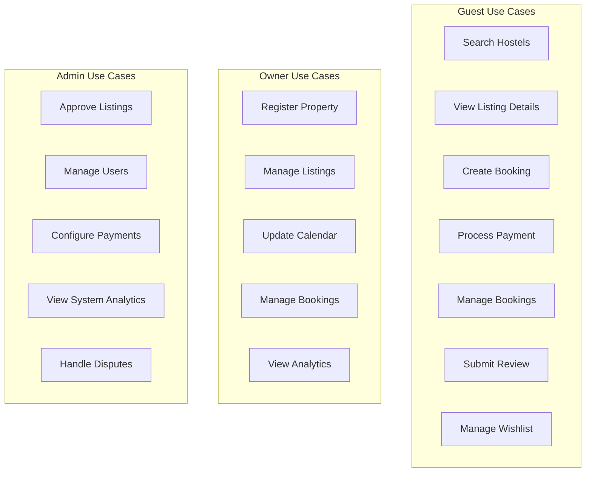

---

# Guest Use Cases

## UC-G01: Search Hostels

| Section | Content |
|---------|---------|
| **1. Use Case Name** | Search Hostels |
| **2. Summary** | Guests search for available hostels using filters like location, dates, price range, amenities, and room type. Results are fetched from Elasticsearch with <500ms response time. |
| **3. Dependency** | UC-G02 (View Listing Details), Elasticsearch index populated, Redis cache available |
| **4. Actors** | Primary: Guest. Secondary: System (auto-suggest) |
| **5. Preconditions** | Guest is on homepage or search page, Elasticsearch indices are synced, Redis cache is operational |
| **6. Main Sequence** | 1. Guest enters search criteria (location, check-in/out dates, guests) 2. System validates dates (check-out > check-in) 3. System queries Elasticsearch with filters 4. System retrieves results from cache if available 5. System displays sorted/filtered results with pagination 6. Guest may refine filters or select a listing |
| **7. Alternative Sequences** | **3a. No results found:** Display "No hostels found" message with suggested nearby locations or date adjustments **5a. Cache miss:** Query Elasticsearch directly, populate Redis cache **6a. Invalid date range:** Show error "Check-out date must be after check-in" **6b. Elasticsearch unavailable:** Fallback to MySQL query, show degraded performance notice |
| **8. Nonfunctional Requirements** | Response time < 500ms (p95), Support 1000 concurrent searches, Vietnamese/English localization, Mobile-responsive, WCAG 2.1 AA compliance |
| **9. Post Condition** | Search results displayed, search criteria stored in session for back navigation, Search analytics logged |
| **10. Outstanding Questions** | Should we save search history for logged-in guests? How to handle location typo corrections? |

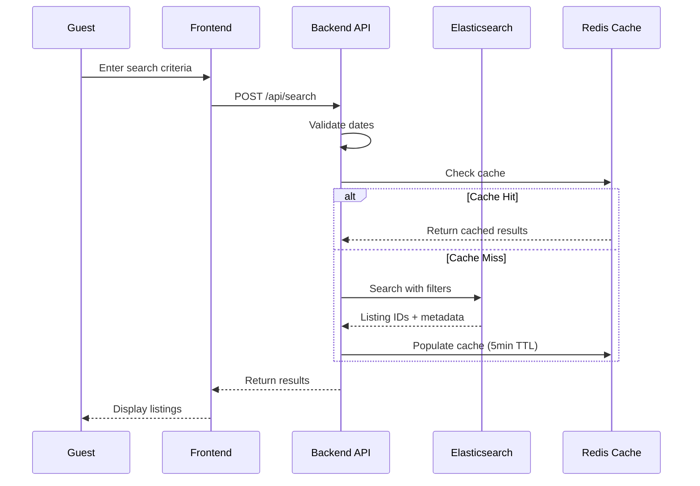

---

## UC-G02: View Listing Details

| Section | Content |
|---------|---------|
| **1. Use Case Name** | View Listing Details |
| **2. Summary** | Guest views comprehensive details of a specific hostel including photos, amenities, pricing, reviews, and availability calendar. |
| **3. Dependency** | UC-G01 (Search Hostels), Listing exists and is approved |
| **4. Actors** | Primary: Guest. Secondary: System (analytics tracking) |
| **5. Preconditions** | Guest has selected a listing from search results or direct link, Listing status is 'approved' |
| **6. Main Sequence** | 1. Guest clicks on a listing from search results 2. System fetches listing details from MySQL 3. System fetches current reviews and ratings 4. System fetches available dates from calendar service 5. System displays listing page with all sections 6. System increments view count (async via RabbitMQ) |
| **7. Alternative Sequences** | **2a. Listing not found:** Display 404 error with similar listing suggestions **2b. Listing not approved:** Display "This listing is under review" message **4a. No availability for selected dates:** Show "Fully Booked" badge with nearest available dates **6a. Image CDN failure:** Display placeholder images, log error for retry |
| **8. Nonfunctional Requirements** | Page load < 2s, Images optimized (WebP, lazy loading), CDN delivery for images, Mobile-responsive, Vietnamese diacritics support |
| **9. Post Condition** | Listing viewed event logged (analytics), View count incremented, Listing added to "Recently Viewed" (if logged in) |
| **10. Outstanding Questions** | Should we show "X people viewing this now" for urgency? How many images per listing max? |

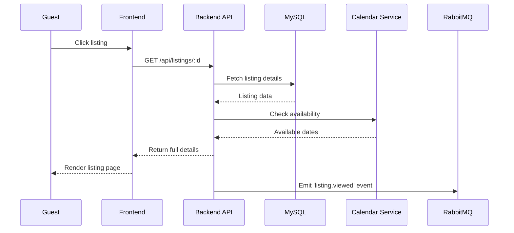

---

## UC-G03: Create Booking

| Section | Content |
|---------|---------|
| **1. Use Case Name** | Create Booking |
| **2. Summary** | Guest initiates a booking request by selecting dates, room type, and number of guests. System validates availability and creates a pending booking record. |
| **3. Dependency** | UC-G02 (View Listing Details), Guest authenticated (or will authenticate in flow), Calendar availability confirmed |
| **4. Actors** | Primary: Guest. Secondary: Payment System, Calendar Service |
| **5. Preconditions** | Guest is authenticated or will authenticate, Listing is available for selected dates, Room type is available |
| **6. Main Sequence** | 1. Guest clicks "Book Now" from listing page 2. System redirects to checkout page (or prompts login if not authenticated) 3. Guest selects/accommodates dates, room type, guests 4. System validates availability using Redis distributed lock 5. System displays price breakdown (base rate, fees, taxes) 6. Guest confirms booking details 7. System creates booking record with status 'pending_payment' 8. System redirects to payment flow |
| **7. Alternative Sequences** | **3a. Dates unavailable:** Show error "Selected dates no longer available" with available alternatives **4a. Lock acquisition fails:** Display "Someone is booking this room. Please try again in a moment" **7a. Guest not authenticated:** Prompt login/register, preserve booking data in temporary state **8a. Booking creation failed:** Display error with retry option, release lock |
| **8. Nonfunctional Requirements** | Lock timeout: 15 minutes, Zero double-bookings (distributed lock), Atomic booking creation, Payment gateway failover support |
| **9. Post Condition** | Booking record created (status: pending_payment), Availability reserved via lock, Payment initiated, Notification queued |
| **10. Outstanding Questions** | Lock timeout duration: 10 or 15 minutes? How to handle abandoned bookings (cleanup schedule)? |

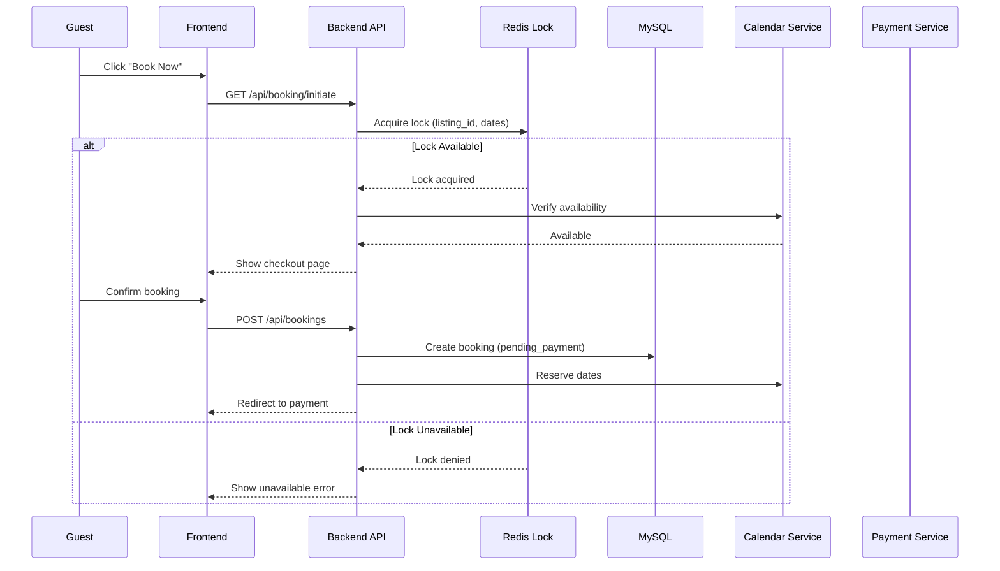

---

## UC-G04: Process Payment

| Section | Content |
|---------|---------|
| **1. Use Case Name** | Process Payment |
| **2. Summary** | Guest completes payment for booking using Vietnam payment gateway (VNPAY/Ngan Luong/MoMo). System handles success/failure webhooks and updates booking status. |
| **3. Dependency** | UC-G03 (Create Booking), Payment gateway configured, Booking exists with 'pending_payment' status |
| **4. Actors** | Primary: Guest. Secondary: Payment Gateway, Webhook Handler |
| **5. Preconditions** | Booking exists with valid 'pending_payment' status, Payment gateway is operational, Redis lock is still active |
| **6. Main Sequence** | 1. Guest selects payment method (VNPAY/Ngan Luong/MoMo) 2. System generates payment URL with callback URLs 3. System redirects guest to payment gateway 4. Guest completes payment on gateway 5. Gateway redirects back with success/failure 6. System verifies payment via webhook 7. System updates booking status 8. System releases Redis lock 9. System sends confirmation email/SMS 10. Guest receives booking confirmation |
| **7. Alternative Sequences** | **5a. Payment cancelled by guest:** Redirect back, show "Payment cancelled" message, keep booking pending for retry **5b. Payment timeout:** Mark booking as 'payment_failed', release lock, allow retry **6a. Webhook verification fails:** Log for manual review, keep pending status **7a. Payment successful:** Update booking to 'confirmed', trigger confirmation notifications **7b. Payment failed:** Update booking to 'payment_failed', release lock, allow retry |
| **8. Nonfunctional Requirements** | Payment webhook timeout < 5s, Idempotent webhook processing, Secure webhook signature verification, PCI DSS compliance (no card data stored), 99.9% payment gateway uptime requirement |
| **9. Post Condition** | Booking status updated (confirmed/failed), Lock released, Payment record created, Notifications sent, Analytics updated |
| **10. Outstanding Questions** | Payment retry limit? How to handle partial payments? Refund process automation? |

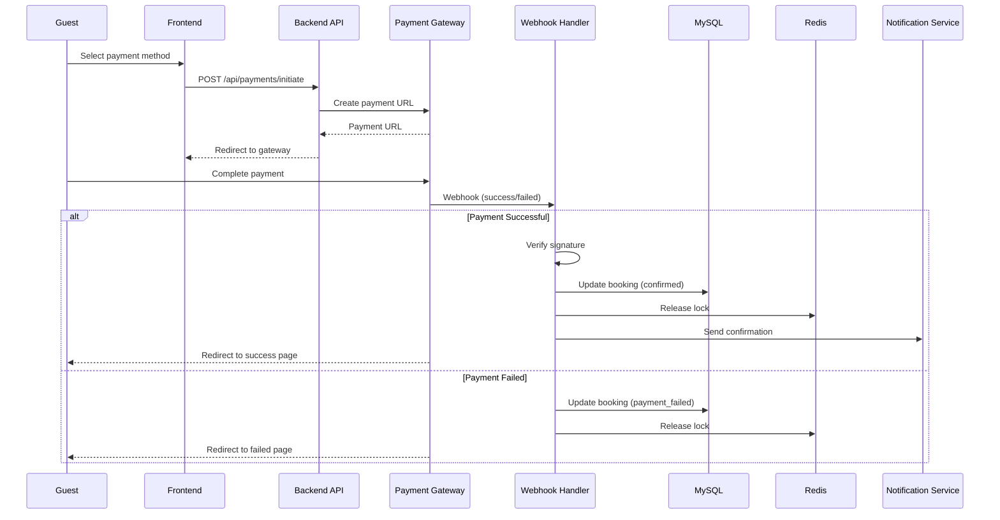

---

## UC-G05: Manage Bookings

| Section | Content |
|---------|---------|
| **1. Use Case Name** | Manage Bookings |
| **2. Summary** | Authenticated guest views their booking history, details, and can cancel bookings within the allowed cancellation period. |
| **3. Dependency** | Guest authenticated, At least one booking exists |
| **4. Actors** | Primary: Guest. Secondary: Owner (receives cancellation notifications) |
| **5. Preconditions** | Guest is logged in, Booking records exist for this guest |
| **6. Main Sequence** | 1. Guest navigates to "My Bookings" page 2. System fetches all bookings for guest 3. System displays bookings grouped by status (upcoming, completed, cancelled) 4. Guest clicks on a booking to view details 5. System shows full booking details with actions available 6. Guest may cancel if within cancellation period |
| **7. Alternative Sequences** | **2a. No bookings found:** Display "You have no bookings yet" with CTA to search hostels **4a. Booking cancelled by owner:** Display "This booking was cancelled by the property" **6a. Outside cancellation period:** Disable cancel button, show "Cancellation period ended" **6b. Cancellation penalty applies:** Show refund amount before confirmation |
| **8. Nonfunctional Requirements** | Paginated display (20 per page), Real-time status updates (WebSocket), Cancellation policy enforcement, Refund calculation accuracy |
| **9. Post Condition** | Booking status updated (if cancelled), Refund initiated, Notifications sent to owner, Calendar availability updated |
| **10. Outstanding Questions** | Cancellation policy: full refund 24h before? 48h? Penalty structure? |

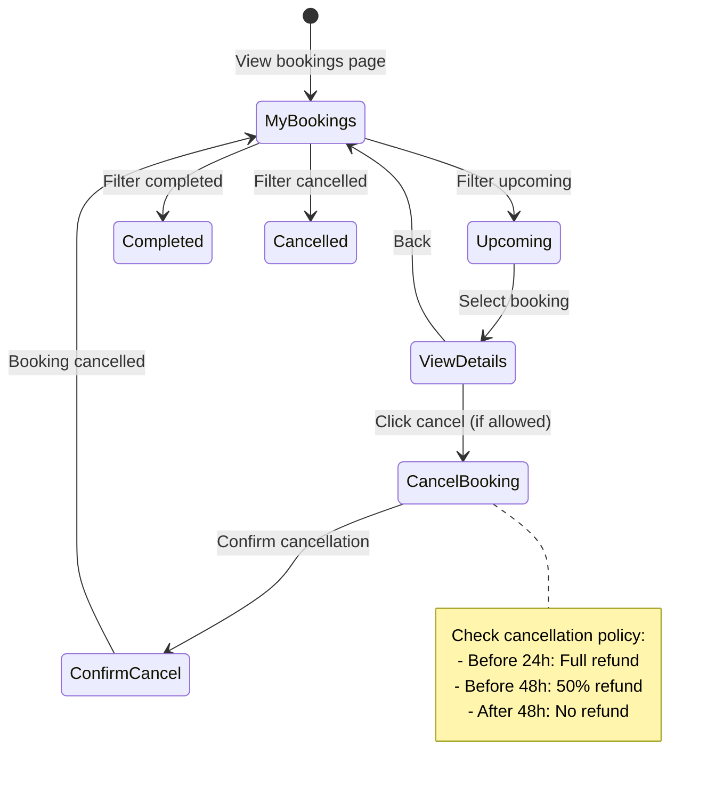

---

## UC-G06: Submit Review

| Section | Content |
|---------|---------|
| **1. Use Case Name** | Submit Review |
| **2. Summary** | Guest who completed a booking can submit a review with rating (1-5 stars) and text. Reviews are moderated before publishing. |
| **3. Dependency** | UC-G05 (Manage Bookings), Booking status is 'completed', Stay date has passed |
| **4. Actors** | Primary: Guest. Secondary: Admin (moderation), Owner (responds to reviews) |
| **5. Preconditions** | Guest is authenticated, Booking is completed, Stay date is in the past, No review exists for this booking |
| **6. Main Sequence** | 1. Guest navigates to "My Bookings" and selects a completed booking 2. Guest clicks "Write a Review" 3. System displays review form (rating 1-5, text, photos optional) 4. Guest submits review 5. System validates review (min length, rating required) 6. System creates review with status 'pending_moderation' 7. System queues notification for admin moderation |
| **7. Alternative Sequences** | **3a. Review already exists:** Display existing review, disable submit **5a. Validation failed:** Show inline errors (rating required, min 50 chars) **5b. Profanity detected:** Flag for moderation, allow submission with warning **7a. Auto-publish enabled:** Bypass moderation, publish immediately |
| **8. Nonfunctional Requirements** | Max 5 photos per review, Photo size limit 5MB each, Profanity filter, Spam detection, Review aggregation for listings |
| **9. Post Condition** | Review created (pending_moderation or published), Listing rating recalculated (when published), Owner notified |
| **10. Outstanding Questions** | Can guests edit reviews after submission? Delete reviews? Time limit for submitting reviews? |

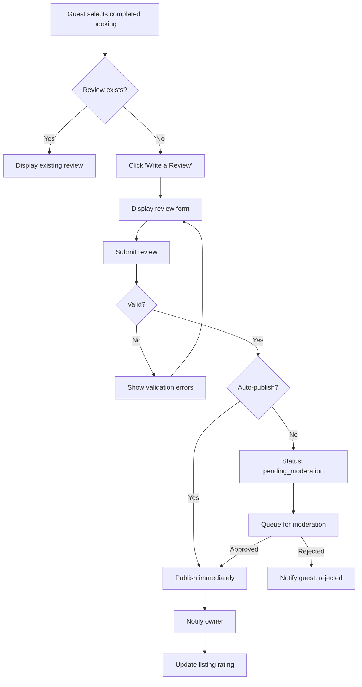

---

## UC-G07: Manage Wishlist

| Section | Content |
|---------|---------|
| **1. Use Case Name** | Manage Wishlist |
| **2. Summary** | Guest can save listings to wishlist for later. Wishlist persists across sessions and can be shared. |
| **3. Dependency** | Guest authenticated (or use temporary storage for guests) |
| **4. Actors** | Primary: Guest |
| **5. Preconditions** | Guest is logged in (for persistence) |
| **6. Main Sequence** | 1. Guest clicks "heart" icon on any listing 2. System adds/removes from wishlist (toggle) 3. System updates UI state immediately (optimistic) 4. System syncs with backend via API 5. Guest navigates to wishlist page 6. System displays all saved listings with current prices |
| **7. Alternative Sequences** | **1a. Guest not logged in:** Save to localStorage, prompt "Sign in to sync your wishlist" **4a. API call fails:** Revert optimistic update, show error toast **6a. Wishlist empty:** Display empty state with "Start exploring" CTA **6b. Some listings unavailable:** Show "No longer available" badge, option to remove |
| **8. Nonfunctional Requirements** | Optimistic UI updates, Wishlist max 100 items, Real-time price updates, Shareable wishlist link |
| **9. Post Condition** | Wishlist updated in database, Analytics logged (if added), Email alerts for price drops (opt-in) |
| **10. Outstanding Questions** | Should we notify when wishlist listings get price drops? Wishlist expiration policy? |

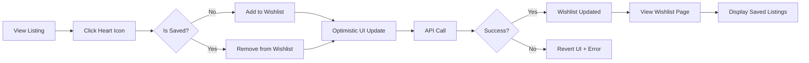

---

# Owner Use Cases

## UC-O01: Register Property

| Section | Content |
|---------|---------|
| **1. Use Case Name** | Register Property |
| **2. Summary** | Owner registers a new hostel property with basic information. Property requires admin approval before listings become visible. |
| **3. Dependency** | Owner account exists and verified |
| **4. Actors** | Primary: Owner. Secondary: Admin (approves property) |
| **5. Preconditions** | Owner is authenticated, Owner account is verified (email/phone) |
| **6. Main Sequence** | 1. Owner navigates to "Add Property" 2. System displays property registration form 3. Owner enters property details (name, address, type, description) 4. Owner uploads property images (cover + gallery) 5. Owner submits property for review 6. System validates input 7. System creates property with status 'pending_approval' 8. System queues notification for admin |
| **7. Alternative Sequences** | **4a. Image upload fails:** Show error, allow retry or skip **6a. Validation failed:** Display inline errors (required fields, address format) **6b. Duplicate property detected:** Warn "Similar property exists" but allow submission **8a. Auto-approve enabled:** Set status to 'active' immediately |
| **8. Nonfunctional Requirements** | Max 10 images per property, Image size limit 5MB each, Address validation (Vietnam provinces), Business license verification (optional) |
| **9. Post Condition** | Property created (pending_approval), Admin notified, Owner sees "Under Review" status |
| **10. Outstanding Questions** | Should we require business license? How many properties per owner max? |

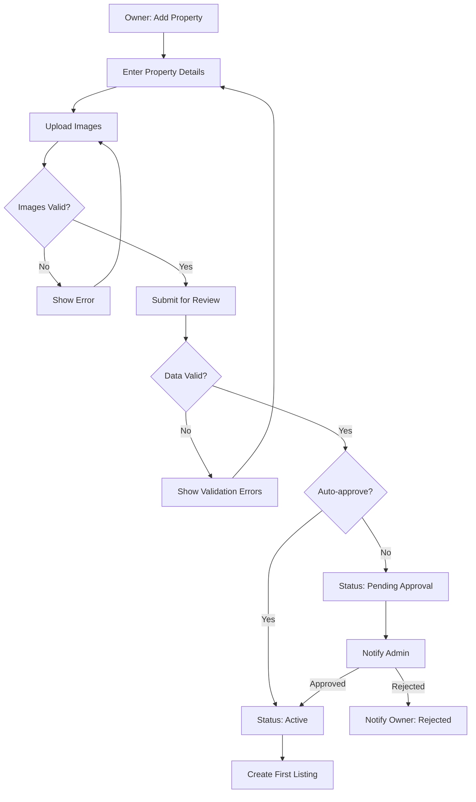

---

## UC-O02: Manage Listings

| Section | Content |
|---------|---------|
| **1. Use Case Name** | Manage Listings |
| **2. Summary** | Owner creates, updates, and deactivates listings under their approved properties. Each listing has room types, pricing, and amenities. |
| **3. Dependency** | UC-O01 (Register Property), Property status is 'active' |
| **4. Actors** | Primary: Owner |
| **5. Preconditions** | Owner authenticated, At least one approved property exists |
| **6. Main Sequence** | 1. Owner navigates to "My Listings" 2. System displays all listings with status indicators 3. Owner clicks "Add Listing" or selects existing to edit 4. Owner enters listing details (room type, capacity, base price, amenities) 5. Owner uploads listing images 6. Owner saves listing 7. System syncs listing to Elasticsearch 8. System updates calendar availability |
| **7. Alternative Sequences** | **2a. No listings:** Display empty state with "Create your first listing" CTA **4a. Duplicate listing:** Warn "Similar listing exists" **7a. Elasticsearch sync fails:** Queue for retry, show warning to owner **8a. Calendar sync fails:** Log error for manual intervention |
| **8. Nonfunctional Requirements** | Max 20 images per listing, Amenities predefined list, Price validation (min/max), Elasticsearch sync reliability |
| **9. Post Condition** | Listing created/updated, Elasticsearch index updated, Calendar initialized, Audit log created |
| **10. Outstanding Questions** | How many listings per property? Should listing changes require re-approval? |

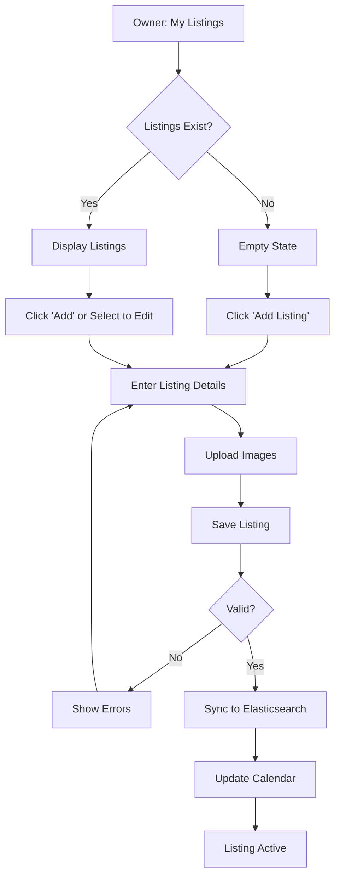

---

## UC-O03: Update Calendar

| Section | Content |
|---------|---------|
| **1. Use Case Name** | Update Calendar |
| **2. Summary** | Owner manages availability and pricing for specific dates. Bulk update and season pricing supported. Changes sync in real-time to guests. |
| **3. Dependency** | UC-O02 (Manage Listings), Listing exists |
| **4. Actors** | Primary: Owner. Secondary: Guests (see real-time updates) |
| **5. Preconditions** | Owner authenticated, Listing selected, Calendar data loaded |
| **6. Main Sequence** | 1. Owner opens calendar for a listing 2. System displays calendar with current bookings and availability 3. Owner selects date range to update 4. Owner sets availability (available/unavailable) and/or price 5. Owner saves changes 6. System updates calendar in MySQL 7. System invalidates Redis cache for affected dates 8. System broadcasts update via WebSocket to connected guests |
| **7. Alternative Sequences** | **3a. Dates have confirmed bookings:** Disable editing, show "Dates with bookings cannot be modified" **4a. Price below minimum:** Show error, enforce minimum price **6a. Database update fails:** Rollback changes, show error **8a. WebSocket broadcast fails:** Log error, cache invalidation ensures eventual consistency |
| **8. Nonfunctional Requirements** | Real-time WebSocket updates, Calendar view performance (1 year range), Bulk update API, Audit trail for all changes |
| **9. Post Condition** | Calendar updated, Cache invalidated, WebSocket broadcast sent, Audit log created |
| **10. Outstanding Questions** | How far in advance can owners set availability? Season pricing templates? |

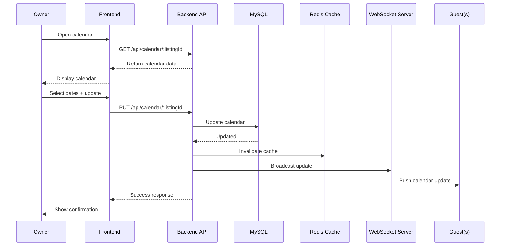

---

## UC-O04: Manage Bookings (Owner View)

| Section | Content |
|---------|---------|
| **1. Use Case Name** | Manage Bookings (Owner View) |
| **2. Summary** | Owner views incoming bookings for their properties, can accept/decline requests (if applicable), and manages guest communications. |
| **3. Dependency** | At least one booking exists for owner's properties |
| **4. Actors** | Primary: Owner. Secondary: Guest (receives notifications) |
| **5. Preconditions** | Owner authenticated, Has active listings |
| **6. Main Sequence** | 1. Owner navigates to "Bookings" dashboard 2. System displays bookings grouped by status (pending, confirmed, checked-in, checked-out, cancelled) 3. Owner filters by listing, date range, status 4. Owner clicks booking to view details 5. Owner sees guest info, booking details, and available actions 6. Owner may send message to guest 7. Owner may cancel booking (with penalty explanation) |
| **7. Alternative Sequences** | **2a. No bookings:** Display empty state with "No bookings yet" **5a. Request booking (if approval required):** Show "Accept" / "Decline" buttons **6a. Instant booking:** No approval needed, show confirmed status **7a. Cancellation by owner:** Require reason, notify guest, process refund |
| **8. Nonfunctional Requirements** | Real-time booking notifications, Message inbox integration, Cancellation policy enforcement, Export booking data (CSV) |
| **9. Post Condition** | Booking status updated, Guest notified, Calendar updated (if cancelled), Analytics updated |
| **10. Outstanding Questions** | Approval flow vs instant booking? Owner cancellation penalties? |

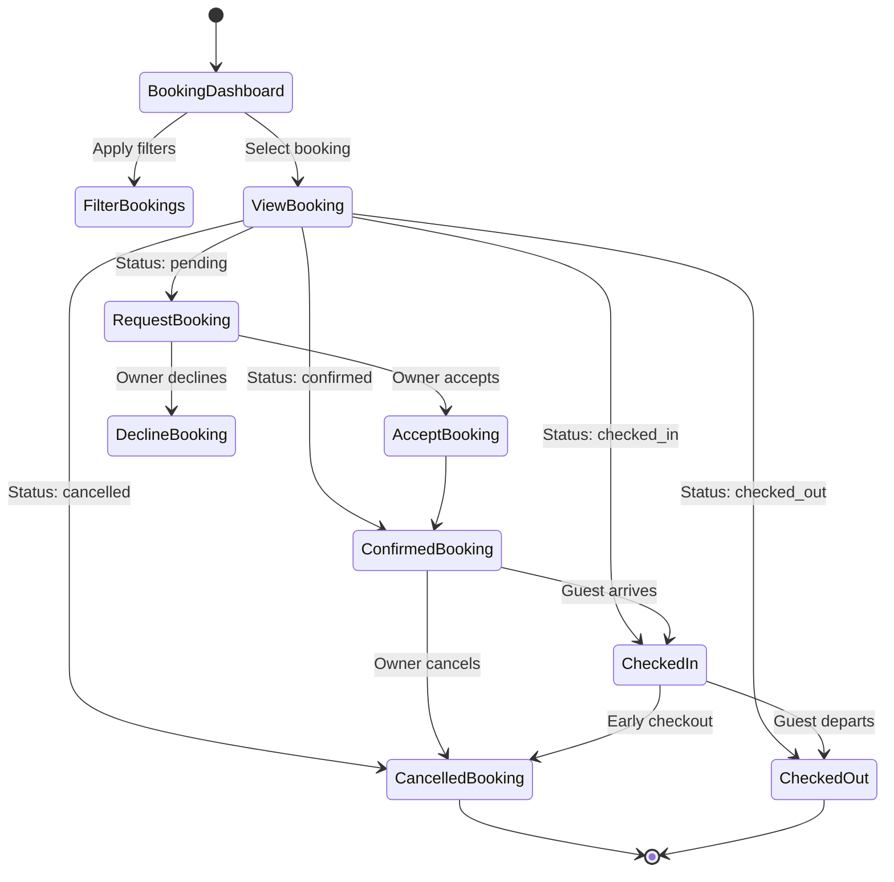

---

## UC-O05: View Analytics

| Section | Content |
|---------|---------|
| **1. Use Case Name** | View Analytics |
| **2. Summary** | Owner accesses dashboard with key metrics: occupancy rate, revenue, booking trends, guest ratings, and top-performing listings. |
| **3. Dependency** | At least one listing with booking history |
| **4. Actors** | Primary: Owner |
| **5. Preconditions** | Owner authenticated, Has booking data |
| **6. Main Sequence** | 1. Owner navigates to "Analytics" 2. System displays dashboard with key metrics (cards) 3. Owner views charts: revenue over time, occupancy rate, booking sources 4. Owner filters by date range, listing 5. Owner drills down into specific metrics 6. System updates charts with filtered data |
| **7. Alternative Sequences** | **2a. No data available:** Display "No analytics data yet" with onboarding tips **6a. Export requested:** Generate CSV/PDF report for download |
| **8. Nonfunctional Requirements** | Chart rendering performance (< 2s), Data aggregation efficiency, Export to PDF/CSV, Mobile-responsive dashboard |
| **9. Post Condition** | Analytics viewed, Export generated (if requested) |
| **10. Outstanding Questions** | Real-time vs daily aggregated data? Comparison to market averages? |

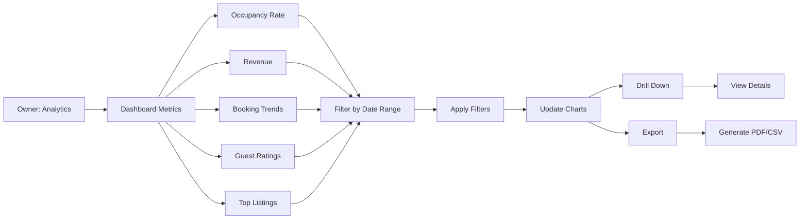

---

# Admin Use Cases

## UC-A01: Approve Listings

| Section | Content |
|---------|---------|
| **1. Use Case Name** | Approve Listings |
| **2. Summary** | Admin reviews pending property/listing submissions for compliance, accuracy, and quality before approving or rejecting. |
| **3. Dependency** | New properties/listings submitted with status 'pending_approval' |
| **4. Actors** | Primary: Admin. Secondary: Owner (receives decision) |
| **5. Preconditions** | Admin authenticated, Has permission to approve listings |
| **6. Main Sequence** | 1. Admin navigates to "Pending Approvals" 2. System displays queue of pending items 3. Admin selects an item to review 4. System displays property/listing details, images, owner info 5. Admin reviews for compliance (business license, accurate info, quality images) 6. Admin approves or rejects 7. System updates status and notifies owner 8. If approved, sync to Elasticsearch |
| **7. Alternative Sequences** | **2a. Queue empty:** Display "All caught up!" message **6a. Approve with conditions:** Approve but flag for follow-up review **6b. Reject:** Require rejection reason, notify owner with feedback **8a. Sync fails:** Queue for retry, keep status as approved but not visible |
| **8. Nonfunctional Requirements** | SLA: Review within 48 hours, Bulk action support, Audit trail, Rejection reason templates |
| **9. Post Condition** | Status updated, Owner notified, Elasticsearch synced (if approved), Audit log created |
| **10. Outstanding Questions** | Should we require business license? What photo quality standards? |

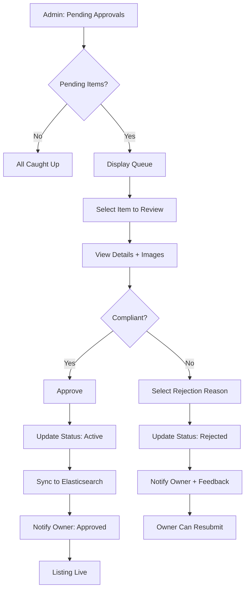

---

## UC-A02: Manage Users

| Section | Content |
|---------|---------|
| **1. Use Case Name** | Manage Users |
| **2. Summary** | Admin views, searches, and manages user accounts. Can suspend/ban users, verify accounts, and view user activity. |
| **3. Dependency** | User accounts exist in system |
| **4. Actors** | Primary: Admin. Secondary: Users (affected by actions) |
| **5. Preconditions** | Admin authenticated, Has user management permissions |
| **6. Main Sequence** | 1. Admin navigates to "User Management" 2. System displays user table with search and filters 3. Admin searches by email, name, phone 4. Admin filters by role, status, verification level 5. Admin selects a user to view details 6. Admin sees user profile, bookings, reviews, activity log 7. Admin may suspend, ban, verify, or unverify user |
| **7. Alternative Sequences** | **3a. User not found:** Display "No users found" message **5a. User has bookings:** Show booking summary with links **7a. Suspend user:** Require reason, set end date (optional) **7b. Ban user:** Permanent, require justification, disable all bookings |
| **8. Nonfunctional Requirements** | Paginated user list (50 per page), Quick search (< 1s), Action confirmation dialogs, Email notifications to users |
| **9. Post Condition** | User status updated, User notified via email, Audit log created |
| **10. Outstanding Questions** | Appeal process for banned users? Data retention for banned users? |

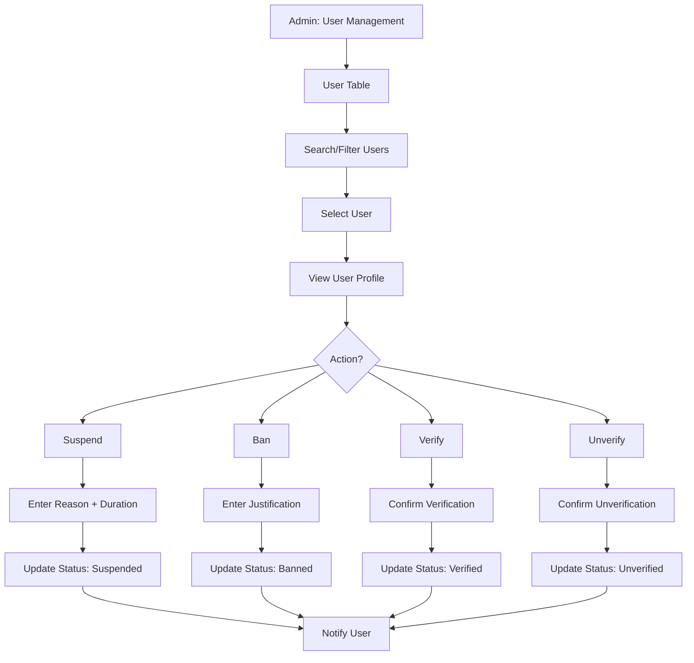

---

## UC-A03: Configure Payments

| Section | Content |
|---------|---------|
| **1. Use Case Name** | Configure Payments |
| **2. Summary** | Admin configures payment gateway settings (VNPAY, Ngan Luong, MoMo) including API keys, webhooks, and commission rates. |
| **3. Dependency** | Payment gateway accounts obtained |
| **4. Actors** | Primary: Admin |
| **5. Preconditions** | Admin authenticated, Has payment configuration permissions |
| **6. Main Sequence** | 1. Admin navigates to "Payment Settings" 2. System displays configured payment gateways 3. Admin selects a gateway to configure 4. Admin enters API credentials (merchant ID, secret key, hash key) 5. Admin configures webhook URLs 6. Admin sets platform commission rate (%) 7. Admin tests connection 8. System validates and saves configuration |
| **7. Alternative Sequences** | **4a. Invalid credentials:** Show error, don't save **7a. Connection test fails:** Display error details, allow retest **8a. Save fails:** Show error, keep values for retry |
| **8. Nonfunctional Requirements** | Encrypted credential storage, Credential rotation support, Test mode support, Configuration audit log |
| **9. Post Condition** | Payment gateway configured, Credentials encrypted, Test transaction recorded |
| **10. Outstanding Questions** | Multiple gateways active simultaneously? Fallback priority? |

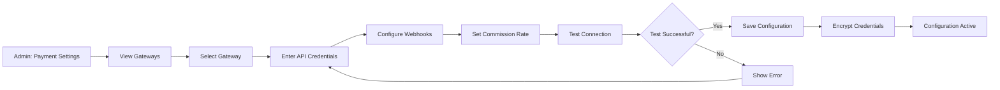

---

## UC-A04: View System Analytics

| Section | Content |
|---------|---------|
| **1. Use Case Name** | View System Analytics |
| **2. Summary** | Admin accesses platform-wide analytics including total bookings, revenue, user growth, search trends, and system performance metrics. |
| **3. Dependency** | Analytics data collection enabled |
| **4. Actors** | Primary: Admin |
| **5. Preconditions** | Admin authenticated, Has analytics permissions |
| **6. Main Sequence** | 1. Admin navigates to "System Analytics" 2. System displays executive dashboard with KPIs 3. Admin views sections: Business metrics, User metrics, Technical metrics 4. Admin filters by date range, region 5. Admin drills down into specific metrics 6. System updates with filtered data |
| **7. Alternative Sequences** | **6a. Export requested:** Generate comprehensive report (PDF/Excel) **6b. Real-time mode:** Switch to live metrics view |
| **8. Nonfunctional Requirements** | Aggregation efficiency, Chart rendering (< 2s), Large dataset handling, Scheduled reports (email) |
| **9. Post Condition** | Analytics viewed, Export generated (if requested) |
| **10. Outstanding Questions** | Real-time vs hourly aggregation? Custom dashboard creation? |

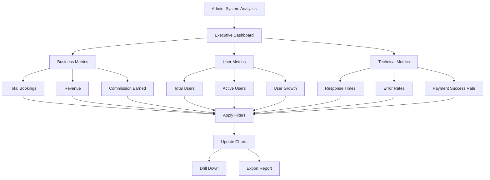

---

## UC-A05: Handle Disputes

| Section | Content |
|---------|---------|
| **1. Use Case Name** | Handle Disputes |
| **2. Summary** | Admin manages disputes between guests and owners, reviews evidence, makes rulings, and processes refunds if necessary. |
| **3. Dependency** | Dispute submitted by guest or owner |
| **4. Actors** | Primary: Admin. Secondary: Guest, Owner |
| **5. Preconditions** | Admin authenticated, Has dispute resolution permissions |
| **6. Main Sequence** | 1. Admin navigates to "Disputes" 2. System displays list of open disputes with priority markers 3. Admin selects a dispute 4. System displays dispute details, messages from both parties, evidence 5. Admin reviews booking details, messages, evidence 6. Admin may request additional information 7. Admin makes ruling: refund guest, refund owner, or split 8. System processes refund according to ruling 9. System notifies both parties of decision |
| **7. Alternative Sequences** | **2a. No open disputes:** Display "No open disputes" **6a. Evidence insufficient:** Request more info from parties **7a. Escalate to legal:** Flag for legal team review **8a. Refund fails:** Log for manual processing |
| **8. Nonfunctional Requirements** | Dispute SLA: respond within 24h, resolve within 72h, Evidence file upload support, Secure messaging, Decision audit trail |
| **9. Post Condition** | Dispute resolved, Refund processed, Parties notified, Analytics updated |
| **10. Outstanding Questions** | Appeal process? Partial refund calculations? Dispute categories? |

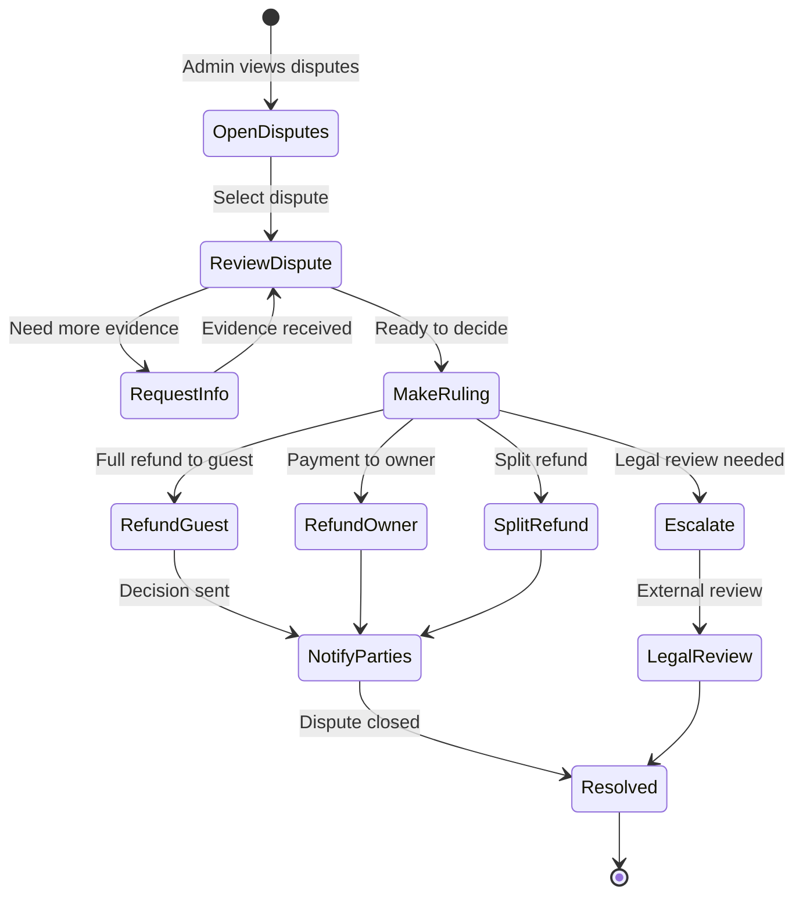

---

# Summary Matrix

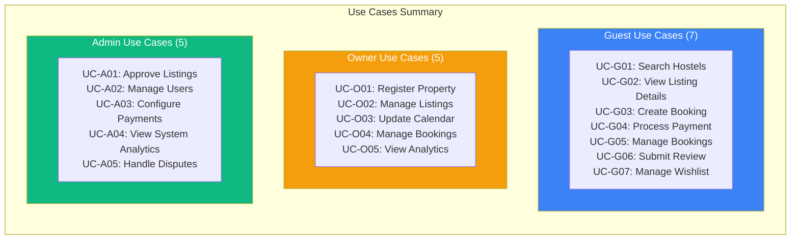

## Use Case Count by Role

| Role | Count | Complexity |
|------|-------|------------|
| Guest | 7 | High (payment integration, real-time updates) |
| Owner | 5 | Medium (CRUD operations, analytics) |
| Admin | 5 | Medium (management, configuration) |
| **Total** | **17** | - |

## Outstanding Questions Summary

| Category | Questions |
|----------|-----------|
| **Booking** | Lock timeout duration? Cancellation policy? Abandoned booking cleanup? |
| **Payment** | Retry limit? Refund process? Partial payments? Multiple gateways? |
| **Search** | Search history saved? Location typo corrections? |
| **Reviews** | Edit after submission? Delete? Time limit? |
| **Wishlist** | Price drop notifications? Expiration policy? |
| **Listings** | Max per property? Re-approval required? Image limits? |
| **Calendar** | Advance booking limit? Season pricing templates? |
| **Users** | Appeal process? Data retention for banned users? |
| **Disputes** | Appeal process? Partial refund calculations? Categories? |
| **Properties** | Business license required? Max per owner? |

---

**Document Version:** 1.0
**Last Updated:** 2026-01-11
**Maintained By:** Product Team
